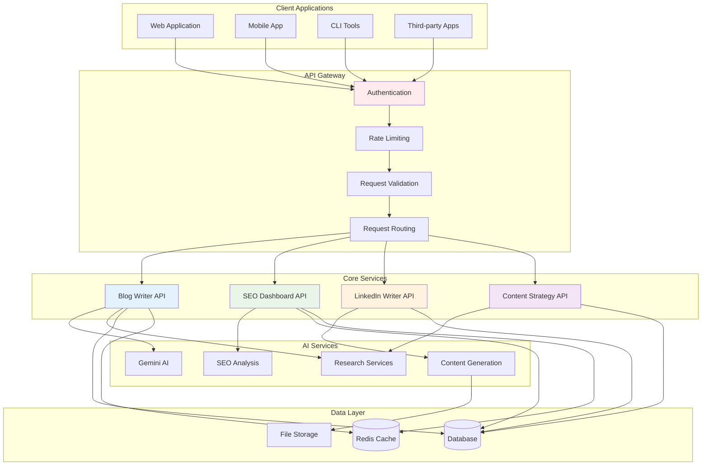

# API Reference Overview

ALwrity provides a comprehensive RESTful API that allows you to integrate AI-powered content creation capabilities into your applications. This API enables you to generate blog posts, optimize SEO, create social media content, and manage your content strategy programmatically.

## Base URL

```
Development: http://localhost:8000
Production: https://your-domain.com
```

## Authentication

ALwrity uses API key authentication for secure access to endpoints.

### API Key Setup

1. **Get your API key** from the ALwrity dashboard
2. **Include in requests** using the `Authorization` header:

```bash
curl -H "Authorization: Bearer YOUR_API_KEY" \
     -H "Content-Type: application/json" \
     https://your-domain.com/api/blog-writer
```

## API Architecture



## Core Endpoints

### Blog Writer API

#### Generate Blog Content
```http
POST /api/blog-writer
Content-Type: application/json
Authorization: Bearer YOUR_API_KEY

{
  "topic": "AI in Digital Marketing",
  "target_audience": "Marketing professionals",
  "content_type": "how-to-guide",
  "word_count": 1500,
  "tone": "professional"
}
```

#### Research Integration
```http
POST /api/blog-writer/research
Content-Type: application/json
Authorization: Bearer YOUR_API_KEY

{
  "topic": "Content Strategy",
  "research_depth": "comprehensive",
  "sources": ["web", "academic", "industry"]
}
```

#### SEO Analysis
```http
POST /api/blog-writer/seo/analyze
Content-Type: application/json
Authorization: Bearer YOUR_API_KEY

{
  "content": "Your blog post content here...",
  "target_keywords": ["content strategy", "digital marketing"],
  "competitor_urls": ["https://example.com"]
}
```

### SEO Dashboard API

#### Performance Analysis
```http
GET /api/seo-dashboard/performance
Authorization: Bearer YOUR_API_KEY

{
  "domain": "your-website.com",
  "date_range": "30d",
  "metrics": ["traffic", "rankings", "conversions"]
}
```

#### Keyword Research
```http
POST /api/seo-dashboard/keywords/research
Content-Type: application/json
Authorization: Bearer YOUR_API_KEY

{
  "seed_keywords": ["digital marketing", "content creation"],
  "language": "en",
  "location": "US",
  "competition_level": "medium"
}
```

#### Content Optimization
```http
POST /api/seo-dashboard/optimize
Content-Type: application/json
Authorization: Bearer YOUR_API_KEY

{
  "content": "Your content here...",
  "target_keyword": "content strategy",
  "optimization_goals": ["readability", "keyword_density", "structure"]
}
```

### LinkedIn Writer API

#### Generate LinkedIn Content
```http
POST /api/linkedin-writer
Content-Type: application/json
Authorization: Bearer YOUR_API_KEY

{
  "content_type": "post",
  "topic": "Professional networking tips",
  "tone": "professional",
  "include_hashtags": true,
  "target_audience": "LinkedIn professionals"
}
```

#### Fact Checking
```http
POST /api/linkedin-writer/fact-check
Content-Type: application/json
Authorization: Bearer YOUR_API_KEY

{
  "content": "Your LinkedIn post content...",
  "verification_level": "comprehensive"
}
```

### Content Strategy API

#### Generate Strategy
```http
POST /api/content-strategy/generate
Content-Type: application/json
Authorization: Bearer YOUR_API_KEY

{
  "business_type": "SaaS",
  "target_audience": "Small business owners",
  "goals": ["lead_generation", "brand_awareness"],
  "content_types": ["blog", "social", "email"]
}
```

#### Persona Development
```http
POST /api/content-strategy/personas
Content-Type: application/json
Authorization: Bearer YOUR_API_KEY

{
  "business_niche": "Digital marketing",
  "target_demographics": {
    "age_range": "25-45",
    "profession": "Marketing professionals",
    "pain_points": ["time_management", "roi_tracking"]
  }
}
```

## Response Formats

### Success Response
```json
{
  "success": true,
  "data": {
    "content": "Generated content here...",
    "metadata": {
      "word_count": 1500,
      "readability_score": 85,
      "seo_score": 92
    }
  },
  "timestamp": "2024-01-15T10:30:00Z"
}
```

### Error Response
```json
{
  "success": false,
  "error": {
    "code": "INVALID_REQUEST",
    "message": "Missing required parameter: topic",
    "details": {
      "parameter": "topic",
      "expected_type": "string"
    }
  },
  "timestamp": "2024-01-15T10:30:00Z"
}
```

## Rate Limits

| Plan | Requests per Minute | Requests per Day |
|------|-------------------|------------------|
| Free | 10 | 100 |
| Basic | 60 | 1,000 |
| Pro | 300 | 10,000 |
| Enterprise | 1,000 | 100,000 |

## Error Codes

| Code | Description |
|------|-------------|
| `INVALID_API_KEY` | API key is missing or invalid |
| `RATE_LIMIT_EXCEEDED` | Too many requests |
| `INVALID_REQUEST` | Request parameters are invalid |
| `CONTENT_TOO_LONG` | Content exceeds maximum length |
| `QUOTA_EXCEEDED` | Daily quota exceeded |
| `SERVICE_UNAVAILABLE` | Service temporarily unavailable |

## SDKs and Libraries

### Python
```bash
pip install alwrity-python
```

```python
from alwrity import AlwrityClient

client = AlwrityClient(api_key="YOUR_API_KEY")

# Generate blog content
response = client.blog_writer.generate(
    topic="AI in Marketing",
    word_count=1000,
    tone="professional"
)

print(response.content)
```

### JavaScript/Node.js
```bash
npm install alwrity-js
```

```javascript
const AlwrityClient = require('alwrity-js');

const client = new AlwrityClient('YOUR_API_KEY');

// Generate LinkedIn content
client.linkedinWriter.generate({
  content_type: 'post',
  topic: 'Professional development',
  tone: 'inspirational'
}).then(response => {
  console.log(response.content);
});
```

### cURL Examples

#### Generate Blog Post
```bash
curl -X POST "https://your-domain.com/api/blog-writer" \
  -H "Authorization: Bearer YOUR_API_KEY" \
  -H "Content-Type: application/json" \
  -d '{
    "topic": "Content Marketing Trends 2024",
    "word_count": 1200,
    "tone": "professional"
  }'
```

#### SEO Analysis
```bash
curl -X POST "https://your-domain.com/api/blog-writer/seo/analyze" \
  -H "Authorization: Bearer YOUR_API_KEY" \
  -H "Content-Type: application/json" \
  -d '{
    "content": "Your content here...",
    "target_keywords": ["content marketing", "trends"]
  }'
```

## Webhooks

ALwrity supports webhooks for real-time notifications about content generation and processing status.

### Webhook Events

- `content.generated` - Content generation completed
- `seo.analysis.completed` - SEO analysis finished
- `strategy.updated` - Content strategy updated
- `quota.warning` - Approaching quota limit

### Webhook Configuration

```http
POST /api/webhooks
Content-Type: application/json
Authorization: Bearer YOUR_API_KEY

{
  "url": "https://your-app.com/webhooks/alwrity",
  "events": ["content.generated", "seo.analysis.completed"],
  "secret": "your_webhook_secret"
}
```

## Best Practices

### API Usage

1. **Use HTTPS**: Always use HTTPS for API requests
2. **Handle Errors**: Implement proper error handling
3. **Rate Limiting**: Respect rate limits and implement backoff
4. **Caching**: Cache responses when appropriate
5. **Monitoring**: Monitor API usage and performance

### Content Generation

1. **Be Specific**: Provide detailed topic descriptions
2. **Set Expectations**: Specify word count and tone
3. **Review Output**: Always review generated content
4. **Iterate**: Use feedback to improve results

### Security

1. **Protect API Keys**: Never expose API keys in client-side code
2. **Use Environment Variables**: Store keys securely
3. **Rotate Keys**: Regularly rotate API keys
4. **Monitor Usage**: Track API usage for anomalies

## Support

### Documentation
- **[Authentication Guide](authentication.md)** - Detailed authentication setup
- **[Rate Limiting](rate-limiting.md)** - Understanding rate limits
- **[Error Handling](error-codes.md)** - Complete error reference

### Getting Help
- **GitHub Issues**: [Report bugs and request features](https://github.com/AJaySi/ALwrity/issues)
- **API Status**: Check [API status page](https://status.alwrity.com)
- **Community**: Join our [developer community](https://discord.gg/alwrity)

---

*Ready to integrate ALwrity into your application? [Get your API key](https://dashboard.alwrity.com/api-keys) and start building!*
