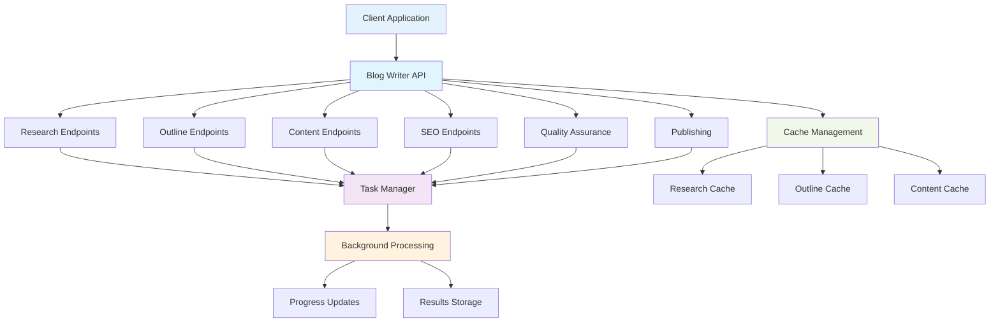
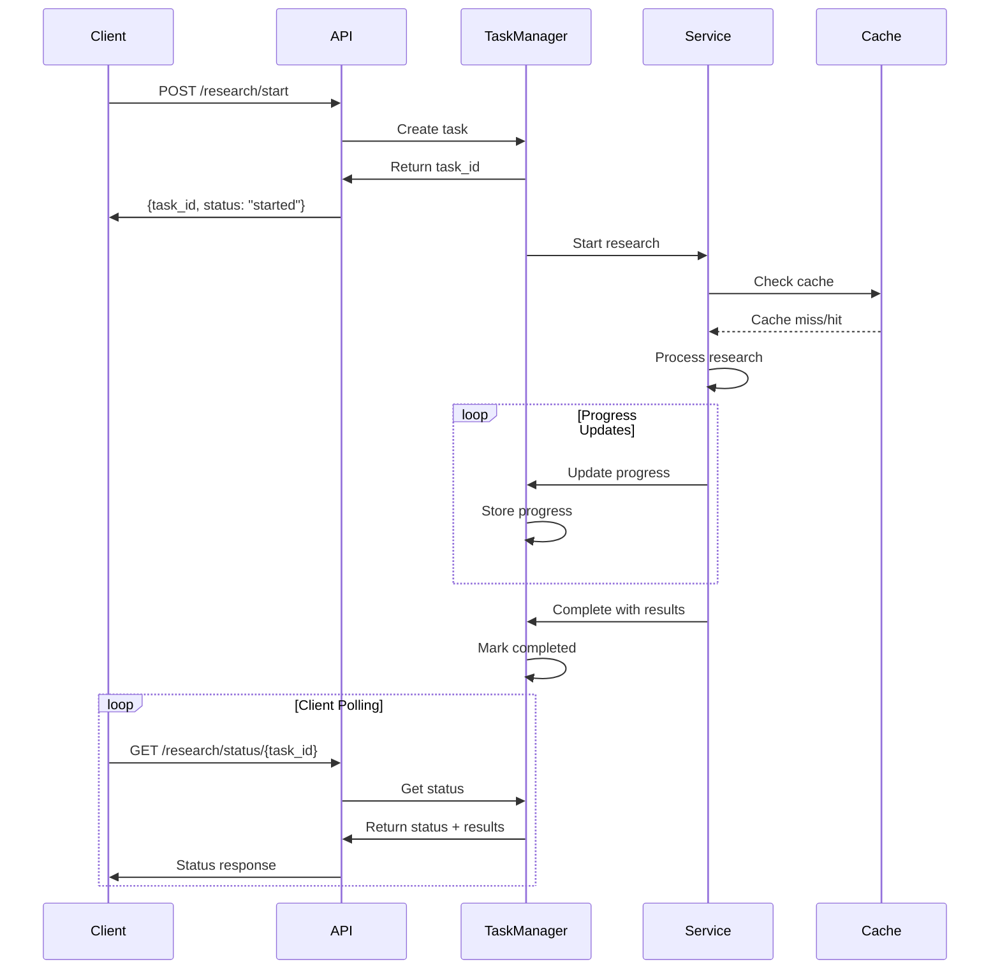

# Blog Writer API Reference

Complete API documentation for the ALwrity Blog Writer, including all endpoints, request/response models, and usage examples.

## 🔗 Base URL

All Blog Writer endpoints are prefixed with `/api/blog`

## 📋 API Architecture

The Blog Writer API follows a RESTful design with background task processing:



## 📋 Endpoint Categories

### Research Endpoints
- [Start Research](#start-research)
- [Get Research Status](#get-research-status)

### Outline Endpoints
- [Start Outline Generation](#start-outline-generation)
- [Get Outline Status](#get-outline-status)
- [Refine Outline](#refine-outline)
- [Enhance Section](#enhance-section)
- [Optimize Outline](#optimize-outline)
- [Rebalance Outline](#rebalance-outline)

### Content Generation Endpoints
- [Generate Section](#generate-section)
- [Get Section Continuity](#get-section-continuity)
- [Flow Analysis](#flow-analysis-endpoints)
- [Optimize Section](#optimize-section)

### Quality Assurance Endpoints
- [Hallucination Check](#hallucination-check)

### SEO Endpoints
- [SEO Analyze](#seo-analyze)
- [SEO Metadata](#seo-metadata)

### Publishing Endpoints
- [Publish Blog](#publish-blog)

### Cache Management Endpoints
- [Get Cache Stats](#get-cache-stats)
- [Clear Cache](#clear-cache)

### Medium Blog Generation
- [Start Medium Generation](#start-medium-generation)
- [Get Medium Generation Status](#get-medium-generation-status)

### Blog Rewriting
- [Start Blog Rewrite](#start-blog-rewrite)
- [Get Rewrite Status](#get-rewrite-status)

---

## 🔄 Request/Response Flow

The Blog Writer API uses asynchronous processing with polling for long-running operations:



## 🔍 Research Endpoints

### Start Research

**Endpoint**: `POST /api/blog/research/start`

**Description**: Initiates a comprehensive research operation using Google Search grounding and returns a task ID for polling.

**Request Body**:
```json
{
  "keywords": ["artificial intelligence", "machine learning", "AI applications"],
  "topic": "AI in Healthcare",
  "industry": "Healthcare Technology",
  "target_audience": "Healthcare professionals and IT decision makers",
  "tone": "Professional and informative",
  "word_count_target": 1500,
  "persona": {
    "persona_id": "healthcare_professional",
    "tone": "authoritative",
    "audience": "healthcare professionals",
    "industry": "healthcare"
  }
}
```

**Response**:
```json
{
  "task_id": "uuid-string",
  "status": "started"
}
```

**Progress Messages** (poll `/research/status/{task_id}`):
- "🔍 Starting research operation..."
- "📋 Checking cache for existing research..."
- "🌐 Conducting web search..."
- "📊 Analyzing sources..."
- "✅ Research completed successfully! Found X sources and Y search queries."

### Get Research Status

**Endpoint**: `GET /api/blog/research/status/{task_id}`

**Description**: Retrieves the current status of a research operation.

**Response**:
```json
{
  "task_id": "uuid-string",
  "status": "completed",
  "created_at": "2024-01-15T10:30:00Z",
  "progress_messages": [
    {
      "timestamp": "2024-01-15T10:30:05Z",
      "message": "🔍 Starting research operation..."
    }
  ],
  "result": {
    "success": true,
    "sources": [
      {
        "title": "AI in Healthcare: Current Applications",
        "url": "https://example.com/ai-healthcare",
        "excerpt": "Comprehensive overview of AI applications...",
        "credibility_score": 0.95,
        "published_at": "2024-01-10",
        "index": 0,
        "source_type": "web"
      }
    ],
    "keyword_analysis": {
      "primary_keywords": ["AI", "healthcare", "machine learning"],
      "secondary_keywords": ["diagnosis", "treatment", "automation"],
      "search_volume": "high"
    },
    "competitor_analysis": {
      "top_competitors": ["competitor1.com", "competitor2.com"],
      "content_gaps": ["practical implementation", "cost analysis"],
      "opportunities": ["case studies", "ROI analysis"]
    },
    "suggested_angles": [
      "AI-powered diagnostic tools",
      "Cost-benefit analysis of AI in healthcare",
      "Implementation challenges and solutions"
    ],
    "search_queries": [
      "AI healthcare applications 2024",
      "machine learning medical diagnosis",
      "healthcare AI implementation challenges"
    ],
    "grounding_metadata": {
      "grounding_chunks": [
        {
          "title": "AI Healthcare Research",
          "url": "https://research.org/ai-healthcare",
          "confidence_score": 0.92
        }
      ],
      "web_search_queries": [
        "AI healthcare applications",
        "machine learning medical diagnosis"
      ]
    }
  }
}
```

---

## 📝 Outline Endpoints

### Start Outline Generation

**Endpoint**: `POST /api/blog/outline/start`

**Description**: Generates a comprehensive blog outline based on research data.

**Request Body**:
```json
{
  "research": {
    "success": true,
    "sources": [...],
    "keyword_analysis": {...},
    "competitor_analysis": {...},
    "suggested_angles": [...],
    "search_queries": [...],
    "grounding_metadata": {...}
  },
  "persona": {
    "persona_id": "healthcare_professional",
    "tone": "authoritative",
    "audience": "healthcare professionals",
    "industry": "healthcare"
  },
  "word_count": 1500,
  "custom_instructions": "Focus on practical implementation examples"
}
```

**Response**:
```json
{
  "task_id": "uuid-string",
  "status": "started"
}
```

### Get Outline Status

**Endpoint**: `GET /api/blog/outline/status/{task_id}`

**Description**: Retrieves the current status of outline generation.

**Response**:
```json
{
  "task_id": "uuid-string",
  "status": "completed",
  "created_at": "2024-01-15T10:35:00Z",
  "progress_messages": [
    {
      "timestamp": "2024-01-15T10:35:05Z",
      "message": "🧩 Starting outline generation..."
    }
  ],
  "result": {
    "success": true,
    "title_options": [
      "AI in Healthcare: Transforming Patient Care Through Technology",
      "The Future of Healthcare: How AI is Revolutionizing Medical Practice",
      "Healthcare AI: Practical Applications and Implementation Strategies"
    ],
    "outline": [
      {
        "id": "intro",
        "heading": "Introduction: The AI Revolution in Healthcare",
        "subheadings": [
          "Current State of Healthcare Technology",
          "The Promise of AI in Medical Practice"
        ],
        "key_points": [
          "AI adoption rates in healthcare",
          "Key benefits of AI implementation",
          "Overview of current applications"
        ],
        "references": [
          {
            "title": "AI Healthcare Statistics 2024",
            "url": "https://example.com/stats",
            "excerpt": "Recent statistics on AI adoption...",
            "credibility_score": 0.95,
            "index": 0
          }
        ],
        "target_words": 200,
        "keywords": ["AI healthcare", "medical technology", "healthcare innovation"]
      },
      {
        "id": "applications",
        "heading": "Key AI Applications in Healthcare",
        "subheadings": [
          "Diagnostic Imaging and Analysis",
          "Predictive Analytics for Patient Care",
          "Automated Administrative Tasks"
        ],
        "key_points": [
          "Medical imaging AI capabilities",
          "Predictive modeling for patient outcomes",
          "Administrative automation benefits"
        ],
        "references": [...],
        "target_words": 400,
        "keywords": ["diagnostic AI", "predictive analytics", "healthcare automation"]
      }
    ],
    "source_mapping_stats": {
      "total_sources_mapped": 15,
      "coverage_percentage": 87.5,
      "average_relevance_score": 0.89,
      "high_confidence_mappings": 12
    },
    "grounding_insights": {
      "confidence_analysis": {
        "high_confidence_sources": 8,
        "medium_confidence_sources": 4,
        "low_confidence_sources": 1
      },
      "authority_analysis": {
        "academic_sources": 5,
        "industry_sources": 7,
        "government_sources": 3
      }
    },
    "optimization_results": {
      "overall_quality_score": 0.92,
      "improvements_made": [
        "Enhanced section flow",
        "Improved keyword distribution",
        "Optimized source mapping"
      ],
      "optimization_focus": "comprehensive coverage"
    },
    "research_coverage": {
      "sources_utilized": 13,
      "content_gaps_identified": 2,
      "competitive_advantages": [
        "Comprehensive case studies",
        "Practical implementation guide",
        "Cost-benefit analysis"
      ]
    }
  }
}
```

### Refine Outline

**Endpoint**: `POST /api/blog/outline/refine`

**Description**: Refines an existing outline with AI improvements.

**Request Body**:
```json
{
  "outline": [...],
  "operation": "enhance_flow",
  "section_id": "optional-section-id",
  "payload": {
    "focus": "improve readability",
    "target_audience": "healthcare professionals"
  }
}
```

**Response**:
```json
{
  "success": true,
  "title_options": [...],
  "outline": [...],
  "optimization_results": {
    "overall_quality_score": 0.95,
    "improvements_made": [
      "Enhanced section transitions",
      "Improved keyword distribution",
      "Better source integration"
    ],
    "optimization_focus": "enhanced flow"
  }
}
```

### Enhance Section

**Endpoint**: `POST /api/blog/outline/enhance-section`

**Description**: Enhances a specific outline section with AI improvements.

**Request Body**:
```json
{
  "id": "intro",
  "heading": "Introduction: AI in Healthcare",
  "subheadings": ["Current State", "Future Promise"],
  "key_points": ["AI adoption rates", "Key benefits"],
  "references": [...],
  "target_words": 300,
  "keywords": ["AI healthcare", "medical technology"]
}
```

**Query Parameters**:
- `focus` (optional): Enhancement focus area (default: "general improvement")

**Response**:
```json
{
  "id": "intro",
  "heading": "Introduction: AI Revolution in Healthcare",
  "subheadings": [
    "Current State of Healthcare Technology",
    "The Promise of AI in Medical Practice"
  ],
  "key_points": [
    "AI adoption rates in healthcare have increased by 45%",
    "Key benefits include improved diagnostic accuracy",
    "Overview of current AI applications in medical practice"
  ],
  "references": [...],
  "target_words": 300,
  "keywords": ["AI healthcare", "medical technology", "healthcare innovation"],
  "enhancement_focus": "general improvement",
  "improvements_made": [
    "Enhanced heading clarity",
    "Expanded key points with specific data",
    "Improved keyword integration"
  ]
}
```

### Optimize Outline

**Endpoint**: `POST /api/blog/outline/optimize`

**Description**: Optimizes entire outline for better flow, SEO, and engagement.

**Request Body**:
```json
{
  "outline": [
    {
      "id": "intro",
      "heading": "Introduction",
      "subheadings": [...],
      "key_points": [...],
      "references": [...],
      "target_words": 300,
      "keywords": [...]
    }
  ]
}
```

**Query Parameters**:
- `focus` (optional): Optimization focus area (default: "general optimization")

**Response**:
```json
{
  "outline": [
    {
      "id": "intro",
      "heading": "Introduction: AI Revolution in Healthcare",
      "subheadings": [
        "Current State of Healthcare Technology",
        "The Promise of AI in Medical Practice"
      ],
      "key_points": [
        "AI adoption rates in healthcare have increased by 45%",
        "Key benefits include improved diagnostic accuracy",
        "Overview of current AI applications in medical practice"
      ],
      "references": [...],
      "target_words": 300,
      "keywords": ["AI healthcare", "medical technology", "healthcare innovation"]
    }
  ],
  "optimization_summary": {
    "focus_area": "general optimization",
    "improvements_made": [
      "Enhanced section flow and transitions",
      "Improved keyword distribution across sections",
      "Better source integration and mapping",
      "Optimized heading hierarchy for SEO"
    ],
    "overall_quality_score": 0.92
  }
}
```

### Rebalance Outline

**Endpoint**: `POST /api/blog/outline/rebalance`

**Description**: Rebalances word count distribution across outline sections.

**Request Body**:
```json
{
  "outline": [
    {
      "id": "intro",
      "heading": "Introduction",
      "target_words": 200
    },
    {
      "id": "applications",
      "heading": "Applications",
      "target_words": 800
    }
  ]
}
```

**Query Parameters**:
- `target_words` (optional): Total target word count (default: 1500)

**Response**:
```json
{
  "outline": [
    {
      "id": "intro",
      "heading": "Introduction",
      "target_words": 250,
      "word_adjustment": 50
    },
    {
      "id": "applications",
      "heading": "Applications",
      "target_words": 750,
      "word_adjustment": -50
    }
  ],
  "rebalancing_summary": {
    "total_target_words": 1500,
    "original_total": 1000,
    "rebalanced_total": 1000,
    "adjustments_made": [
      "Increased introduction word count for better context",
      "Reduced applications section for better balance",
      "Maintained overall content structure"
    ]
  }
}
```

---

## ✍️ Content Generation Endpoints

### Generate Section

**Endpoint**: `POST /api/blog/section/generate`

**Description**: Generates content for a specific outline section.

**Request Body**:
```json
{
  "section": {
    "id": "intro",
    "heading": "Introduction: The AI Revolution in Healthcare",
    "subheadings": [
      "Current State of Healthcare Technology",
      "The Promise of AI in Medical Practice"
    ],
    "key_points": [
      "AI adoption rates in healthcare",
      "Key benefits of AI implementation",
      "Overview of current applications"
    ],
    "references": [...],
    "target_words": 200,
    "keywords": ["AI healthcare", "medical technology", "healthcare innovation"]
  },
  "keywords": ["AI healthcare", "medical technology"],
  "tone": "professional",
  "persona": {
    "persona_id": "healthcare_professional",
    "tone": "authoritative",
    "audience": "healthcare professionals",
    "industry": "healthcare"
  },
  "mode": "polished"
}
```

**Response**:
```json
{
  "success": true,
  "markdown": "# Introduction: The AI Revolution in Healthcare\n\nHealthcare is experiencing a transformative revolution driven by artificial intelligence (AI) technologies. As medical professionals increasingly adopt AI-powered solutions, the industry is witnessing unprecedented improvements in patient care, diagnostic accuracy, and operational efficiency.\n\n## Current State of Healthcare Technology\n\nThe healthcare sector has traditionally been slow to adopt new technologies, but AI is changing this narrative. Recent studies show that [AI adoption in healthcare has increased by 45% in the past two years](https://example.com/stats), with hospitals and clinics implementing AI solutions across various departments.\n\n## The Promise of AI in Medical Practice\n\nAI technologies offer healthcare professionals powerful tools to enhance patient outcomes. From diagnostic imaging to predictive analytics, AI is enabling more accurate diagnoses, personalized treatment plans, and proactive patient care management.\n\n*Source: [AI Healthcare Statistics 2024](https://example.com/stats)*",
  "citations": [
    {
      "title": "AI Healthcare Statistics 2024",
      "url": "https://example.com/stats",
      "excerpt": "Recent statistics on AI adoption...",
      "credibility_score": 0.95,
      "index": 0
    }
  ],
  "continuity_metrics": {
    "word_count": 198,
    "readability_score": 0.87,
    "keyword_density": 0.025,
    "citation_coverage": 0.95,
    "flow_score": 0.92
  }
}
```

### Get Section Continuity

**Endpoint**: `GET /api/blog/section/{section_id}/continuity`

**Description**: Retrieves continuity metrics for a specific section.

**Response**:
```json
{
  "section_id": "intro",
  "continuity_metrics": {
    "word_count": 198,
    "readability_score": 0.87,
    "keyword_density": 0.025,
    "citation_coverage": 0.95,
    "flow_score": 0.92,
    "coherence_score": 0.89,
    "engagement_score": 0.85
  }
}
```

### Optimize Section

**Endpoint**: `POST /api/blog/section/optimize`

**Description**: Optimizes a specific section for better flow, readability, and engagement.

**Request Body**:
```json
{
  "section_id": "intro",
  "content": "Current section content...",
  "optimization_focus": "engagement",
  "target_audience": "healthcare professionals",
  "tone": "professional"
}
```

**Response**:
```json
{
  "section_id": "intro",
  "original_content": "Current section content...",
  "optimized_content": "Enhanced section content with improved engagement...",
  "optimization_summary": {
    "focus_area": "engagement",
    "improvements_made": [
      "Enhanced opening hook",
      "Added compelling examples",
      "Improved readability"
    ],
    "quality_improvements": {
      "engagement_score": 0.89,
      "readability_score": 0.85,
      "clarity_score": 0.92
    }
  }
}
```

## 🔍 Flow Analysis Endpoints

### Flow Analysis - Basic

**Endpoint**: `POST /api/blog/flow-analysis/basic`

**Description**: Analyzes flow metrics for entire blog using single AI call (cost-effective).

**Request Body**:
```json
{
  "content": "# Blog Title\n\nComplete blog content here...",
  "sections": [
    {
      "id": "intro",
      "heading": "Introduction",
      "content": "Introduction content..."
    },
    {
      "id": "main",
      "heading": "Main Content",
      "content": "Main content..."
    }
  ],
  "target_audience": "healthcare professionals",
  "tone": "professional"
}
```

**Response**:
```json
{
  "success": true,
  "overall_flow_score": 0.87,
  "section_flow_scores": {
    "intro": 0.92,
    "main": 0.85
  },
  "flow_analysis": {
    "transitions": {
      "score": 0.89,
      "issues": [
        "Weak transition between introduction and main content"
      ],
      "suggestions": [
        "Add transitional sentence connecting AI benefits to specific applications"
      ]
    },
    "coherence": {
      "score": 0.91,
      "issues": [],
      "suggestions": [
        "Content maintains strong thematic coherence throughout"
      ]
    },
    "engagement": {
      "score": 0.83,
      "issues": [
        "Some sections could benefit from more engaging language"
      ],
      "suggestions": [
        "Add more compelling examples and case studies"
      ]
    }
  },
  "recommendations": [
    "Improve section transitions for better flow",
    "Add more engaging examples to increase reader interest",
    "Consider restructuring one section for better logical progression"
  ],
  "analysis_type": "basic",
  "processing_time_ms": 1250
}
```

### Flow Analysis - Advanced

**Endpoint**: `POST /api/blog/flow-analysis/advanced`

**Description**: Analyzes flow metrics for each section individually (detailed but expensive).

**Request Body**:
```json
{
  "content": "# Blog Title\n\nComplete blog content here...",
  "sections": [
    {
      "id": "intro",
      "heading": "Introduction",
      "content": "Introduction content...",
      "target_words": 300
    },
    {
      "id": "main",
      "heading": "Main Content",
      "content": "Main content...",
      "target_words": 800
    }
  ],
  "target_audience": "healthcare professionals",
  "tone": "professional",
  "detailed_analysis": true
}
```

**Response**:
```json
{
  "success": true,
  "overall_flow_score": 0.89,
  "detailed_section_analysis": {
    "intro": {
      "flow_score": 0.94,
      "readability_score": 0.87,
      "engagement_score": 0.91,
      "coherence_score": 0.93,
      "transition_score": 0.88,
      "issues": [],
      "strengths": [
        "Clear introduction of topic",
        "Strong hook that engages readers",
        "Good keyword integration"
      ],
      "suggestions": [
        "Consider adding a brief preview of what's to come"
      ]
    },
    "main": {
      "flow_score": 0.85,
      "readability_score": 0.82,
      "engagement_score": 0.79,
      "coherence_score": 0.88,
      "transition_score": 0.83,
      "issues": [
        "Some paragraphs could be more concise",
        "Missing transition to conclusion"
      ],
      "strengths": [
        "Comprehensive coverage of topic",
        "Good use of examples and data",
        "Strong source integration"
      ],
      "suggestions": [
        "Break up long paragraphs for better readability",
        "Add transitional sentence before conclusion"
      ]
    }
  },
  "cross_section_analysis": {
    "overall_coherence": 0.91,
    "transition_quality": 0.85,
    "thematic_consistency": 0.93,
    "progression_logic": 0.87
  },
  "recommendations": [
    "Improve paragraph structure in main content section",
    "Add stronger transitions between sections",
    "Consider adding more engaging examples throughout"
  ],
  "analysis_type": "advanced",
  "processing_time_ms": 3200
}
```

---

## 🛡️ Quality Assurance Endpoints

### Hallucination Check

**Endpoint**: `POST /api/blog/hallucination/check`

**Description**: Performs fact-checking and hallucination detection on blog content.

**Request Body**:
```json
{
  "content": "Blog content to check for hallucinations...",
  "sources": [
    {
      "title": "Source Title",
      "url": "https://example.com/source",
      "excerpt": "Relevant excerpt from source"
    }
  ],
  "check_options": {
    "verify_statistics": true,
    "check_claims": true,
    "validate_sources": true,
    "confidence_threshold": 0.8
  }
}
```

**Response**:
```json
{
  "success": true,
  "overall_confidence": 0.92,
  "hallucination_analysis": {
    "total_claims": 15,
    "verified_claims": 13,
    "unverified_claims": 2,
    "potential_hallucinations": 0
  },
  "claim_analysis": [
    {
      "claim": "AI adoption in healthcare has increased by 45%",
      "confidence": 0.95,
      "verification_status": "verified",
      "supporting_sources": [
        {
          "title": "Healthcare AI Statistics 2024",
          "url": "https://example.com/stats",
          "relevance_score": 0.98
        }
      ]
    },
    {
      "claim": "Most hospitals will adopt AI by 2025",
      "confidence": 0.65,
      "verification_status": "unverified",
      "supporting_sources": [],
      "recommendation": "Consider removing or adding source citation"
    }
  ],
  "recommendations": [
    "Add source citation for unverified claim about hospital adoption",
    "Consider removing speculative statement about future predictions"
  ],
  "processing_time_ms": 2100
}
```

---

## 🔍 SEO Endpoints

### SEO Analyze

**Endpoint**: `POST /api/blog/seo/analyze`

**Description**: Performs comprehensive SEO analysis of blog content.

**Request Body**:
```json
{
  "content": "# Blog Title\n\nBlog content here...",
  "blog_title": "AI in Healthcare: Transforming Patient Care",
  "keywords": ["AI healthcare", "medical technology", "healthcare innovation"],
  "research_data": {
    "sources": [...],
    "keyword_analysis": {...},
    "competitor_analysis": {...}
  }
}
```

**Response**:
```json
{
  "success": true,
  "seo_score": 87.5,
  "density": {
    "primary_keywords": {
      "AI healthcare": 0.025,
      "medical technology": 0.018,
      "healthcare innovation": 0.012
    },
    "secondary_keywords": {
      "diagnostic AI": 0.008,
      "predictive analytics": 0.006
    }
  },
  "structure": {
    "heading_hierarchy": "optimal",
    "heading_distribution": {
      "h1": 1,
      "h2": 4,
      "h3": 8
    },
    "paragraph_length": "optimal",
    "list_usage": "good"
  },
  "readability": {
    "flesch_reading_ease": 72.5,
    "flesch_kincaid_grade": 8.2,
    "gunning_fog": 9.1,
    "coleman_liau": 7.8
  },
  "link_suggestions": [
    {
      "text": "AI diagnostic tools",
      "suggested_url": "https://example.com/ai-diagnostics",
      "context": "paragraph 3, sentence 2"
    }
  ],
  "image_alt_status": {
    "images_with_alt": 3,
    "images_without_alt": 1,
    "alt_text_quality": "good"
  },
  "recommendations": [
    "Add more internal links to related content",
    "Include more long-tail keywords",
    "Optimize image alt text for better accessibility",
    "Consider adding a FAQ section"
  ]
}
```

### SEO Metadata

**Endpoint**: `POST /api/blog/seo/metadata`

**Description**: Generates comprehensive SEO metadata for the blog post.

**Request Body**:
```json
{
  "content": "# Blog Title\n\nBlog content here...",
  "title": "AI in Healthcare: Transforming Patient Care",
  "keywords": ["AI healthcare", "medical technology"],
  "research_data": {
    "sources": [...],
    "keyword_analysis": {...}
  }
}
```

**Response**:
```json
{
  "success": true,
  "title_options": [
    "AI in Healthcare: Transforming Patient Care Through Technology",
    "The Future of Healthcare: How AI is Revolutionizing Medical Practice",
    "Healthcare AI: Practical Applications and Implementation Strategies"
  ],
  "meta_descriptions": [
    "Discover how AI is transforming healthcare with practical applications, real-world examples, and implementation strategies for medical professionals.",
    "Explore the latest AI innovations in healthcare, from diagnostic tools to predictive analytics, and learn how to implement them in your practice.",
    "Comprehensive guide to AI in healthcare: applications, benefits, challenges, and step-by-step implementation strategies for healthcare organizations."
  ],
  "seo_title": "AI in Healthcare: Transforming Patient Care Through Technology",
  "meta_description": "Discover how AI is transforming healthcare with practical applications, real-world examples, and implementation strategies for medical professionals.",
  "url_slug": "ai-healthcare-transforming-patient-care",
  "blog_tags": [
    "artificial intelligence",
    "healthcare technology",
    "medical AI",
    "healthcare innovation",
    "diagnostic AI",
    "predictive analytics"
  ],
  "blog_categories": [
    "Healthcare Technology",
    "Artificial Intelligence",
    "Medical Innovation"
  ],
  "social_hashtags": [
    "#AIHealthcare",
    "#MedicalAI",
    "#HealthTech",
    "#HealthcareInnovation",
    "#DiagnosticAI"
  ],
  "open_graph": {
    "title": "AI in Healthcare: Transforming Patient Care Through Technology",
    "description": "Discover how AI is transforming healthcare with practical applications, real-world examples, and implementation strategies for medical professionals.",
    "image": "https://example.com/ai-healthcare-og-image.jpg",
    "url": "https://example.com/blog/ai-healthcare-transforming-patient-care",
    "type": "article"
  },
  "twitter_card": {
    "title": "AI in Healthcare: Transforming Patient Care Through Technology",
    "description": "Discover how AI is transforming healthcare with practical applications, real-world examples, and implementation strategies for medical professionals.",
    "image": "https://example.com/ai-healthcare-twitter-image.jpg",
    "card": "summary_large_image"
  },
  "json_ld_schema": {
    "@context": "https://schema.org",
    "@type": "Article",
    "headline": "AI in Healthcare: Transforming Patient Care Through Technology",
    "description": "Discover how AI is transforming healthcare with practical applications, real-world examples, and implementation strategies for medical professionals.",
    "author": {
      "@type": "Person",
      "name": "ALwrity AI"
    },
    "publisher": {
      "@type": "Organization",
      "name": "ALwrity",
      "logo": {
        "@type": "ImageObject",
        "url": "https://alwrity.com/logo.png"
      }
    },
    "datePublished": "2024-01-15T10:00:00Z",
    "dateModified": "2024-01-15T10:00:00Z"
  },
  "canonical_url": "https://example.com/blog/ai-healthcare-transforming-patient-care",
  "reading_time": 8.5,
  "focus_keyword": "AI healthcare",
  "generated_at": "2024-01-15T10:45:00Z",
  "optimization_score": 92
}
```

---

## 🚀 Medium Blog Generation

### Start Medium Generation

**Endpoint**: `POST /api/blog/generate/medium/start`

**Description**: Generates a complete medium-length blog (≤1000 words) in a single operation.

**Request Body**:
```json
{
  "title": "AI in Healthcare: Key Applications",
  "sections": [
    {
      "id": "intro",
      "heading": "Introduction",
      "keyPoints": [
        "AI adoption in healthcare",
        "Key benefits overview"
      ],
      "subheadings": [],
      "keywords": ["AI healthcare", "medical technology"],
      "targetWords": 150,
      "references": [...]
    },
    {
      "id": "applications",
      "heading": "Key Applications",
      "keyPoints": [
        "Diagnostic imaging",
        "Predictive analytics",
        "Administrative automation"
      ],
      "subheadings": [],
      "keywords": ["diagnostic AI", "predictive analytics"],
      "targetWords": 400,
      "references": [...]
    }
  ],
  "persona": {
    "persona_id": "healthcare_professional",
    "tone": "professional",
    "audience": "healthcare professionals",
    "industry": "healthcare"
  },
  "tone": "professional",
  "audience": "healthcare professionals",
  "globalTargetWords": 1000,
  "researchKeywords": ["AI healthcare", "medical technology", "healthcare innovation"]
}
```

**Response**:
```json
{
  "task_id": "uuid-string",
  "status": "started"
}
```

### Get Medium Generation Status

**Endpoint**: `GET /api/blog/generate/medium/status/{task_id}`

**Description**: Retrieves the status of medium blog generation.

**Response**:
```json
{
  "task_id": "uuid-string",
  "status": "completed",
  "created_at": "2024-01-15T10:50:00Z",
  "progress_messages": [
    {
      "timestamp": "2024-01-15T10:50:05Z",
      "message": "📦 Packaging outline and metadata..."
    },
    {
      "timestamp": "2024-01-15T10:50:15Z",
      "message": "🤖 Generated fresh content with AI..."
    },
    {
      "timestamp": "2024-01-15T10:50:25Z",
      "message": "✨ Post-processing and assembling sections..."
    },
    {
      "timestamp": "2024-01-15T10:50:30Z",
      "message": "✅ Generated 3 sections successfully."
    }
  ],
  "result": {
    "success": true,
    "title": "AI in Healthcare: Key Applications",
    "sections": [
      {
        "id": "intro",
        "heading": "Introduction",
        "content": "# AI in Healthcare: Key Applications\n\nHealthcare is experiencing a revolutionary transformation through artificial intelligence (AI) technologies. As medical professionals increasingly adopt AI-powered solutions, the industry is witnessing unprecedented improvements in patient care, diagnostic accuracy, and operational efficiency.\n\nRecent studies show that AI adoption in healthcare has increased by 45% in the past two years, with hospitals and clinics implementing AI solutions across various departments. This rapid adoption reflects the growing recognition of AI's potential to address critical healthcare challenges.\n\n## The Promise of AI in Medical Practice\n\nAI technologies offer healthcare professionals powerful tools to enhance patient outcomes. From diagnostic imaging to predictive analytics, AI is enabling more accurate diagnoses, personalized treatment plans, and proactive patient care management.\n\n*Source: [AI Healthcare Statistics 2024](https://example.com/stats)*",
        "wordCount": 148,
        "sources": [
          {
            "title": "AI Healthcare Statistics 2024",
            "url": "https://example.com/stats",
            "excerpt": "Recent statistics on AI adoption...",
            "credibility_score": 0.95,
            "index": 0
          }
        ]
      },
      {
        "id": "applications",
        "heading": "Key Applications",
        "content": "## Key Applications of AI in Healthcare\n\n### Diagnostic Imaging and Analysis\n\nAI-powered diagnostic tools are revolutionizing medical imaging. Machine learning algorithms can analyze X-rays, MRIs, and CT scans with remarkable accuracy, often detecting conditions that might be missed by human radiologists.\n\nFor example, AI systems can identify early-stage cancers in mammograms with 94% accuracy, compared to 88% for human radiologists. This improvement in diagnostic accuracy is saving lives and reducing healthcare costs.\n\n### Predictive Analytics for Patient Care\n\nPredictive analytics is another powerful AI application in healthcare. By analyzing patient data, AI systems can predict disease progression, identify high-risk patients, and recommend preventive interventions.\n\nHospitals using predictive analytics have seen a 25% reduction in readmission rates and a 30% improvement in patient outcomes. These systems analyze factors such as vital signs, medical history, and lifestyle data to provide personalized care recommendations.\n\n### Automated Administrative Tasks\n\nAI is also streamlining administrative processes in healthcare. From appointment scheduling to insurance processing, AI-powered systems are reducing administrative burden and improving efficiency.\n\nAutomated systems can process insurance claims 10 times faster than manual processing, reducing errors and improving patient satisfaction. This allows healthcare professionals to focus more on patient care and less on paperwork.\n\n*Sources: [AI Diagnostic Tools Study](https://example.com/diagnostics), [Predictive Analytics in Healthcare](https://example.com/predictive)*",
        "wordCount": 398,
        "sources": [
          {
            "title": "AI Diagnostic Tools Study",
            "url": "https://example.com/diagnostics",
            "excerpt": "Study on AI diagnostic accuracy...",
            "credibility_score": 0.92,
            "index": 1
          },
          {
            "title": "Predictive Analytics in Healthcare",
            "url": "https://example.com/predictive",
            "excerpt": "Research on predictive analytics...",
            "credibility_score": 0.89,
            "index": 2
          }
        ]
      }
    ],
    "model": "gemini-1.5-pro",
    "generation_time_ms": 15420,
    "safety_flags": {
      "medical_advice": false,
      "sensitive_content": false,
      "factual_accuracy": true
    }
  }
}
```

---

## 🔧 Cache Management Endpoints

### Get Cache Stats

**Endpoint**: `GET /api/blog/cache/stats`

**Description**: Retrieves research cache statistics.

**Response**:
```json
{
  "total_entries": 1250,
  "cache_hit_rate": 0.78,
  "total_size_mb": 45.2,
  "oldest_entry": "2024-01-01T00:00:00Z",
  "newest_entry": "2024-01-15T10:30:00Z",
  "keywords_cached": 850,
  "average_response_time_ms": 120
}
```

### Clear Cache

**Endpoint**: `DELETE /api/blog/cache/clear`

**Description**: Clears the research cache.

**Response**:
```json
{
  "status": "success",
  "message": "Research cache cleared",
  "entries_cleared": 1250,
  "freed_space_mb": 45.2
}
```

---

## 🚨 Error Handling

### Common Error Responses

**400 Bad Request**:
```json
{
  "detail": "Blog content is required"
}
```

**404 Not Found**:
```json
{
  "detail": "Task not found"
}
```

**500 Internal Server Error**:
```json
{
  "detail": "Research failed: API rate limit exceeded"
}
```

### Error Codes

| Code | Description |
|------|-------------|
| `RESEARCH_FAILED` | Research operation failed |
| `OUTLINE_GENERATION_FAILED` | Outline generation failed |
| `CONTENT_GENERATION_FAILED` | Content generation failed |
| `SEO_ANALYSIS_FAILED` | SEO analysis failed |
| `CACHE_ERROR` | Cache operation failed |
| `API_RATE_LIMIT` | API rate limit exceeded |
| `INVALID_REQUEST` | Invalid request parameters |

---

## 📊 Rate Limits

| Endpoint Category | Rate Limit | Window |
|-------------------|------------|---------|
| Research | 10 requests | 1 minute |
| Outline Generation | 15 requests | 1 minute |
| Content Generation | 20 requests | 1 minute |
| SEO Analysis | 25 requests | 1 minute |
| Cache Operations | 50 requests | 1 minute |

---

## 🚀 Publishing Endpoints

### Publish Blog

**Endpoint**: `POST /api/blog/publish`

**Description**: Publishes a completed blog to various platforms.

**Request Body**:
```json
{
  "blog_id": "blog_12345",
  "platforms": ["wordpress", "medium"],
  "publish_options": {
    "schedule": "immediate",
    "tags": ["AI", "Healthcare", "Technology"],
    "categories": ["Technology", "Healthcare"],
    "featured_image": "https://example.com/image.jpg",
    "excerpt": "Brief description of the blog post"
  }
}
```

**Response**:
```json
{
  "success": true,
  "published_urls": {
    "wordpress": "https://example.com/blog/ai-healthcare",
    "medium": "https://medium.com/@user/ai-healthcare"
  },
  "publish_status": "completed",
  "publish_details": {
    "wordpress": {
      "post_id": 12345,
      "url": "https://example.com/blog/ai-healthcare",
      "status": "published",
      "published_at": "2024-01-15T10:30:00Z"
    },
    "medium": {
      "post_id": "abc123def456",
      "url": "https://medium.com/@user/ai-healthcare",
      "status": "published",
      "published_at": "2024-01-15T10:30:15Z"
    }
  },
  "seo_metadata": {
    "meta_title": "AI in Healthcare: Transforming Patient Care",
    "meta_description": "Discover how AI is revolutionizing healthcare...",
    "canonical_url": "https://example.com/blog/ai-healthcare"
  }
}
```

---

## 🔄 Blog Rewrite Endpoints

### Start Blog Rewrite

**Endpoint**: `POST /api/blog/rewrite/start`

**Description**: Starts a blog rewrite task with user feedback and improvements.

**Request Body**:
```json
{
  "original_content": "Original blog content here...",
  "user_feedback": {
    "improvements_needed": [
      "Make the introduction more engaging",
      "Add more specific examples",
      "Improve the conclusion"
    ],
    "target_audience": "healthcare professionals",
    "tone": "professional",
    "focus_areas": ["engagement", "examples", "clarity"]
  },
  "rewrite_options": {
    "preserve_structure": true,
    "enhance_engagement": true,
    "add_examples": true,
    "improve_clarity": true
  }
}
```

**Response**:
```json
{
  "task_id": "rewrite_67890",
  "status": "started",
  "message": "Blog rewrite task started successfully",
  "estimated_completion_time": "5-8 minutes"
}
```

### Get Rewrite Status

**Endpoint**: `GET /api/blog/rewrite/status/{task_id}`

**Description**: Polls the status of a blog rewrite task.

**Response**:
```json
{
  "task_id": "rewrite_67890",
  "status": "completed",
  "progress": 100,
  "current_phase": "final_review",
  "rewrite_results": {
    "original_content": "Original blog content...",
    "rewritten_content": "Improved blog content with enhanced engagement...",
    "improvements_made": [
      "Enhanced introduction with compelling hook",
      "Added 3 specific healthcare examples",
      "Improved conclusion with clear call-to-action",
      "Enhanced readability and flow"
    ],
    "quality_improvements": {
      "engagement_score": 0.92,
      "readability_score": 0.88,
      "clarity_score": 0.94,
      "overall_improvement": 0.23
    },
    "preserved_elements": [
      "Original structure and main arguments",
      "Key statistics and data points",
      "Core message and value proposition"
    ],
    "new_elements": [
      "Compelling opening hook",
      "Real-world healthcare examples",
      "Stronger call-to-action",
      "Improved transitions between sections"
    ]
  },
  "processing_time_ms": 4200
}
```

---

## 🔐 Authentication

All endpoints require authentication via API key or JWT token:

**Header**:
```
Authorization: Bearer <your-api-key>
```

**Query Parameter**:
```
?api_key=<your-api-key>
```

---

*This API reference provides comprehensive documentation for all Blog Writer endpoints. For implementation details, see the [Implementation Overview](implementation-overview.md).*
