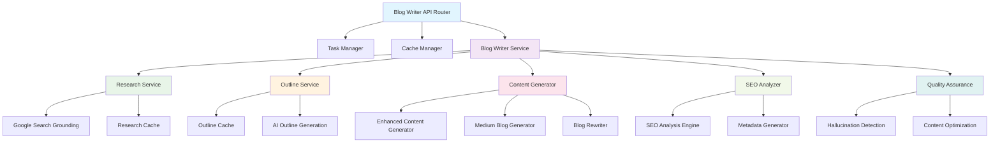
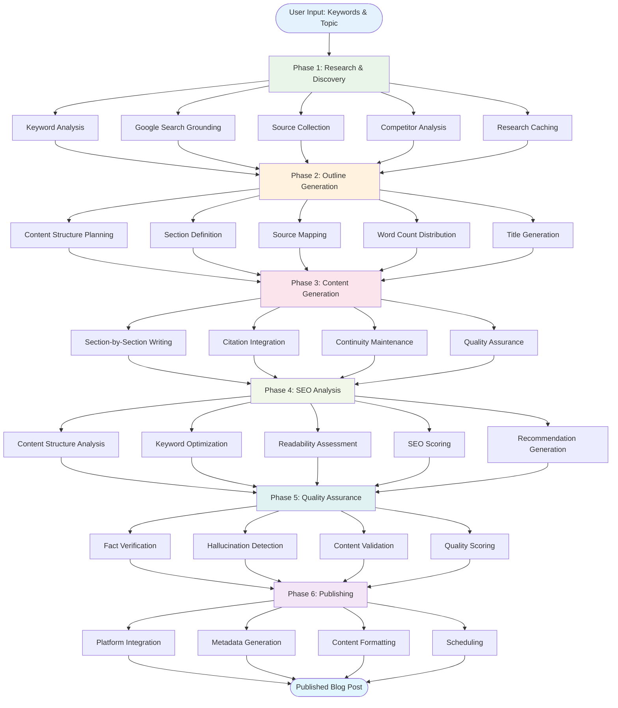
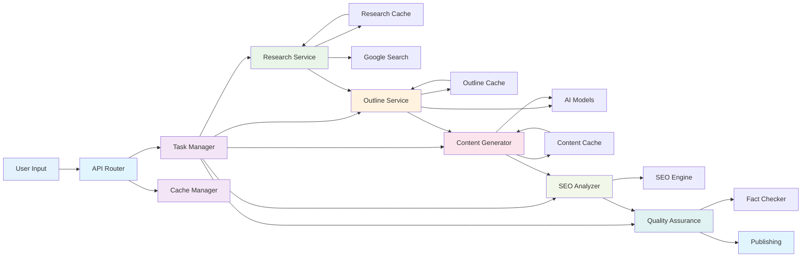

# Blog Writer Implementation Overview

The ALwrity Blog Writer is a comprehensive AI-powered content creation system that transforms research into high-quality, SEO-optimized blog posts through a sophisticated multi-phase workflow.

## 🏗️ Architecture Overview

The Blog Writer follows a modular, service-oriented architecture with clear separation of concerns:



## 📋 Core Components

### 1. **API Router** (`router.py`)
- **Purpose**: Main entry point for all Blog Writer operations
- **Key Features**:
  - RESTful API endpoints for all blog writing phases
  - Background task management with polling
  - Comprehensive error handling and logging
  - Cache management endpoints

### 2. **Task Manager** (`task_manager.py`)
- **Purpose**: Manages background operations and progress tracking
- **Key Features**:
  - Asynchronous task execution
  - Real-time progress updates
  - Task status tracking and cleanup
  - Memory management (1-hour task retention)

### 3. **Cache Manager** (`cache_manager.py`)
- **Purpose**: Handles research and outline caching for performance
- **Key Features**:
  - Research cache statistics and management
  - Outline cache operations
  - Cache invalidation and clearing
  - Performance optimization

### 4. **Blog Writer Service** (`blog_writer_service.py`)
- **Purpose**: Main orchestrator coordinating all blog writing operations
- **Key Features**:
  - Service coordination and workflow management
  - Integration with specialized services
  - Progress tracking and error handling
  - Task management integration

## 🔄 Blog Writing Workflow

The Blog Writer implements a sophisticated 6-phase workflow:



### Phase 1: Research & Discovery
**Endpoint**: `POST /api/blog/research/start`

**Process**:
1. **Keyword Analysis**: Analyze provided keywords for search intent
2. **Google Search Grounding**: Leverage Google's search capabilities for real-time data
3. **Source Collection**: Gather credible sources and research materials
4. **Competitor Analysis**: Analyze competing content and identify gaps
5. **Research Caching**: Store research results for future use

**Key Features**:
- Real-time web search integration
- Source credibility scoring
- Research data caching
- Progress tracking with detailed messages

### Phase 2: Outline Generation
**Endpoint**: `POST /api/blog/outline/start`

**Process**:
1. **Content Structure Planning**: Create logical content flow
2. **Section Definition**: Define headings, subheadings, and key points
3. **Source Mapping**: Map research sources to specific sections
4. **Word Count Distribution**: Optimize word count across sections
5. **Title Generation**: Create multiple compelling title options

**Key Features**:
- AI-powered outline generation
- Source-to-section mapping
- Multiple title options
- Outline optimization and refinement

### Phase 3: Content Generation
**Endpoint**: `POST /api/blog/section/generate`

**Process**:
1. **Section-by-Section Writing**: Generate content for each outline section
2. **Citation Integration**: Automatically include source citations
3. **Continuity Maintenance**: Ensure content flow and consistency
4. **Quality Assurance**: Implement quality checks during generation

**Key Features**:
- Individual section generation
- Automatic citation integration
- Content continuity tracking
- Multiple generation modes (draft/polished)

### Phase 4: SEO Analysis & Optimization
**Endpoint**: `POST /api/blog/seo/analyze`

**Process**:
1. **Content Structure Analysis**: Evaluate heading structure and organization
2. **Keyword Optimization**: Analyze keyword density and placement
3. **Readability Assessment**: Check content readability and flow
4. **SEO Scoring**: Generate comprehensive SEO scores
5. **Recommendation Generation**: Provide actionable optimization suggestions

**Key Features**:
- Comprehensive SEO analysis
- Real-time progress updates
- Detailed scoring and recommendations
- Visualization data for UI integration

### Phase 5: Quality Assurance
**Endpoint**: `POST /api/blog/quality/hallucination-check`

**Process**:
1. **Fact Verification**: Check content against research sources
2. **Hallucination Detection**: Identify potential AI-generated inaccuracies
3. **Content Validation**: Ensure factual accuracy and credibility
4. **Quality Scoring**: Generate content quality metrics

**Key Features**:
- AI-powered fact-checking
- Source verification
- Quality scoring and metrics
- Improvement suggestions

### Phase 6: Publishing & Distribution
**Endpoint**: `POST /api/blog/publish`

**Process**:
1. **Platform Integration**: Support for WordPress and Wix
2. **Metadata Generation**: Create SEO metadata and social tags
3. **Content Formatting**: Format content for target platform
4. **Scheduling**: Support for scheduled publishing

**Key Features**:
- Multi-platform publishing
- SEO metadata generation
- Social media optimization
- Publishing scheduling

## 🚀 Advanced Features

### Medium Blog Generation
**Endpoint**: `POST /api/blog/generate/medium/start`

A streamlined approach for shorter content (≤1000 words):
- Single-pass content generation
- Optimized for quick turnaround
- Cached content reuse
- Simplified workflow

### Content Optimization
**Endpoint**: `POST /api/blog/section/optimize`

Advanced content improvement:
- AI-powered content enhancement
- Flow analysis and improvement
- Engagement optimization
- Performance tracking

### Blog Rewriting
**Endpoint**: `POST /api/blog/rewrite/start`

Content improvement based on feedback:
- User feedback integration
- Iterative content improvement
- Quality enhancement
- Version tracking

## 📊 Data Flow Architecture

The Blog Writer processes data through a sophisticated pipeline with caching and optimization:



## 📊 Data Models

### Core Request/Response Models

**BlogResearchRequest**:
```python
{
    "keywords": ["list", "of", "keywords"],
    "topic": "optional topic",
    "industry": "optional industry",
    "target_audience": "optional audience",
    "tone": "optional tone",
    "word_count_target": 1500,
    "persona": PersonaInfo
}
```

**BlogOutlineResponse**:
```python
{
    "success": true,
    "title_options": ["title1", "title2", "title3"],
    "outline": [BlogOutlineSection],
    "source_mapping_stats": SourceMappingStats,
    "grounding_insights": GroundingInsights,
    "optimization_results": OptimizationResults,
    "research_coverage": ResearchCoverage
}
```

**BlogSectionResponse**:
```python
{
    "success": true,
    "markdown": "generated content",
    "citations": [ResearchSource],
    "continuity_metrics": ContinuityMetrics
}
```

## 🔧 Technical Implementation

### Background Task Processing
- **Asynchronous Execution**: All long-running operations use background tasks
- **Progress Tracking**: Real-time progress updates with detailed messages
- **Error Handling**: Comprehensive error handling and graceful failures
- **Memory Management**: Automatic cleanup of old tasks

### Caching Strategy
- **Research Caching**: Cache research results by keywords
- **Outline Caching**: Cache generated outlines for reuse
- **Content Caching**: Cache generated content sections
- **Performance Optimization**: Reduce API calls and improve response times

### Integration Points
- **Google Search Grounding**: Real-time web search integration
- **AI Providers**: Support for multiple AI providers (Gemini, OpenAI, etc.)
- **Platform APIs**: Integration with WordPress and Wix APIs
- **Analytics**: Integration with SEO and performance analytics

## 🎯 Performance Characteristics

### Response Times
- **Research Phase**: 30-60 seconds (depending on complexity)
- **Outline Generation**: 15-30 seconds
- **Content Generation**: 20-40 seconds per section
- **SEO Analysis**: 10-20 seconds
- **Quality Assurance**: 15-25 seconds

### Scalability Features
- **Background Processing**: Non-blocking operations
- **Caching**: Reduced API calls and improved performance
- **Task Management**: Efficient resource utilization
- **Error Recovery**: Graceful handling of failures

## 🔒 Quality Assurance

### Content Quality
- **Fact Verification**: Source-based fact checking
- **Hallucination Detection**: AI accuracy validation
- **Continuity Tracking**: Content flow and consistency
- **Quality Scoring**: Comprehensive quality metrics

### Technical Quality
- **Error Handling**: Comprehensive error management
- **Logging**: Detailed operation logging
- **Monitoring**: Performance and usage monitoring
- **Testing**: Automated testing and validation

## 📈 Future Enhancements

### Planned Features
- **Multi-language Support**: Content generation in multiple languages
- **Advanced Analytics**: Detailed performance analytics
- **Custom Templates**: User-defined content templates
- **Collaboration Features**: Multi-user content creation
- **API Extensions**: Additional platform integrations

### Performance Improvements
- **Caching Optimization**: Enhanced caching strategies
- **Parallel Processing**: Improved concurrent operations
- **Resource Optimization**: Better resource utilization
- **Response Time Reduction**: Faster operation completion

---

*This implementation overview provides a comprehensive understanding of the Blog Writer's architecture, workflow, and technical capabilities. For detailed API documentation, see the [API Reference](api-reference.md).*
