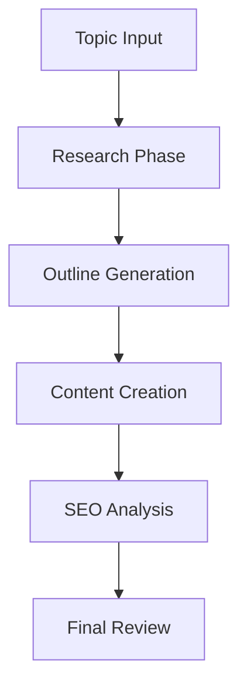

# Blog Writer Overview

The ALwrity Blog Writer is a powerful AI-driven content creation tool that helps you generate high-quality, SEO-optimized blog posts with minimal effort.

## Key Features

### 🤖 AI-Powered Content Generation
- **Topic Research**: Automated research and fact-checking
- **Content Structure**: Intelligent outline generation
- **Writing Styles**: Multiple writing styles and tones
- **SEO Optimization**: Built-in SEO analysis and recommendations

### 📊 Research Integration
- **Real-time Research**: Access to current information
- **Source Verification**: Fact-checking and source validation
- **Trend Analysis**: Current trends and topics
- **Competitor Analysis**: Content gap identification

### 🎯 SEO Optimization
- **Keyword Analysis**: Primary and secondary keyword optimization
- **Meta Tags**: Automatic meta description and title generation
- **Readability**: Content readability optimization
- **Internal Linking**: Smart internal linking suggestions

## How It Works

### 1. Content Planning

### 2. Research Process
- **Topic Analysis**: Understanding the subject matter
- **Keyword Research**: Identifying relevant keywords
- **Competitor Analysis**: Analyzing top-performing content
- **Source Gathering**: Collecting reliable information

### 3. Content Generation
- **Introduction**: Engaging opening paragraphs
- **Body Content**: Well-structured main content
- **Conclusion**: Compelling closing statements
- **Call-to-Action**: Strategic CTAs placement

## Content Types

### Blog Posts
- **How-to Guides**: Step-by-step tutorials
- **Listicles**: Numbered list articles
- **Case Studies**: Real-world examples
- **Opinion Pieces**: Thought leadership content

### Long-form Content
- **Comprehensive Guides**: In-depth resources
- **White Papers**: Professional documents
- **E-books**: Extended content pieces
- **Research Reports**: Data-driven content

## SEO Features

### Keyword Optimization
- **Primary Keywords**: Main topic keywords
- **Secondary Keywords**: Supporting terms
- **Long-tail Keywords**: Specific phrases
- **LSI Keywords**: Semantically related terms

### Content Structure
- **Headings**: H1, H2, H3 hierarchy
- **Paragraphs**: Optimal length and structure
- **Lists**: Bulleted and numbered lists
- **Images**: Alt text and captions

### Meta Optimization
- **Title Tags**: SEO-optimized titles
- **Meta Descriptions**: Compelling descriptions
- **URL Structure**: Clean, readable URLs
- **Schema Markup**: Structured data

## Writing Styles

### Professional
- **Business Content**: Corporate communications
- **Technical Writing**: Industry-specific content
- **Academic Style**: Research-based content
- **Formal Tone**: Professional language

### Conversational
- **Blog Style**: Casual, engaging tone
- **Social Media**: Platform-optimized content
- **Personal Brand**: Authentic voice
- **Community Content**: Community-focused writing

## Integration Features

### Google Search Console
- **Performance Data**: Real search performance
- **Keyword Insights**: Actual search queries
- **Click-through Rates**: CTR optimization
- **Search Rankings**: Position tracking

### Analytics Integration
- **Google Analytics**: Traffic analysis
- **Content Performance**: Engagement metrics
- **User Behavior**: Reader interaction data
- **Conversion Tracking**: Goal completion

## Best Practices

### Content Quality
1. **Research Thoroughly**: Use multiple sources
2. **Original Content**: Avoid plagiarism
3. **Fact-checking**: Verify all information
4. **Regular Updates**: Keep content current

### SEO Optimization
1. **Keyword Density**: Natural keyword usage
2. **Content Length**: Optimal word count
3. **Internal Linking**: Strategic link placement
4. **External Links**: Authoritative sources

### User Experience
1. **Readable Format**: Clear structure
2. **Visual Elements**: Images and graphics
3. **Mobile Optimization**: Responsive design
4. **Loading Speed**: Fast page loads

## Advanced Features

### Content Templates
- **Industry-specific**: Tailored templates
- **Content Types**: Various formats
- **Brand Guidelines**: Consistent styling
- **Custom Templates**: Personalized formats

### Collaboration Tools
- **Team Editing**: Multiple contributors
- **Version Control**: Content history
- **Comments**: Feedback system
- **Approval Workflow**: Review process

### Automation
- **Scheduled Publishing**: Automated posting
- **Content Calendar**: Planning tools
- **Social Sharing**: Auto-distribution
- **Performance Monitoring**: Analytics tracking

## Getting Started

1. **[Research Integration](research.md)** - Set up automated research
2. **[SEO Analysis](seo-analysis.md)** - Configure SEO optimization
3. **[Implementation Spec](implementation-spec.md)** - Technical details
4. **[Best Practices](../guides/best-practices.md)** - Optimization tips

## Related Features

- **[SEO Dashboard](../seo-dashboard/overview.md)** - Comprehensive SEO tools
- **[Content Strategy](../content-strategy/overview.md)** - Strategic planning
- **[LinkedIn Writer](../linkedin-writer/overview.md)** - Social content
- **[AI Features](../ai/assistive-writing.md)** - Advanced AI capabilities

---

*Ready to create amazing blog content? Check out our [Research Integration Guide](research.md) to get started!*
