# Blog Writer Workflow Guide

A comprehensive guide to using the ALwrity Blog Writer, from initial research to published content. This guide walks you through each phase of the blog writing process with practical examples and best practices.

## 🎯 Overview

The ALwrity Blog Writer follows a sophisticated 6-phase workflow designed to create high-quality, SEO-optimized blog content:


## ⏱️ Timeline Overview

Each phase has specific time requirements and dependencies:


## 📋 Prerequisites

Before starting, ensure you have:

- **API Access**: Valid ALwrity API key
- **Research Keywords**: 3-5 relevant keywords for your topic
- **Target Audience**: Clear understanding of your audience
- **Content Goals**: Defined objectives for your blog post
- **Word Count Target**: Desired length (typically 1000-3000 words)

## 🔍 Phase 1: Research & Discovery

### Step 1: Initiate Research

**Endpoint**: `POST /api/blog/research/start`

**Request Example**:
```json
{
  "keywords": ["artificial intelligence", "healthcare", "medical diagnosis"],
  "topic": "AI in Medical Diagnosis",
  "industry": "Healthcare Technology",
  "target_audience": "Healthcare professionals and medical researchers",
  "tone": "Professional and authoritative",
  "word_count_target": 2000,
  "persona": {
    "persona_id": "healthcare_professional",
    "tone": "authoritative",
    "audience": "healthcare professionals",
    "industry": "healthcare"
  }
}
```

**What Happens**:
1. **Keyword Analysis**: AI analyzes your keywords for search intent and relevance
2. **Web Search**: Google Search grounding finds current, credible sources
3. **Source Collection**: Gathers 10-20 high-quality research sources
4. **Competitor Analysis**: Identifies competing content and gaps
5. **Research Caching**: Stores results for future use

**Expected Duration**: 30-60 seconds

### Step 2: Monitor Research Progress

**Endpoint**: `GET /api/blog/research/status/{task_id}`

**Progress Messages**:
- "🔍 Starting research operation..."
- "📋 Checking cache for existing research..."
- "🌐 Conducting web search..."
- "📊 Analyzing sources..."
- "✅ Research completed successfully! Found 15 sources and 8 search queries."

**Success Indicators**:
- `status: "completed"`
- 10+ credible sources
- Comprehensive keyword analysis
- Identified content gaps and opportunities

### Step 3: Review Research Results

**Key Data Points**:
- **Sources**: Credible, recent research materials
- **Keyword Analysis**: Primary and secondary keywords
- **Competitor Analysis**: Top competing content
- **Suggested Angles**: Unique content opportunities
- **Search Queries**: AI-generated search terms

**Quality Checklist**:
- ✅ Sources are recent (within 2 years)
- ✅ High credibility scores (0.8+)
- ✅ Diverse source types (academic, industry, government)
- ✅ Relevant to your target audience
- ✅ Covers multiple aspects of your topic

## 📝 Phase 2: Outline Generation

### Step 1: Generate Outline

**Endpoint**: `POST /api/blog/outline/start`

**Request Example**:
```json
{
  "research": {
    "success": true,
    "sources": [...],
    "keyword_analysis": {...},
    "competitor_analysis": {...},
    "suggested_angles": [...],
    "search_queries": [...],
    "grounding_metadata": {...}
  },
  "persona": {
    "persona_id": "healthcare_professional",
    "tone": "authoritative",
    "audience": "healthcare professionals",
    "industry": "healthcare"
  },
  "word_count": 2000,
  "custom_instructions": "Focus on practical implementation examples and case studies"
}
```

**What Happens**:
1. **Content Structure Planning**: Creates logical flow and organization
2. **Section Definition**: Defines headings, subheadings, and key points
3. **Source Mapping**: Maps research sources to specific sections
4. **Word Count Distribution**: Optimizes word count across sections
5. **Title Generation**: Creates multiple compelling title options

**Expected Duration**: 15-30 seconds

### Step 2: Review Generated Outline

**Key Components**:
- **Title Options**: 3-5 compelling, SEO-optimized titles
- **Outline Sections**: 5-8 well-structured sections
- **Source Mapping**: Research sources mapped to sections
- **Word Distribution**: Balanced word count across sections
- **Quality Metrics**: Overall outline quality score

**Quality Checklist**:
- ✅ Logical content flow and progression
- ✅ Balanced word count distribution
- ✅ Strong source coverage (80%+ sources mapped)
- ✅ SEO-optimized headings and structure
- ✅ Engaging title options

### Step 3: Refine Outline (Optional)

**Endpoint**: `POST /api/blog/outline/refine`

**Common Refinements**:
- **Enhance Flow**: Improve section transitions
- **Optimize Structure**: Better heading hierarchy
- **Rebalance Word Count**: Adjust section lengths
- **Add Sections**: Include missing content areas
- **Improve SEO**: Better keyword distribution

## ✍️ Phase 3: Content Generation

### Step 1: Generate Section Content

**Endpoint**: `POST /api/blog/section/generate`

**Request Example**:
```json
{
  "section": {
    "id": "intro",
    "heading": "Introduction: AI Revolution in Medical Diagnosis",
    "subheadings": [
      "Current State of Medical Diagnosis",
      "The Promise of AI Technology"
    ],
    "key_points": [
      "AI adoption rates in healthcare",
      "Key benefits of AI diagnosis",
      "Overview of current applications"
    ],
    "references": [...],
    "target_words": 300,
    "keywords": ["AI healthcare", "medical diagnosis", "healthcare technology"]
  },
  "keywords": ["AI healthcare", "medical diagnosis"],
  "tone": "professional",
  "persona": {
    "persona_id": "healthcare_professional",
    "tone": "authoritative",
    "audience": "healthcare professionals",
    "industry": "healthcare"
  },
  "mode": "polished"
}
```

**What Happens**:
1. **Content Generation**: AI writes section content based on outline
2. **Citation Integration**: Automatically includes source citations
3. **Continuity Tracking**: Maintains content flow and consistency
4. **Quality Assurance**: Implements quality checks during generation

**Expected Duration**: 20-40 seconds per section

### Step 2: Review Generated Content

**Key Components**:
- **Markdown Content**: Well-formatted, engaging content
- **Citations**: Properly integrated source references
- **Continuity Metrics**: Content flow and consistency scores
- **Quality Scores**: Readability and engagement metrics

**Quality Checklist**:
- ✅ Meets target word count (±10%)
- ✅ Includes relevant citations
- ✅ Maintains professional tone
- ✅ Good readability score (70+)
- ✅ Proper keyword integration

### Step 3: Generate Remaining Sections

Repeat the process for each outline section:

1. **Introduction** (300 words)
2. **Key Applications** (500 words)
3. **Benefits and Challenges** (400 words)
4. **Implementation Strategies** (500 words)
5. **Future Outlook** (300 words)

**Pro Tips**:
- Generate sections in order for better continuity
- Review each section before proceeding
- Use continuity metrics to ensure flow
- Adjust tone and style as needed

## 🔍 Phase 4: SEO Analysis & Optimization

### Step 1: Perform SEO Analysis

**Endpoint**: `POST /api/blog/seo/analyze`

**Request Example**:
```json
{
  "content": "# AI in Medical Diagnosis\n\nComplete blog content here...",
  "blog_title": "AI in Medical Diagnosis: Transforming Healthcare Through Technology",
  "keywords": ["AI healthcare", "medical diagnosis", "healthcare technology"],
  "research_data": {
    "sources": [...],
    "keyword_analysis": {...},
    "competitor_analysis": {...}
  }
}
```

**What Happens**:
1. **Content Structure Analysis**: Evaluates heading hierarchy and organization
2. **Keyword Optimization**: Analyzes keyword density and placement
3. **Readability Assessment**: Checks content readability and flow
4. **SEO Scoring**: Generates comprehensive SEO scores
5. **Recommendation Generation**: Provides actionable optimization suggestions

**Expected Duration**: 10-20 seconds

### Step 2: Review SEO Analysis

**Key Metrics**:
- **Overall SEO Score**: 0-100 (aim for 80+)
- **Keyword Density**: Optimal range (1-3%)
- **Readability Score**: Flesch Reading Ease (aim for 70+)
- **Structure Analysis**: Heading hierarchy and organization
- **Recommendations**: Specific improvement suggestions

**Quality Checklist**:
- ✅ SEO score above 80
- ✅ Optimal keyword density
- ✅ Good readability score
- ✅ Proper heading structure
- ✅ Actionable recommendations

### Step 3: Generate SEO Metadata

**Endpoint**: `POST /api/blog/seo/metadata`

**Request Example**:
```json
{
  "content": "# AI in Medical Diagnosis\n\nComplete blog content here...",
  "title": "AI in Medical Diagnosis: Transforming Healthcare Through Technology",
  "keywords": ["AI healthcare", "medical diagnosis", "healthcare technology"],
  "research_data": {
    "sources": [...],
    "keyword_analysis": {...}
  }
}
```

**Generated Metadata**:
- **SEO Title**: Optimized for search engines
- **Meta Description**: Compelling 155-character description
- **URL Slug**: SEO-friendly URL structure
- **Tags & Categories**: Relevant content classification
- **Social Media Tags**: Open Graph and Twitter Card data
- **JSON-LD Schema**: Structured data for search engines

## 🛡️ Phase 5: Quality Assurance

### Step 1: Perform Hallucination Check

**Endpoint**: `POST /api/blog/quality/hallucination-check`

**Request Example**:
```json
{
  "content": "Complete blog content here...",
  "sources": [
    "https://example.com/source1",
    "https://example.com/source2"
  ]
}
```

**What Happens**:
1. **Fact Verification**: Checks content against research sources
2. **Hallucination Detection**: Identifies potential AI-generated inaccuracies
3. **Content Validation**: Ensures factual accuracy and credibility
4. **Quality Scoring**: Generates content quality metrics

**Expected Duration**: 15-25 seconds

### Step 2: Review Quality Results

**Key Metrics**:
- **Factual Accuracy**: Percentage of verified claims
- **Source Coverage**: Percentage of content backed by sources
- **Quality Score**: Overall content quality (0-100)
- **Improvement Suggestions**: Specific enhancement recommendations

**Quality Checklist**:
- ✅ High factual accuracy (90%+)
- ✅ Good source coverage (80%+)
- ✅ Quality score above 85
- ✅ No major factual errors
- ✅ Clear improvement suggestions

### Step 3: Content Optimization (Optional)

**Endpoint**: `POST /api/blog/section/optimize`

**Common Optimizations**:
- **Improve Readability**: Simplify complex sentences
- **Enhance Engagement**: Add compelling examples and stories
- **Strengthen Arguments**: Provide more supporting evidence
- **Fix Flow Issues**: Improve section transitions
- **Optimize Keywords**: Better keyword integration

## 🚀 Phase 6: Publishing & Distribution

### Step 1: Prepare for Publishing

**Endpoint**: `POST /api/blog/publish`

**Request Example**:
```json
{
  "platform": "wordpress",
  "html": "<h1>AI in Medical Diagnosis</h1><p>Content here...</p>",
  "metadata": {
    "seo_title": "AI in Medical Diagnosis: Transforming Healthcare Through Technology",
    "meta_description": "Discover how AI is transforming medical diagnosis...",
    "url_slug": "ai-medical-diagnosis-healthcare-technology",
    "blog_tags": ["AI healthcare", "medical diagnosis", "healthcare technology"],
    "blog_categories": ["Healthcare Technology", "Artificial Intelligence"],
    "social_hashtags": ["#AIHealthcare", "#MedicalAI", "#HealthTech"]
  },
  "schedule_time": "2024-01-20T09:00:00Z"
}
```

**What Happens**:
1. **Platform Integration**: Connects to WordPress or Wix
2. **Content Formatting**: Formats content for target platform
3. **Metadata Application**: Applies SEO metadata and tags
4. **Publishing**: Publishes content or schedules for later

**Expected Duration**: 5-15 seconds

### Step 2: Verify Publication

**Success Indicators**:
- ✅ Content published successfully
- ✅ SEO metadata applied correctly
- ✅ Social media tags included
- ✅ URL generated and accessible
- ✅ Scheduled publication confirmed (if applicable)

## 🔄 Blog Rewrite Workflow

The Blog Writer includes a sophisticated rewrite system for content improvement:


## 🔀 Workflow Decision Tree

The Blog Writer adapts its workflow based on your specific needs:

```mermaid
flowchart TD
    Start([Start Blog Creation]) --> Input{What's your content goal?}
    
    Input -->|Quick Content| Quick[Medium Blog Generation<br/>≤1000 words]
    Input -->|Comprehensive Content| Full[Full Blog Workflow<br/>1000+ words]
    Input -->|Content Improvement| Rewrite[Blog Rewriting<br/>Based on feedback]
    
    Quick --> QuickResearch[Basic Research]
    QuickResearch --> QuickOutline[Simple Outline]
    QuickOutline --> QuickContent[Single-pass Generation]
    QuickContent --> QuickSEO[Basic SEO]
    QuickSEO --> QuickPublish[Publish]
    
    Full --> FullResearch[Comprehensive Research]
    FullResearch --> FullOutline[Detailed Outline]
    FullOutline --> FullContent[Section-by-Section]
    FullContent --> FullSEO[Advanced SEO]
    FullSEO --> FullQA[Quality Assurance]
    FullQA --> FullPublish[Publish]
    
    Rewrite --> RewriteAnalysis[Analyze Current Content]
    RewriteAnalysis --> RewriteFeedback[Apply User Feedback]
    RewriteFeedback --> RewriteImprove[Improve Content]
    RewriteImprove --> RewriteQA[Quality Check]
    RewriteQA --> RewritePublish[Publish Updated]
    
    style Start fill:#e3f2fd
    style Quick fill:#e8f5e8
    style Full fill:#fff3e0
    style Rewrite fill:#fce4ec
    style QuickPublish fill:#e1f5fe
    style FullPublish fill:#e1f5fe
    style RewritePublish fill:#e1f5fe
```



## 🔄 Blog Rewrite Workflow

### When to Use Blog Rewrite

The Blog Rewrite feature is ideal when you need to:

- **Improve Engagement**: Make content more compelling and reader-friendly
- **Add Examples**: Include specific, relevant examples and case studies
- **Enhance Clarity**: Improve readability and reduce complexity
- **Update Information**: Incorporate new data or recent developments
- **Refine Tone**: Adjust the writing style for different audiences
- **Optimize Structure**: Improve flow and logical progression

### Rewrite Process

#### Step 1: Provide Feedback
```json
{
  "user_feedback": {
    "improvements_needed": [
      "Make the introduction more engaging",
      "Add more specific examples",
      "Improve the conclusion"
    ],
    "target_audience": "healthcare professionals",
    "tone": "professional",
    "focus_areas": ["engagement", "examples", "clarity"]
  }
}
```

#### Step 2: Configure Rewrite Options
```json
{
  "rewrite_options": {
    "preserve_structure": true,
    "enhance_engagement": true,
    "add_examples": true,
    "improve_clarity": true
  }
}
```

#### Step 3: Monitor Progress
- **Started**: Task initiated successfully
- **Analyzing**: Reviewing original content and feedback
- **Planning**: Developing rewrite strategy
- **Rewriting**: Generating improved content
- **Reviewing**: Final quality assessment
- **Completed**: Enhanced content ready

#### Step 4: Review Results
The rewrite system provides:
- **Original vs. Rewritten Content**: Side-by-side comparison
- **Improvements Made**: Detailed list of enhancements
- **Quality Metrics**: Before/after scores for engagement, readability, clarity
- **Preserved Elements**: What was maintained from the original
- **New Elements**: What was added or enhanced

### Rewrite Best Practices

#### Effective Feedback
- **Be Specific**: Instead of "make it better," specify "add more healthcare examples"
- **Focus Areas**: Identify 2-3 key areas for improvement
- **Target Audience**: Clearly define who will read the content
- **Tone Guidelines**: Specify the desired writing style

#### Quality Expectations
- **Engagement Score**: Target 0.85+ for compelling content
- **Readability Score**: Target 0.80+ for clear communication
- **Clarity Score**: Target 0.90+ for professional content
- **Overall Improvement**: Expect 15-25% improvement in quality metrics

#### Common Use Cases
1. **Content Refresh**: Update existing blog posts with new information
2. **Audience Adaptation**: Modify content for different reader groups
3. **Engagement Boost**: Make technical content more accessible
4. **SEO Enhancement**: Improve content for better search rankings
5. **Brand Alignment**: Adjust tone to match brand voice

## 🎯 Best Practices

### Research Phase
- **Use Specific Keywords**: Avoid overly broad terms
- **Define Clear Audience**: Be specific about target readers
- **Set Realistic Word Count**: 1000-3000 words typically optimal
- **Review Source Quality**: Ensure credible, recent sources

### Outline Phase
- **Review Title Options**: Choose the most compelling and SEO-friendly
- **Check Section Balance**: Ensure even word count distribution
- **Verify Source Mapping**: Confirm good source coverage
- **Refine as Needed**: Use refinement tools for better structure

### Content Generation
- **Generate in Order**: Maintain content flow and continuity
- **Review Each Section**: Check quality before proceeding
- **Monitor Continuity**: Use continuity metrics for consistency
- **Adjust Tone**: Ensure consistent voice throughout

### SEO Optimization
- **Aim for High Scores**: Target SEO score above 80
- **Optimize Keywords**: Ensure proper density and placement
- **Improve Readability**: Target Flesch score above 70
- **Follow Recommendations**: Implement suggested improvements

### Quality Assurance
- **Verify Facts**: Ensure high factual accuracy
- **Check Sources**: Confirm good source coverage
- **Review Quality**: Aim for quality score above 85
- **Address Issues**: Fix any identified problems

### Publishing
- **Choose Right Platform**: Select appropriate publishing platform
- **Apply Metadata**: Ensure all SEO metadata is included
- **Schedule Strategically**: Publish at optimal times
- **Verify Results**: Confirm successful publication

## 🚨 Common Issues & Solutions

### Research Issues
**Problem**: Low-quality sources
**Solution**: Refine keywords, adjust topic focus, increase word count target

**Problem**: Insufficient research data
**Solution**: Add more keywords, broaden topic scope, adjust target audience

### Outline Issues
**Problem**: Poor section structure
**Solution**: Use outline refinement, adjust custom instructions, review research data

**Problem**: Unbalanced word distribution
**Solution**: Use rebalance outline feature, adjust target word counts

### Content Issues
**Problem**: Low continuity scores
**Solution**: Generate sections in order, review continuity metrics, adjust tone

**Problem**: Poor readability
**Solution**: Use content optimization, simplify language, improve structure

### SEO Issues
**Problem**: Low SEO scores
**Solution**: Improve keyword density, enhance structure, follow recommendations

**Problem**: Poor readability scores
**Solution**: Simplify sentences, improve paragraph structure, use shorter words

### Quality Issues
**Problem**: Low factual accuracy
**Solution**: Review sources, improve citations, verify claims

**Problem**: Poor source coverage
**Solution**: Add more research sources, improve source mapping, enhance citations

## 📊 Performance Metrics

### Target Metrics Visualization


### Performance Dashboard


### Target Metrics
- **Research Quality**: 10+ credible sources, 0.8+ credibility scores
- **Outline Quality**: 80%+ source coverage, balanced word distribution
- **Content Quality**: 85+ quality score, 70+ readability score
- **SEO Performance**: 80+ SEO score, optimal keyword density
- **Factual Accuracy**: 90%+ accuracy, 80%+ source coverage

### Monitoring
- **Track Progress**: Monitor each phase completion
- **Review Metrics**: Check quality scores at each step
- **Address Issues**: Fix problems as they arise
- **Optimize Continuously**: Use feedback for improvement

---

*This workflow guide provides a comprehensive approach to using the ALwrity Blog Writer effectively. For technical details, see the [API Reference](api-reference.md) and [Implementation Overview](implementation-overview.md).*
