# Content Strategy Overview

ALwrity's Content Strategy module is the brain of your content marketing efforts, providing AI-powered strategic planning, persona development, and content calendar generation to help you create a comprehensive, data-driven content marketing strategy.

## What is Content Strategy?

Content strategy is the planning, development, and management of content to achieve specific business objectives. ALwrity's AI-powered approach transforms complex strategic planning into an automated, intelligent process that delivers measurable results.

### Key Components

- **Strategic Planning**: AI-generated content strategies based on your business goals
- **Persona Development**: Detailed buyer personas created from data analysis
- **Content Planning**: Comprehensive content calendars and topic clusters
- **Performance Tracking**: Analytics and optimization recommendations
- **Competitive Analysis**: Market positioning and gap identification

## AI-Powered Strategic Planning

### Intelligent Strategy Generation

ALwrity analyzes your business information, target audience, and goals to create a comprehensive content strategy:

#### Business Analysis
- **Industry Research**: Deep analysis of your industry landscape
- **Competitive Positioning**: Understanding your market position
- **Opportunity Identification**: Finding content gaps and opportunities
- **Goal Alignment**: Ensuring content supports business objectives

#### Audience Intelligence
- **Demographic Analysis**: Age, gender, location, income analysis
- **Psychographic Profiling**: Interests, values, lifestyle insights
- **Behavioral Patterns**: Online behavior and content consumption habits
- **Pain Point Mapping**: Identifying audience challenges and needs

#### Content Planning
- **Topic Clusters**: Organized content themes and relationships
- **Content Mix**: Balanced variety of content types and formats
- **Publishing Schedule**: Optimal timing and frequency recommendations
- **Distribution Strategy**: Multi-channel content distribution plan

### Strategic Framework

```mermaid
graph LR
    subgraph "Foundation Phase"
        A[Business Goals] --> B[Target Audience]
        B --> C[Brand Voice]
        C --> D[Content Pillars]
    end
    
    subgraph "Research Phase"
        E[Market Research] --> F[Competitor Analysis]
        F --> G[Keyword Research]
        G --> H[Audience Research]
    end
    
    subgraph "Strategy Phase"
        I[Content Calendar] --> J[Topic Clusters]
        J --> K[Content Types]
        K --> L[Distribution Plan]
    end
    
    subgraph "Implementation Phase"
        M[Content Creation] --> N[Performance Tracking]
        N --> O[Strategy Refinement]
        O --> P[Scaling Success]
    end
    
    D --> E
    H --> I
    L --> M
    
    style A fill:#e1f5fe
    style D fill:#e1f5fe
    style E fill:#fff3e0
    style H fill:#fff3e0
    style I fill:#f3e5f5
    style L fill:#f3e5f5
    style M fill:#e8f5e8
    style P fill:#e8f5e8
```

#### 1. Foundation Setting
- **Business Goals**: Define clear, measurable objectives
- **Target Audience**: Identify and understand your audience
- **Brand Voice**: Establish consistent messaging and tone
- **Content Pillars**: Define 3-5 main content themes

#### 2. Research and Analysis
- **Market Research**: Industry trends and opportunities
- **Competitor Analysis**: Content strategies of top competitors
- **Keyword Research**: SEO opportunities and search behavior
- **Audience Research**: Deep dive into target audience needs

#### 3. Strategy Development
- **Content Calendar**: 12-month strategic content plan
- **Topic Clusters**: Organized content themes and relationships
- **Content Types**: Mix of blog posts, social media, videos, etc.
- **Distribution Plan**: Multi-channel content distribution strategy

#### 4. Implementation and Optimization
- **Content Creation**: AI-powered content generation
- **Performance Tracking**: Monitor key metrics and KPIs
- **Strategy Refinement**: Continuous improvement based on data
- **Scaling Success**: Replicate and scale winning strategies

## Persona Development

### AI-Generated Buyer Personas

ALwrity creates detailed, data-driven buyer personas that inform all your content decisions:

#### Persona Components

**Demographics**
- Age, gender, location
- Income level and education
- Job title and industry
- Company size and type

**Psychographics**
- Interests and hobbies
- Values and beliefs
- Lifestyle and behavior
- Media consumption habits

**Pain Points and Challenges**
- Current problems and frustrations
- Goals and aspirations
- Decision-making process
- Information needs

**Content Preferences**
- Preferred content formats
- Consumption patterns
- Platform preferences
- Engagement behaviors

### Persona-Driven Content

#### Content Personalization
- **Tone and Style**: Match content tone to persona preferences
- **Topic Selection**: Choose topics that resonate with each persona
- **Format Optimization**: Use preferred content formats
- **Channel Selection**: Distribute content on preferred platforms

#### Journey Mapping
- **Awareness Stage**: Educational content for problem recognition
- **Consideration Stage**: Comparison and evaluation content
- **Decision Stage**: Product-focused and testimonial content
- **Retention Stage**: Customer success and loyalty content

## Content Calendar Generation

### Intelligent Calendar Planning

ALwrity generates comprehensive content calendars that align with your strategy:

#### Calendar Features
- **12-Month Planning**: Long-term strategic content planning
- **Seasonal Optimization**: Content aligned with seasons and events
- **Topic Clusters**: Organized content themes and relationships
- **Multi-Platform**: Coordinated content across all channels

#### Content Types
- **Blog Posts**: In-depth articles and guides
- **Social Media**: Platform-specific social content
- **Email Campaigns**: Newsletter and promotional content
- **Video Content**: Scripts and video planning
- **Infographics**: Visual content planning
- **Webinars**: Educational event planning

### Publishing Optimization

#### Timing Strategy
- **Optimal Publishing Times**: Data-driven timing recommendations
- **Platform-Specific Timing**: Best times for each social platform
- **Audience Activity**: Content timing based on audience behavior
- **Competitive Analysis**: Timing relative to competitor activity

#### Content Mix
- **Educational Content**: 40% - How-to guides and tutorials
- **Inspirational Content**: 20% - Motivational and success stories
- **Promotional Content**: 20% - Product and service promotion
- **Behind-the-Scenes**: 20% - Company culture and processes

## Performance Analytics

### Strategic Metrics

#### Content Performance
- **Engagement Rates**: Likes, shares, comments, and saves
- **Traffic Metrics**: Page views, unique visitors, and session duration
- **Conversion Rates**: Lead generation and sales attribution
- **Brand Awareness**: Mentions, reach, and brand recognition

#### SEO Performance
- **Search Rankings**: Keyword position tracking
- **Organic Traffic**: Search engine traffic growth
- **Backlink Acquisition**: Link building success
- **Domain Authority**: Overall SEO strength improvement

#### Business Impact
- **Lead Generation**: Qualified leads from content
- **Sales Attribution**: Revenue attributed to content
- **Customer Acquisition**: New customers from content
- **Customer Retention**: Content impact on retention

### Optimization Recommendations

#### Content Optimization
- **Performance Analysis**: Identify top-performing content
- **Gap Analysis**: Find content opportunities
- **A/B Testing**: Test different approaches
- **Content Refresh**: Update and repurpose existing content

#### Strategy Refinement
- **Audience Insights**: Refine personas based on data
- **Content Mix Adjustment**: Optimize content type distribution
- **Publishing Schedule**: Adjust timing based on performance
- **Channel Optimization**: Focus on highest-performing channels

## Competitive Intelligence

### Market Analysis

#### Competitor Research
- **Content Audit**: Analysis of competitor content strategies
- **Topic Analysis**: Content themes and topics covered
- **Performance Benchmarking**: Compare content performance
- **Gap Identification**: Find content opportunities competitors miss

#### Market Positioning
- **Unique Value Proposition**: Differentiate your content
- **Content Differentiation**: Stand out from competitors
- **Market Opportunities**: Identify underserved content areas
- **Trend Analysis**: Stay ahead of industry trends

### Competitive Advantage

#### Content Gaps
- **Underserved Topics**: Content areas competitors ignore
- **Audience Needs**: Unmet audience information needs
- **Format Opportunities**: Content formats competitors don't use
- **Channel Gaps**: Platforms competitors aren't utilizing

#### Differentiation Strategy
- **Unique Angle**: Different perspective on common topics
- **Expertise Showcase**: Demonstrate unique knowledge
- **Storytelling**: Use compelling narratives
- **Interactive Content**: Engage audiences differently

## Integration with Other Modules

### Blog Writer Integration
- **Strategic Content**: Blog posts aligned with overall strategy
- **SEO Optimization**: Content optimized for target keywords
- **Persona Alignment**: Content tailored to specific personas
- **Performance Tracking**: Monitor blog content success

### SEO Dashboard Integration
- **Keyword Strategy**: SEO keywords integrated into content plan
- **Performance Analysis**: SEO metrics inform content strategy
- **Technical Optimization**: Content optimized for search engines
- **Competitive SEO**: SEO strategy aligned with content strategy

### Social Media Integration
- **Platform Strategy**: Content adapted for each social platform
- **Engagement Optimization**: Content designed for social engagement
- **Cross-Platform Coordination**: Coordinated messaging across platforms
- **Social Listening**: Social insights inform content strategy

## Best Practices

### Strategy Development
1. **Start with Goals**: Define clear, measurable business objectives
2. **Know Your Audience**: Develop detailed, data-driven personas
3. **Research Thoroughly**: Understand market and competitive landscape
4. **Plan Long-term**: Create 12-month strategic content plans
5. **Measure Everything**: Track performance and optimize continuously

### Content Planning
1. **Balance Content Types**: Mix educational, inspirational, and promotional content
2. **Maintain Consistency**: Regular publishing schedule and brand voice
3. **Optimize for Each Platform**: Adapt content for different channels
4. **Plan for Seasons**: Align content with seasons and events
5. **Repurpose Content**: Maximize value from each piece of content

### Performance Optimization
1. **Set Clear KPIs**: Define success metrics for each content type
2. **Monitor Regularly**: Track performance weekly and monthly
3. **Analyze Trends**: Identify patterns in successful content
4. **Test and Iterate**: Continuously test and improve strategies
5. **Scale Success**: Replicate and scale winning approaches

## Getting Started

### Initial Setup
1. **Business Information**: Provide detailed business and audience information
2. **Goal Definition**: Set clear content marketing objectives
3. **Persona Generation**: Let AI create detailed buyer personas
4. **Strategy Development**: Generate comprehensive content strategy
5. **Calendar Creation**: Create 12-month content calendar

### Implementation
1. **Content Creation**: Use strategy to guide content creation
2. **Publishing**: Follow calendar for consistent publishing
3. **Performance Tracking**: Monitor key metrics and KPIs
4. **Optimization**: Refine strategy based on performance data
5. **Scaling**: Expand successful strategies and content types

## Advanced Features

### AI-Powered Insights
- **Trend Prediction**: AI identifies emerging content trends
- **Performance Forecasting**: Predict content success before publishing
- **Audience Evolution**: Track how personas change over time
- **Market Opportunity**: Identify new content opportunities

### Automation
- **Content Scheduling**: Automated content publishing
- **Performance Monitoring**: Real-time performance tracking
- **Strategy Updates**: Automatic strategy refinement
- **Report Generation**: Automated performance reports

---

*Ready to develop your content strategy? [Start with our First Steps Guide](../../getting-started/first-steps.md) or [Explore Persona Development](personas.md) to begin building your strategic content plan!*
