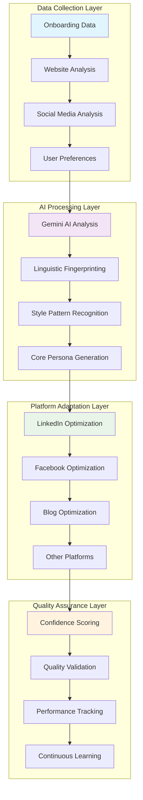

# Persona System Overview

The ALwrity Persona System is a revolutionary AI-powered feature that creates personalized writing assistants tailored specifically to your voice, style, and communication preferences. It analyzes your writing patterns and creates platform-specific optimizations for LinkedIn, Facebook, and other social media platforms.

## 🎯 What is the Persona System?

The Persona System transforms generic content generation into hyper-personalized, platform-optimized content creation. It builds upon a sophisticated core persona that captures your authentic writing style, voice, and communication preferences, then intelligently adapts for each platform while maintaining your core identity and brand voice.

### Key Benefits

- **Authentic Voice**: Maintains your unique writing style across all platforms
- **Platform Optimization**: Adapts content for each platform's algorithm and audience
- **Quality Consistency**: Ensures consistent, high-quality content generation
- **Time Efficiency**: Automates personalized content creation
- **Engagement Improvement**: Optimizes content for better audience engagement

## 🏗️ System Architecture

## 🚀 Core Features

### 1. Hyper-Personalized Content Generation

#### Intelligent Persona Creation
- **AI-Powered Analysis**: Advanced machine learning algorithms analyze your writing patterns, tone, and communication style
- **Comprehensive Data Collection**: Extracts insights from website content, social media presence, and user preferences
- **Multi-Dimensional Profiling**: Creates detailed linguistic fingerprints including vocabulary, sentence structure, and rhetorical devices
- **Confidence Scoring**: Provides quality metrics and confidence levels for each generated persona

#### Platform-Specific Optimization
- **Algorithm Awareness**: Each persona understands and optimizes for platform-specific algorithms
- **Content Format Adaptation**: Automatically adjusts content structure for platform constraints
- **Audience Targeting**: Leverages platform demographics and user behavior patterns
- **Engagement Optimization**: Implements platform-specific engagement strategies

### 2. Platform-Specific Adaptations

#### LinkedIn Integration
- **Professional Networking Optimization**: Specialized for professional networking and B2B communication
- **Thought Leadership**: Optimizes content for establishing industry authority
- **Professional Tone**: Maintains appropriate business communication standards
- **Industry Context**: Incorporates industry-specific terminology and best practices

#### Facebook Integration
- **Community Building Focus**: Optimized for community building and social engagement
- **Viral Content Potential**: Strategies for creating shareable, engaging content
- **Community Features**: Leverages Facebook Groups, Events, and Live features
- **Audience Interaction**: Emphasizes community building and social sharing

#### Blog/Medium Integration
- **Long-Form Content**: Optimized for comprehensive, in-depth content
- **SEO Optimization**: Built-in SEO analysis and recommendations
- **Reader Engagement**: Strategies for maintaining reader interest
- **Content Structure**: Intelligent outline generation and content organization

### 3. Quality Assurance and Learning

#### Continuous Improvement
- **Performance Learning**: Learns from your content performance and engagement metrics
- **Feedback Integration**: Incorporates your feedback and preferences
- **Algorithm Updates**: Adapts to platform algorithm changes
- **Quality Enhancement**: Continuous optimization of persona generation

#### Quality Metrics
- **Style Consistency Score**: Measures how well the persona maintains your writing style
- **Authenticity Score**: Evaluates how authentic the generated content feels
- **Readability Score**: Ensures content is readable and engaging
- **Engagement Potential**: Predicts content performance based on persona optimization

## 🎨 Understanding Your Persona

### Persona Banner
You'll see a persona banner at the top of each writing tool that displays:
- **Persona Name**: Your personalized writing assistant name
- **Archetype**: Your communication style archetype (e.g., "The Professional Connector")
- **Confidence Score**: How well the system understands your style (0-100%)
- **Platform Optimization**: Which platform the persona is optimized for

### Hover for Details
Hover over the persona banner to see comprehensive details about:
- How your persona was created
- What makes it unique
- How it helps with content creation
- Platform-specific optimizations
- CopilotKit integration features

## 📊 Quality Metrics and Assessment

### Confidence Score
Your persona's confidence score (0-100%) indicates how well the system understands your writing style:
- **90-100%**: Excellent understanding, highly personalized content
- **80-89%**: Good understanding, well-personalized content
- **70-79%**: Fair understanding, moderately personalized content
- **Below 70%**: Limited understanding, may need more data

### Quality Validation
The system continuously validates your persona quality across multiple dimensions:
- **Completeness**: How comprehensive your persona data is
- **Platform Optimization**: How well optimized for each platform
- **Professional Context**: Industry and role-specific validation
- **Algorithm Performance**: Platform algorithm optimization effectiveness

## 🔄 Persona Lifecycle

### 1. Onboarding and Data Collection
- **Website Analysis**: Analyzes your existing content and writing style
- **Social Media Review**: Reviews your social media presence and engagement patterns
- **Preference Collection**: Gathers your content preferences and goals
- **Target Audience Definition**: Identifies your target audience and communication goals

### 2. Core Persona Generation
- **Linguistic Analysis**: Creates detailed linguistic fingerprints
- **Style Pattern Recognition**: Identifies your unique writing patterns
- **Tone and Voice Analysis**: Captures your communication tone and voice
- **Quality Assessment**: Evaluates and scores the generated persona

### 3. Platform Adaptation
- **LinkedIn Optimization**: Adapts persona for professional networking
- **Facebook Optimization**: Optimizes for social engagement and community building
- **Blog Optimization**: Adapts for long-form content and SEO
- **Quality Validation**: Ensures platform-specific optimizations are effective

### 4. Continuous Learning and Improvement
- **Performance Monitoring**: Tracks content performance and engagement
- **Feedback Integration**: Incorporates user feedback and preferences
- **Algorithm Adaptation**: Adapts to platform algorithm changes
- **Quality Enhancement**: Continuously improves persona accuracy and effectiveness

## 🎛️ Customization and Control

### Persona Settings
You can customize various aspects of your persona:
- **Tone Adjustments**: Fine-tune the tone for different contexts
- **Platform Preferences**: Adjust optimization levels for different platforms
- **Content Types**: Specify preferred content types and formats
- **Audience Targeting**: Refine audience targeting parameters

### Manual Override
When needed, you can temporarily disable persona features:
- **Disable Persona**: Turn off persona optimization for specific content
- **Platform Override**: Use different settings for specific platforms
- **Content Type Override**: Apply different persona settings for different content types
- **Temporary Adjustments**: Make temporary changes without affecting your core persona

## 🚀 Getting Started

### Step 1: Complete Onboarding
The persona system automatically activates when you complete the ALwrity onboarding process. During onboarding, the system analyzes:
- Your website content and writing style
- Your target audience and business goals
- Your content preferences and research needs
- Your platform preferences and integration requirements

### Step 2: Persona Generation
Once onboarding is complete, the system automatically generates your personalized writing persona. This process typically takes 1-2 minutes and includes:
- Core persona creation based on your writing style
- Platform-specific adaptations for LinkedIn and Facebook
- Quality validation and confidence scoring
- Optimization for each platform's algorithm

### Step 3: Start Creating Content
Your persona is now active and will automatically enhance your content creation across all supported platforms.

## 🎯 Best Practices

### Maximizing Persona Effectiveness
- **Complete Onboarding Thoroughly**: Provide detailed, accurate information during onboarding
- **Regular Content Creation**: Use the system regularly to improve persona understanding
- **Provide Feedback**: Give feedback on generated content to improve quality
- **Stay Updated**: Keep your website and social media profiles updated

### Content Creation Tips
- **Trust Your Persona**: Let the persona guide your content creation
- **Review Suggestions**: Consider all persona-generated suggestions
- **Maintain Consistency**: Use your persona consistently across platforms
- **Monitor Performance**: Track how persona-optimized content performs

### Platform Optimization
- **Use Platform-Specific Features**: Leverage platform-specific optimizations
- **Follow Platform Guidelines**: Ensure content follows platform best practices
- **Engage with Audience**: Use persona insights to improve audience engagement
- **Measure Results**: Track performance metrics to validate persona effectiveness

## 🔮 Advanced Features

### Multi-Platform Management
- **Unified Persona**: Single persona that adapts to multiple platforms
- **Platform Switching**: Seamlessly switch between platform optimizations
- **Cross-Platform Consistency**: Maintain consistent voice across platforms
- **Platform-Specific Optimization**: Leverage unique features of each platform

### Analytics and Insights
- **Performance Tracking**: Monitor how your persona affects content performance
- **Engagement Analysis**: Analyze engagement patterns and trends
- **Quality Metrics**: Track content quality improvements over time
- **ROI Measurement**: Measure the return on investment of persona optimization

### Integration Capabilities
- **API Access**: Programmatic access to persona features
- **Third-Party Integration**: Integrate with other tools and platforms
- **Workflow Automation**: Automate persona-based content creation
- **Custom Development**: Develop custom features using persona data

## 🆘 Troubleshooting

### Common Issues

#### Low Confidence Score
If your persona has a low confidence score:
- **Complete More Onboarding**: Provide more detailed information during onboarding
- **Update Website Content**: Ensure your website has sufficient content for analysis
- **Add Social Media Profiles**: Connect more social media accounts for better analysis
- **Provide Feedback**: Give feedback on generated content to improve the persona

#### Persona Not Working
If your persona isn't working as expected:
- **Check Internet Connection**: Ensure you have a stable internet connection
- **Refresh the Page**: Try refreshing your browser
- **Clear Cache**: Clear your browser cache and cookies
- **Contact Support**: Reach out to ALwrity support for assistance

#### Platform-Specific Issues
If you're having issues with specific platforms:
- **Check Platform Status**: Verify the platform is supported and active
- **Update Platform Settings**: Ensure your platform preferences are correct
- **Test with Different Content**: Try creating different types of content
- **Review Platform Guidelines**: Check if your content follows platform guidelines

## 🎉 Conclusion

The ALwrity Persona System transforms your content creation experience by providing personalized, platform-optimized assistance that maintains your authentic voice while maximizing engagement and performance. By understanding and leveraging your persona, you can create more effective, engaging content that resonates with your audience across all social media platforms.

Remember: Your persona is a powerful tool that learns and improves over time. The more you use it, the better it becomes at understanding your style and helping you create exceptional content.

---

*Ready to create your personalized writing persona? [Start with our First Steps Guide](../../getting-started/first-steps.md) and [Explore Platform-Specific Features](platform-integration.md) to begin your personalized content creation journey!*
