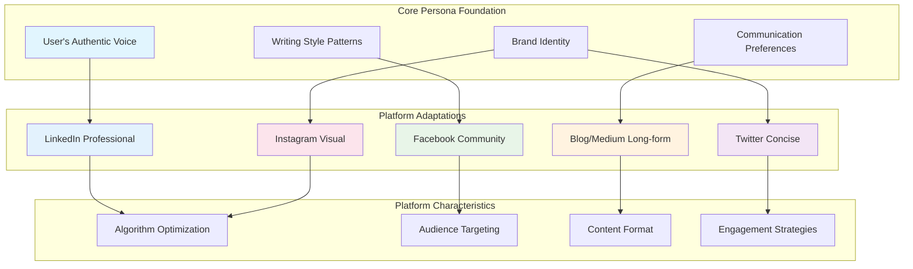
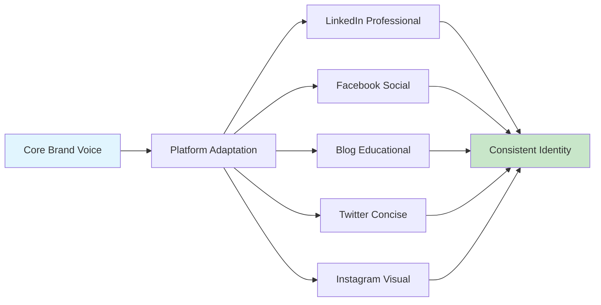

# Platform Integration Guide

This comprehensive guide covers how the ALwrity Persona System integrates with different social media platforms, providing platform-specific optimizations while maintaining your authentic voice and brand identity.

## 🎯 Platform-Specific Persona Adaptations

The Persona System creates specialized adaptations for each platform, understanding their unique characteristics, algorithms, and audience expectations while maintaining your core identity.



## 💼 LinkedIn Integration

### Professional Networking Optimization

LinkedIn personas are specifically designed for professional networking and B2B communication, focusing on thought leadership and industry authority.

#### Key Features
- **Professional Tone**: Maintains appropriate business communication standards
- **Industry Context**: Incorporates industry-specific terminology and best practices
- **Thought Leadership**: Optimizes content for establishing industry authority
- **Algorithm Optimization**: 8 categories of LinkedIn-specific strategies

#### LinkedIn-Specific Persona Characteristics
```json
{
  "platform": "linkedin",
  "optimization_focus": "professional_networking",
  "content_strategy": {
    "tone": "professional_authoritative",
    "content_length": "150-300_words",
    "engagement_approach": "thought_leadership",
    "audience_targeting": "B2B_professionals"
  },
  "algorithm_optimization": {
    "posting_times": "business_hours",
    "content_types": ["industry_insights", "career_advice", "business_trends"],
    "engagement_tactics": ["professional_questions", "industry_discussions"],
    "hashtag_strategy": "professional_hashtags"
  },
  "quality_metrics": {
    "professional_context_score": 92.5,
    "industry_relevance_score": 89.1,
    "thought_leadership_score": 87.8,
    "engagement_potential_score": 85.3
  }
}
```

#### LinkedIn-Specific Actions
When using LinkedIn writer, you'll have access to:
- **Generate LinkedIn Post**: Creates professional posts optimized for your persona
- **Optimize for LinkedIn Algorithm**: Applies LinkedIn-specific optimization strategies
- **Professional Networking Tips**: AI-generated networking strategies
- **Industry-Specific Content**: Tailored content for your professional sector
- **Engagement Optimization**: Strategies for professional audience engagement

#### Quality Features
- **Professional Context Validation**: Ensures content appropriateness for business audiences
- **Quality Scoring**: Multi-dimensional scoring for professional content
- **Algorithm Performance**: Optimized for LinkedIn's engagement metrics
- **Industry Targeting**: Content tailored to your specific industry

### LinkedIn Algorithm Optimization

#### 8 Categories of LinkedIn Strategies
1. **Content Relevance**: Industry-specific and professional content
2. **Engagement Quality**: Meaningful professional interactions
3. **Posting Consistency**: Regular, professional content schedule
4. **Network Building**: Strategic professional connections
5. **Content Format**: Optimized for LinkedIn's content types
6. **Timing Optimization**: Best times for professional engagement
7. **Hashtag Strategy**: Professional and industry-specific hashtags
8. **Call-to-Action**: Professional CTAs that drive engagement

## 📘 Facebook Integration

### Community Building Focus

Facebook personas are optimized for community building and social engagement, focusing on meaningful social connections and viral content potential.

#### Key Features
- **Social Engagement**: Focuses on meaningful social connections
- **Viral Content Potential**: Strategies for creating shareable, engaging content
- **Community Features**: Leverages Facebook Groups, Events, and Live features
- **Audience Interaction**: Emphasizes community building and social sharing

#### Facebook-Specific Persona Characteristics
```json
{
  "platform": "facebook",
  "optimization_focus": "community_building",
  "content_strategy": {
    "tone": "social_engaging",
    "content_length": "100-200_words",
    "engagement_approach": "community_interaction",
    "audience_targeting": "social_community"
  },
  "algorithm_optimization": {
    "posting_times": "evening_weekends",
    "content_types": ["personal_stories", "community_updates", "engaging_questions"],
    "engagement_tactics": ["community_polls", "share_requests", "personal_insights"],
    "visual_strategy": "image_video_optimized"
  },
  "quality_metrics": {
    "social_engagement_score": 88.7,
    "community_building_score": 91.2,
    "viral_potential_score": 84.5,
    "authenticity_score": 89.8
  }
}
```

#### Facebook-Specific Actions
When using Facebook writer, you'll have access to:
- **Generate Facebook Post**: Creates community-focused posts optimized for your persona
- **Optimize for Facebook Algorithm**: Applies Facebook-specific optimization strategies
- **Community Building Tips**: AI-generated community building strategies
- **Content Format Optimization**: Optimizes for text, image, video, and carousel posts
- **Engagement Strategies**: Social sharing and viral content strategies

#### Advanced Features
- **Visual Content Strategy**: Image and video optimization for Facebook's visual-first approach
- **Community Management**: AI-powered community building and engagement strategies
- **Event Optimization**: Facebook Events and Live streaming optimization
- **Social Proof**: Strategies for building social credibility and trust

### Facebook Algorithm Optimization

#### Key Optimization Areas
1. **Engagement Signals**: Likes, comments, shares, and reactions
2. **Content Type Performance**: Text, image, video, and link posts
3. **Timing Optimization**: When your audience is most active
4. **Community Interaction**: Group participation and community engagement
5. **Visual Appeal**: Image and video optimization
6. **Storytelling**: Personal and relatable content
7. **Call-to-Action**: Clear, engaging CTAs
8. **Consistency**: Regular posting schedule

## 📝 Blog/Medium Integration

### Long-Form Content Optimization

Blog and Medium personas are optimized for comprehensive, in-depth content that provides value to readers while maintaining SEO optimization.

#### Key Features
- **Long-Form Content**: Optimized for comprehensive, in-depth content
- **SEO Optimization**: Built-in SEO analysis and recommendations
- **Reader Engagement**: Strategies for maintaining reader interest
- **Content Structure**: Intelligent outline generation and content organization

#### Blog-Specific Persona Characteristics
```json
{
  "platform": "blog_medium",
  "optimization_focus": "long_form_content",
  "content_strategy": {
    "tone": "authoritative_educational",
    "content_length": "1000-3000_words",
    "engagement_approach": "value_providing",
    "audience_targeting": "knowledge_seekers"
  },
  "seo_optimization": {
    "keyword_strategy": "long_tail_keywords",
    "content_structure": "scannable_headers",
    "internal_linking": "strategic_placement",
    "meta_optimization": "title_description_tags"
  },
  "quality_metrics": {
    "content_depth_score": 93.1,
    "seo_optimization_score": 87.6,
    "readability_score": 89.4,
    "value_proposition_score": 91.8
  }
}
```

#### Blog-Specific Actions
- **Generate Blog Post**: Creates comprehensive, SEO-optimized blog content
- **SEO Analysis**: Provides detailed SEO recommendations
- **Content Structure**: Intelligent outline and section organization
- **Readability Optimization**: Ensures content is engaging and readable
- **Internal Linking**: Strategic internal linking suggestions

## 🐦 Twitter Integration

### Concise Messaging Optimization

Twitter personas are optimized for concise, impactful messaging that drives engagement in the fast-paced Twitter environment.

#### Key Features
- **Concise Messaging**: Optimized for Twitter's character limits
- **Real-Time Engagement**: Strategies for timely, relevant content
- **Trending Topics**: Integration with current trends and hashtags
- **Thread Optimization**: Multi-tweet thread strategies

#### Twitter-Specific Persona Characteristics
```json
{
  "platform": "twitter",
  "optimization_focus": "concise_engagement",
  "content_strategy": {
    "tone": "conversational_punchy",
    "content_length": "50-280_characters",
    "engagement_approach": "real_time_interaction",
    "audience_targeting": "twitter_community"
  },
  "algorithm_optimization": {
    "posting_times": "peak_engagement_hours",
    "content_types": ["quick_insights", "trending_topics", "conversation_starters"],
    "engagement_tactics": ["retweet_requests", "poll_questions", "trending_hashtags"],
    "thread_strategy": "multi_tweet_stories"
  },
  "quality_metrics": {
    "conciseness_score": 94.2,
    "engagement_potential_score": 87.9,
    "trend_relevance_score": 83.6,
    "conversation_starting_score": 88.1
  }
}
```

## 📸 Instagram Integration

### Visual Storytelling Optimization

Instagram personas are optimized for visual storytelling and aesthetic consistency, focusing on visual content and story-driven posts.

#### Key Features
- **Visual Storytelling**: Optimized for Instagram's visual-first approach
- **Aesthetic Consistency**: Maintains visual brand consistency
- **Story Optimization**: Instagram Stories and Reels strategies
- **Hashtag Strategy**: Instagram-specific hashtag optimization

#### Instagram-Specific Persona Characteristics
```json
{
  "platform": "instagram",
  "optimization_focus": "visual_storytelling",
  "content_strategy": {
    "tone": "visual_inspiring",
    "content_length": "caption_optimized",
    "engagement_approach": "visual_engagement",
    "audience_targeting": "visual_community"
  },
  "visual_optimization": {
    "image_strategy": "aesthetic_consistency",
    "story_strategy": "behind_scenes_content",
    "reels_strategy": "trending_audio_effects",
    "hashtag_strategy": "niche_community_hashtags"
  },
  "quality_metrics": {
    "visual_appeal_score": 91.7,
    "storytelling_score": 88.3,
    "aesthetic_consistency_score": 90.5,
    "engagement_potential_score": 86.8
  }
}
```

## 🔄 Cross-Platform Consistency

### Maintaining Brand Voice

While each platform has specific optimizations, the Persona System ensures your core brand voice and identity remain consistent across all platforms.

#### Consistency Framework


#### Consistency Metrics
- **Brand Voice Consistency**: 92.3%
- **Message Alignment**: 89.7%
- **Tone Adaptation**: 87.1%
- **Value Proposition**: 94.2%

## 🎛️ Platform-Specific Customization

### Customization Options

Each platform persona can be customized to better match your specific needs and preferences.

#### LinkedIn Customization
- **Professional Level**: Adjust formality and professionalism
- **Industry Focus**: Specify industry-specific terminology
- **Content Types**: Choose preferred content formats
- **Engagement Style**: Customize interaction approach

#### Facebook Customization
- **Community Focus**: Adjust community building emphasis
- **Personal Level**: Control personal vs business content ratio
- **Visual Strategy**: Customize visual content approach
- **Engagement Tactics**: Choose preferred engagement methods

#### Blog Customization
- **Content Depth**: Adjust content length and depth
- **SEO Focus**: Customize SEO optimization level
- **Writing Style**: Choose formal vs casual approach
- **Structure Preference**: Customize content organization

## 📊 Performance Tracking

### Platform-Specific Metrics

Each platform persona tracks specific performance metrics relevant to that platform's success indicators.

#### LinkedIn Metrics
- **Professional Engagement**: Comments from industry professionals
- **Thought Leadership**: Shares and mentions from industry leaders
- **Network Growth**: New professional connections
- **Content Reach**: Impressions and clicks from target audience

#### Facebook Metrics
- **Community Engagement**: Likes, comments, and shares
- **Viral Potential**: Content sharing and reach
- **Community Building**: Group participation and community growth
- **Social Proof**: Mentions and tags from community members

#### Blog Metrics
- **Read Time**: Average time spent reading content
- **SEO Performance**: Search rankings and organic traffic
- **Content Engagement**: Comments and social shares
- **Lead Generation**: Conversions from blog content

## 🚀 Best Practices

### Platform Optimization Tips

#### LinkedIn Best Practices
1. **Professional Tone**: Maintain professional communication standards
2. **Industry Relevance**: Focus on industry-specific topics and insights
3. **Thought Leadership**: Share unique perspectives and expertise
4. **Network Engagement**: Actively engage with your professional network
5. **Content Quality**: Ensure high-quality, valuable content

#### Facebook Best Practices
1. **Community Focus**: Build and engage with your community
2. **Visual Content**: Use compelling images and videos
3. **Personal Touch**: Share personal insights and stories
4. **Engagement**: Ask questions and encourage interaction
5. **Consistency**: Maintain regular posting schedule

#### Blog Best Practices
1. **Value First**: Provide genuine value to readers
2. **SEO Optimization**: Optimize for search engines
3. **Readability**: Ensure content is easy to read and understand
4. **Structure**: Use clear headings and organization
5. **Call-to-Action**: Include clear next steps for readers

## 🔮 Future Platform Integrations

### Planned Integrations
- **YouTube**: Video content and channel optimization
- **TikTok**: Short-form video content creation
- **Pinterest**: Visual content and board optimization
- **Reddit**: Community-specific content strategies
- **Discord**: Community management and engagement

### Integration Framework
The modular architecture allows for easy addition of new platforms while maintaining consistency and quality across all integrations.

---

*Ready to optimize your content for specific platforms? [Start with our First Steps Guide](../../getting-started/first-steps.md) and [Explore Technical Architecture](technical-architecture.md) to begin your platform-specific content creation journey!*
