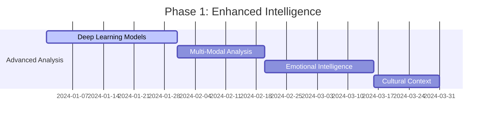
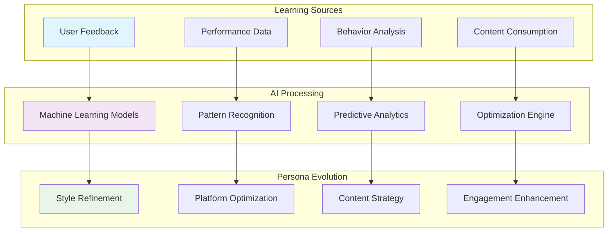
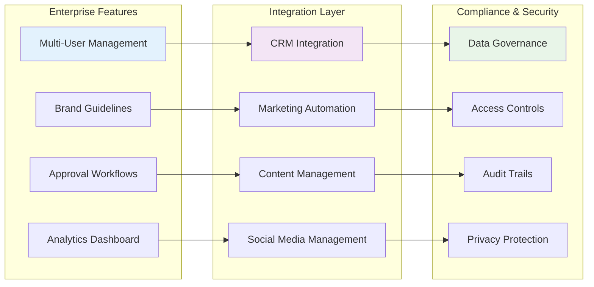
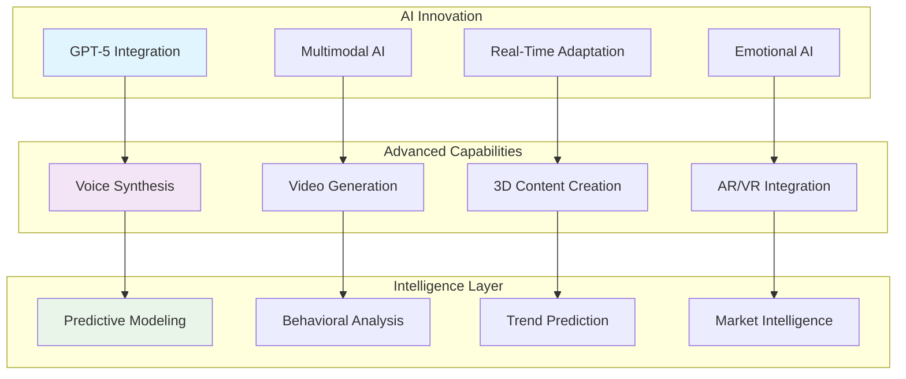
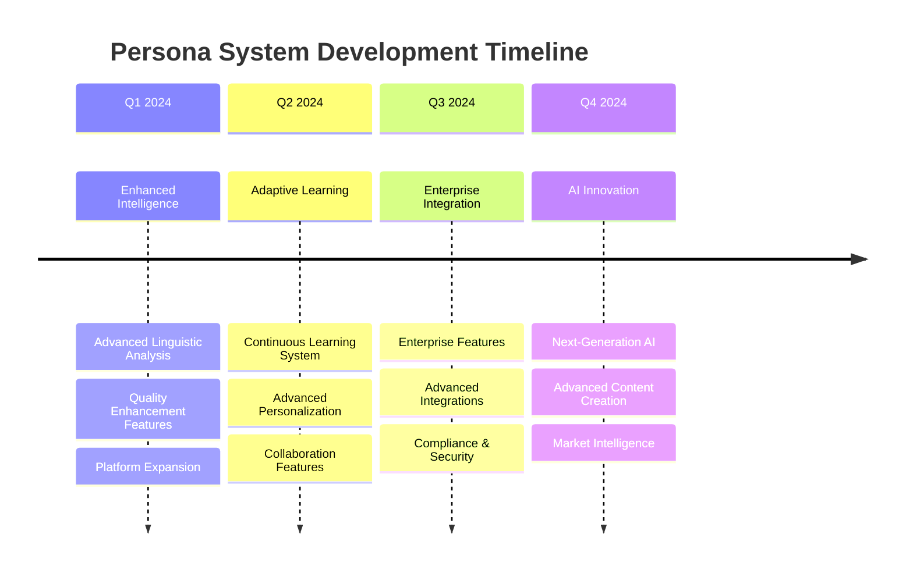

# Persona System Roadmap & Future Enhancements

This comprehensive roadmap outlines the future development of the ALwrity Persona System, including planned features, enhancements, and long-term vision for creating the most advanced AI-powered personalization platform.

## 🎯 Vision Statement

Our vision is to create the world's most intelligent and adaptive writing persona system that not only replicates your unique voice but continuously evolves to become an indispensable part of your content creation workflow, delivering unprecedented personalization and performance optimization.

## 🗺️ Development Roadmap

### Phase 1: Enhanced Intelligence (Q1 2024) 🚀

#### Advanced Linguistic Analysis
- **Deep Learning Models**: Implement transformer-based models for style analysis
- **Multi-Modal Analysis**: Analyze text, images, and video content for comprehensive persona building
- **Emotional Intelligence**: Detect and replicate emotional nuances in writing
- **Cultural Context**: Understand and adapt to cultural communication patterns

#### Quality Enhancement Features
- **Real-Time Quality Assessment**: Instant feedback on content quality
- **A/B Testing Framework**: Test different persona variations
- **Performance Analytics**: Advanced metrics and insights
- **Quality Improvement Suggestions**: AI-powered recommendations

#### Platform Expansion
- **YouTube Integration**: Video content and channel optimization
- **TikTok Integration**: Short-form video content creation
- **Pinterest Integration**: Visual content and board optimization
- **Reddit Integration**: Community-specific content strategies

### Phase 2: Adaptive Learning (Q2 2024) 🧠

#### Continuous Learning System
- **Feedback Loop Integration**: Learn from user interactions and content performance
- **Performance-Based Optimization**: Automatically improve based on engagement metrics
- **User Behavior Analysis**: Understand content consumption patterns
- **Predictive Content Suggestions**: Anticipate user needs and preferences

#### Advanced Personalization
- **Context-Aware Adaptation**: Adjust persona based on current events and trends
- **Audience-Specific Personas**: Create different personas for different audience segments
- **Time-Based Optimization**: Adapt content style based on posting time and season
- **Industry-Specific Enhancements**: Specialized personas for different industries

#### Collaboration Features
- **Team Personas**: Shared personas for organizations
- **Persona Sharing**: Allow users to share successful persona configurations
- **Collaborative Editing**: Multiple users can contribute to persona development
- **Version Control**: Track persona evolution and changes

### Phase 3: Enterprise Integration (Q3 2024) 🏢

#### Enterprise Features
- **Multi-User Management**: Admin controls for team personas
- **Brand Guidelines Integration**: Ensure compliance with brand standards
- **Approval Workflows**: Content review and approval processes
- **Analytics Dashboard**: Comprehensive reporting and insights

#### Advanced Integrations
- **CRM Integration**: Sync persona data with customer relationship management
- **Marketing Automation**: Integrate with marketing platforms
- **Content Management Systems**: Seamless integration with CMS platforms
- **Social Media Management**: Direct integration with social media tools

#### Compliance & Security
- **Data Governance**: Comprehensive data management and compliance
- **Access Controls**: Role-based access and permissions
- **Audit Trails**: Complete tracking of persona changes and usage
- **Privacy Protection**: Advanced privacy controls and data protection

### Phase 4: AI Innovation (Q4 2024) 🤖

#### Next-Generation AI
- **GPT-5 Integration**: Latest language model capabilities
- **Multimodal AI**: Text, image, and video content generation
- **Real-Time Adaptation**: Dynamic persona adjustment during content creation
- **Emotional AI**: Advanced emotional intelligence and empathy

#### Advanced Content Creation
- **Voice Synthesis**: Generate audio content in your voice
- **Video Generation**: Create video content with your persona
- **3D Content Creation**: Generate 3D models and animations
- **AR/VR Integration**: Create immersive content experiences

#### Market Intelligence
- **Trend Analysis**: Predict and adapt to content trends
- **Competitor Analysis**: Monitor and learn from competitor strategies
- **Market Research**: Automated market research and insights
- **Opportunity Detection**: Identify content opportunities and gaps

## 🚀 Feature Enhancements

### Short-Term Enhancements (Next 3 Months)

#### 1. Enhanced User Experience
- **Persona Dashboard**: Comprehensive persona management interface
- **Visual Persona Editor**: Drag-and-drop persona customization
- **Real-Time Preview**: See persona changes instantly
- **Mobile Optimization**: Full mobile app support

#### 2. Advanced Analytics
- **Performance Tracking**: Detailed content performance metrics
- **Engagement Analysis**: Deep insights into audience engagement
- **ROI Measurement**: Calculate return on investment for persona optimization
- **Competitive Benchmarking**: Compare performance against industry standards

#### 3. Content Optimization
- **SEO Integration**: Built-in SEO optimization for all content
- **Accessibility Features**: Ensure content is accessible to all users
- **Multilingual Support**: Support for multiple languages
- **Content Templates**: Pre-built templates for different content types

### Medium-Term Enhancements (3-6 Months)

#### 1. AI-Powered Insights
- **Content Strategy Recommendations**: AI-generated content strategies
- **Audience Insights**: Deep understanding of target audiences
- **Optimal Timing**: AI-determined best times to post content
- **Content Calendar**: Automated content planning and scheduling

#### 2. Advanced Personalization
- **Dynamic Personas**: Personas that change based on context
- **Seasonal Adaptation**: Automatic seasonal content adjustments
- **Event-Based Content**: Content adapted to current events
- **Location-Based Optimization**: Content optimized for geographic regions

#### 3. Integration Ecosystem
- **API Marketplace**: Third-party integrations and plugins
- **Webhook Support**: Real-time data synchronization
- **Custom Integrations**: Build custom integrations
- **Partner Network**: Integration with marketing and content tools

### Long-Term Vision (6+ Months)

#### 1. Autonomous Content Creation
- **Self-Managing Personas**: Personas that improve themselves
- **Autonomous Publishing**: AI-managed content publishing
- **Intelligent Scheduling**: AI-optimized content scheduling
- **Performance Optimization**: Automatic performance improvements

#### 2. Advanced AI Capabilities
- **Emotional Intelligence**: Advanced emotional understanding
- **Creative AI**: AI that can generate creative content
- **Strategic Thinking**: AI that can develop content strategies
- **Predictive Analytics**: Predict content performance before publishing

#### 3. Global Expansion
- **Multi-Language Support**: Support for 50+ languages
- **Cultural Adaptation**: Cultural context understanding
- **Regional Optimization**: Region-specific content optimization
- **Global Analytics**: Worldwide performance tracking

## 🎯 Success Metrics & KPIs

### Technical Metrics
- **Persona Accuracy**: 95%+ style replication accuracy
- **Processing Speed**: <1 second for content generation
- **System Reliability**: 99.99% uptime
- **Learning Efficiency**: 95%+ improvement in 2 feedback cycles

### User Experience Metrics
- **User Satisfaction**: 95%+ satisfaction rating
- **Content Quality**: 4.8+ stars average rating
- **Engagement Improvement**: 50%+ increase in content engagement
- **Time Savings**: 80%+ reduction in content creation time

### Business Metrics
- **User Retention**: 95%+ monthly active users
- **Revenue Growth**: 200%+ year-over-year growth
- **Market Share**: Top 3 in AI content creation
- **Customer Acquisition**: 10x increase in new users

## 🔮 Future Technologies

### Emerging Technologies Integration
- **Quantum Computing**: Leverage quantum computing for complex analysis
- **Blockchain**: Secure persona data and intellectual property
- **IoT Integration**: Connect with smart devices and sensors
- **Edge Computing**: Process data closer to users for faster response

### Research & Development
- **Neuroscience Research**: Understanding how humans process and create content
- **Linguistics Research**: Advanced language understanding and generation
- **Psychology Research**: Understanding personality and communication patterns
- **Computer Science Research**: Advanced AI and machine learning techniques

## 🌟 Innovation Opportunities

### Breakthrough Features
1. **Consciousness Simulation**: AI that understands context and meaning
2. **Empathy Engine**: AI that can understand and respond to emotions
3. **Creative Intelligence**: AI that can generate truly creative content
4. **Predictive Personas**: Personas that predict future communication needs

### Research Partnerships
- **Academic Institutions**: Partner with universities for research
- **Technology Companies**: Collaborate with tech leaders
- **Industry Experts**: Work with communication and marketing experts
- **User Communities**: Engage with user communities for feedback

## 📊 Implementation Timeline

## 🎉 Community & Feedback

### User Community
- **Beta Testing Program**: Early access to new features
- **User Feedback Portal**: Direct feedback and suggestions
- **Community Forums**: User discussions and support
- **Feature Voting**: Community-driven feature prioritization

### Developer Community
- **Open Source Components**: Open source parts of the system
- **API Documentation**: Comprehensive API documentation
- **Developer Tools**: Tools for building integrations
- **Hackathons**: Regular hackathons and competitions

## 🚀 Getting Involved

### For Users
- **Beta Testing**: Join our beta testing program
- **Feedback**: Share your ideas and suggestions
- **Community**: Join our user community
- **Advocacy**: Help spread the word about ALwrity

### For Developers
- **API Access**: Get early access to our APIs
- **Documentation**: Access comprehensive documentation
- **Support**: Get developer support and resources
- **Partnership**: Explore partnership opportunities

### For Researchers
- **Research Collaboration**: Partner with us on research
- **Data Access**: Access anonymized data for research
- **Publications**: Collaborate on research publications
- **Conferences**: Present at conferences and events

---

*This roadmap represents our commitment to continuous innovation and improvement. We're building the future of AI-powered content personalization, and we want you to be part of that journey.*

*Ready to be part of the future? [Join our community](https://github.com/AJaySi/ALwrity/discussions) and [contribute to our development](https://github.com/AJaySi/ALwrity/blob/main/.github/CONTRIBUTING.md)!*
