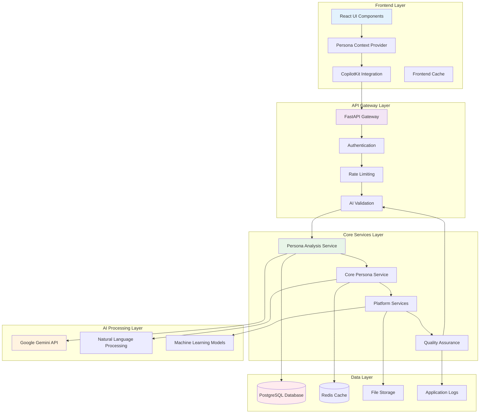
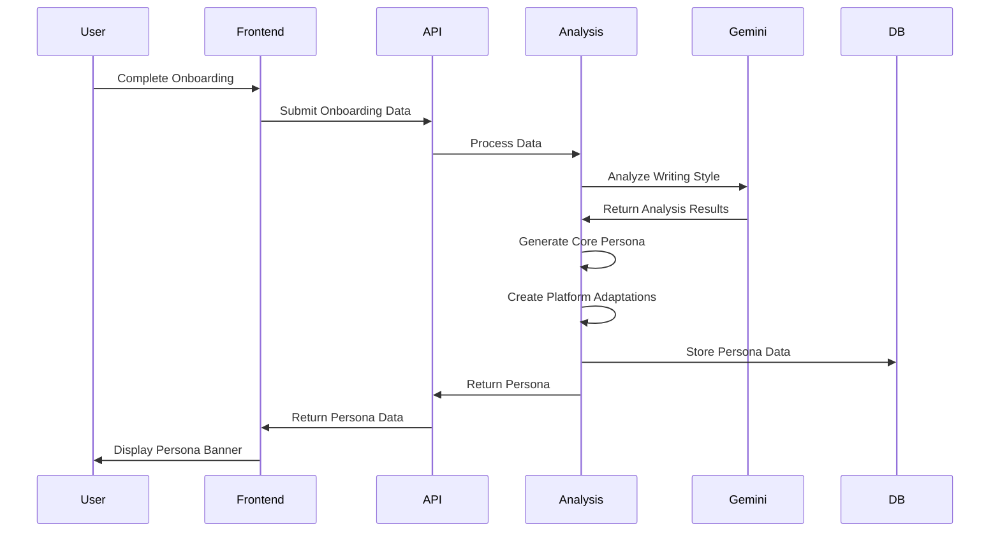
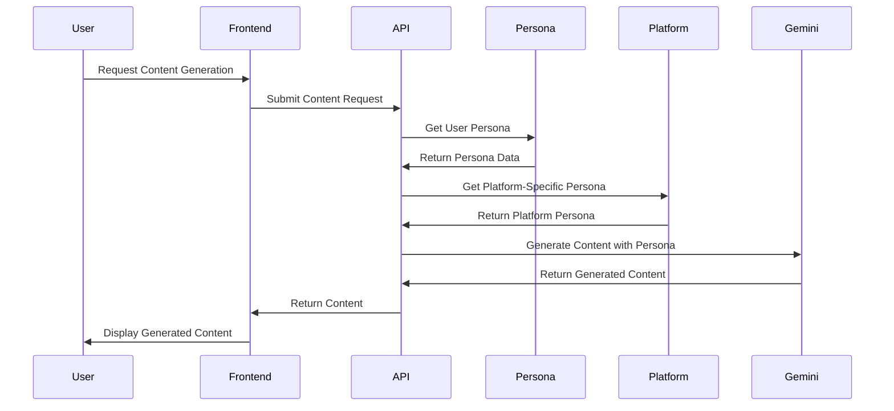

# Persona System Technical Architecture

This document provides a comprehensive technical overview of the ALwrity Persona System architecture, including system design, data flow, API structure, and implementation details.

## 🏗️ System Architecture Overview

The ALwrity Persona System is built on a modular, scalable architecture that separates core persona logic from platform-specific implementations. This design enables easy extension to new platforms while maintaining consistency and quality across all implementations.



## 🔧 Core Architecture Components

### 1. Persona Analysis Service
The central orchestrator that coordinates persona generation, validation, and optimization across all platforms.

**Key Responsibilities:**
- Orchestrates the complete persona generation workflow
- Manages data collection from onboarding processes
- Coordinates between core and platform-specific services
- Handles database operations and persona storage
- Provides API endpoints for frontend integration

**Architecture Pattern:** Service Layer with Dependency Injection

### 2. Core Persona Service
Handles the generation of the foundational persona that serves as the base for all platform adaptations.

**Key Responsibilities:**
- Analyzes onboarding data to create core persona
- Generates linguistic fingerprints and writing patterns
- Establishes tonal range and stylistic constraints
- Provides quality scoring and validation
- Serves as the foundation for platform-specific adaptations

**Architecture Pattern:** Domain Service with Data Transfer Objects

### 3. Platform-Specific Services
Modular services that handle platform-specific persona adaptations and optimizations.

**Current Implementations:**
- **LinkedIn Persona Service**: Professional networking optimization
- **Facebook Persona Service**: Community building and social engagement
- **Blog Persona Service**: Long-form content and SEO optimization

**Architecture Pattern:** Strategy Pattern with Platform-Specific Implementations

## 📊 Data Flow Architecture

### Persona Generation Flow



### Content Generation Flow



## 🗄️ Database Architecture

### Core Tables

#### writing_personas
Stores core persona data and metadata:
```sql
CREATE TABLE writing_personas (
    id SERIAL PRIMARY KEY,
    user_id INTEGER NOT NULL,
    persona_name VARCHAR(255) NOT NULL,
    archetype VARCHAR(100),
    core_belief TEXT,
    linguistic_fingerprint JSONB,
    confidence_score FLOAT,
    created_at TIMESTAMP DEFAULT NOW(),
    updated_at TIMESTAMP DEFAULT NOW(),
    is_active BOOLEAN DEFAULT TRUE
);
```

#### platform_personas
Stores platform-specific adaptations:
```sql
CREATE TABLE platform_personas (
    id SERIAL PRIMARY KEY,
    writing_persona_id INTEGER REFERENCES writing_personas(id),
    platform VARCHAR(50) NOT NULL,
    platform_specific_data JSONB,
    optimization_strategies JSONB,
    quality_metrics JSONB,
    created_at TIMESTAMP DEFAULT NOW(),
    updated_at TIMESTAMP DEFAULT NOW()
);
```

#### persona_analysis_results
Tracks AI analysis process and results:
```sql
CREATE TABLE persona_analysis_results (
    id SERIAL PRIMARY KEY,
    writing_persona_id INTEGER REFERENCES writing_personas(id),
    analysis_type VARCHAR(100),
    analysis_data JSONB,
    confidence_score FLOAT,
    processing_time_ms INTEGER,
    created_at TIMESTAMP DEFAULT NOW()
);
```

#### persona_validation_results
Stores quality metrics and validation data:
```sql
CREATE TABLE persona_validation_results (
    id SERIAL PRIMARY KEY,
    writing_persona_id INTEGER REFERENCES writing_personas(id),
    validation_type VARCHAR(100),
    validation_data JSONB,
    quality_score FLOAT,
    validation_status VARCHAR(50),
    created_at TIMESTAMP DEFAULT NOW()
);
```

### Data Relationships
- **One-to-Many**: Core persona to platform personas
- **One-to-One**: Persona to analysis results
- **One-to-One**: Persona to validation results

### Data Storage Strategy
- **Core Persona**: Stored in normalized format for consistency
- **Platform Data**: Stored in JSONB format for flexibility
- **Analysis Results**: Stored with full audit trail
- **Validation Data**: Stored with timestamps and quality metrics

## 🔌 API Architecture

### RESTful API Design
- **Resource-Based URLs**: Clear, intuitive endpoint structure
- **HTTP Methods**: Proper use of GET, POST, PUT, DELETE
- **Status Codes**: Meaningful HTTP status code responses
- **Error Handling**: Consistent error response format

### API Endpoints Structure

```http
# Core Persona Management
GET    /api/personas/user/{user_id}              # Get user's personas
POST   /api/personas/generate                    # Generate new persona
PUT    /api/personas/{persona_id}                # Update persona
DELETE /api/personas/{persona_id}                # Delete persona

# Platform-Specific Personas
GET    /api/personas/{persona_id}/platform/{platform}  # Get platform persona
POST   /api/personas/{persona_id}/platform/{platform}/optimize  # Optimize platform persona

# LinkedIn Integration
GET    /api/personas/linkedin/user/{user_id}     # Get LinkedIn persona
POST   /api/personas/linkedin/validate           # Validate LinkedIn persona
POST   /api/personas/linkedin/optimize           # Optimize LinkedIn persona

# Facebook Integration
GET    /api/personas/facebook/user/{user_id}     # Get Facebook persona
POST   /api/personas/facebook/validate           # Validate Facebook persona
POST   /api/personas/facebook/optimize           # Optimize Facebook persona

# Quality and Analytics
GET    /api/personas/{persona_id}/quality        # Get quality metrics
POST   /api/personas/{persona_id}/feedback       # Submit feedback
GET    /api/personas/{persona_id}/analytics      # Get performance analytics
```

### Request/Response Patterns

#### Generate Persona Request
```json
{
  "user_id": 123,
  "onboarding_data": {
    "website_url": "https://example.com",
    "business_type": "SaaS",
    "target_audience": "B2B professionals",
    "content_preferences": {
      "tone": "professional",
      "style": "authoritative",
      "length": "medium"
    }
  }
}
```

#### Generate Persona Response
```json
{
  "success": true,
  "data": {
    "persona_id": 456,
    "persona_name": "The Professional Connector",
    "archetype": "Thought Leader",
    "confidence_score": 87.5,
    "platform_personas": {
      "linkedin": {
        "optimization_level": "high",
        "quality_score": 89.2
      },
      "facebook": {
        "optimization_level": "medium",
        "quality_score": 82.1
      }
    },
    "created_at": "2024-01-15T10:30:00Z"
  }
}
```

## 🤖 AI Processing Architecture

### Gemini AI Integration

#### Analysis Pipeline
```python
class PersonaAnalysisService:
    def __init__(self):
        self.gemini_client = GeminiClient()
        self.nlp_processor = NLPProcessor()
        self.quality_assessor = QualityAssessor()
    
    async def analyze_writing_style(self, content_data):
        # 1. Content preprocessing
        processed_content = await self.nlp_processor.preprocess(content_data)
        
        # 2. Gemini AI analysis
        analysis_prompt = self._build_analysis_prompt(processed_content)
        ai_analysis = await self.gemini_client.analyze(analysis_prompt)
        
        # 3. Quality assessment
        quality_metrics = await self.quality_assessor.assess(ai_analysis)
        
        return {
            "linguistic_fingerprint": ai_analysis.linguistic_data,
            "style_patterns": ai_analysis.style_data,
            "quality_metrics": quality_metrics
        }
```

#### Linguistic Analysis
```python
linguistic_analysis = {
    "sentence_analysis": {
        "sentence_length_distribution": {"min": 8, "max": 45, "average": 18.5},
        "sentence_type_distribution": {"declarative": 0.7, "question": 0.2, "exclamation": 0.1},
        "sentence_complexity": {"complex_ratio": 0.3, "compound_ratio": 0.4}
    },
    "vocabulary_analysis": {
        "lexical_diversity": 0.65,
        "vocabulary_sophistication": 0.72,
        "most_frequent_content_words": ["innovation", "strategy", "growth"],
        "word_length_distribution": {"short": 0.4, "medium": 0.45, "long": 0.15}
    },
    "rhetorical_analysis": {
        "questions": 12,
        "metaphors": 8,
        "alliteration": ["strategic success", "business breakthrough"],
        "repetition_patterns": {"key_phrases": ["growth", "innovation"]}
    }
}
```

### Platform-Specific Optimization

#### LinkedIn Optimization
```python
class LinkedInPersonaService:
    def optimize_for_linkedin(self, core_persona):
        return {
            "professional_tone": self._enhance_professional_tone(core_persona),
            "industry_context": self._add_industry_context(core_persona),
            "thought_leadership": self._optimize_for_authority(core_persona),
            "algorithm_strategies": self._get_linkedin_strategies(),
            "content_length_optimization": {"optimal_range": [150, 300]},
            "engagement_tactics": self._get_professional_engagement_tactics()
        }
```

#### Facebook Optimization
```python
class FacebookPersonaService:
    def optimize_for_facebook(self, core_persona):
        return {
            "social_engagement": self._enhance_social_tone(core_persona),
            "viral_potential": self._optimize_for_sharing(core_persona),
            "community_focus": self._add_community_elements(core_persona),
            "visual_content_strategy": self._get_visual_strategies(),
            "content_format_optimization": self._get_format_preferences(),
            "engagement_tactics": self._get_social_engagement_tactics()
        }
```

## 🔄 Quality Assurance System

### Quality Metrics Framework

#### Multi-Dimensional Scoring
```python
quality_metrics = {
    "overall_quality_score": 85.2,
    "linguistic_quality": 88.0,
    "consistency_score": 82.5,
    "authenticity_score": 87.0,
    "platform_optimization_quality": 83.5,
    "user_satisfaction": 84.0,
    "improvement_suggestions": [
        {
            "category": "linguistic_analysis",
            "priority": "medium",
            "suggestion": "Enhance sentence complexity analysis",
            "action": "reanalyze_source_content"
        }
    ]
}
```

#### Continuous Learning System
```python
class PersonaQualityImprover:
    def improve_persona_quality(self, persona_id, feedback_data):
        # 1. Assess current quality
        quality_metrics = self.assess_persona_quality(persona_id, feedback_data)
        
        # 2. Generate improvements
        improvements = self.generate_improvements(quality_metrics)
        
        # 3. Apply improvements
        updated_persona = self.apply_improvements(persona_id, improvements)
        
        # 4. Track learning
        self.save_learning_data(persona_id, feedback_data, improvements)
        
        return updated_persona
```

## 🚀 Performance and Scalability

### Caching Strategy

#### Multi-Level Caching
```python
class PersonaCacheManager:
    def __init__(self):
        self.redis_client = redis.Redis()
        self.memory_cache = {}
    
    async def get_persona(self, user_id, platform=None):
        # 1. Check memory cache
        cache_key = f"persona:{user_id}:{platform}"
        if cache_key in self.memory_cache:
            return self.memory_cache[cache_key]
        
        # 2. Check Redis cache
        cached_data = await self.redis_client.get(cache_key)
        if cached_data:
            persona_data = json.loads(cached_data)
            self.memory_cache[cache_key] = persona_data
            return persona_data
        
        # 3. Fetch from database
        persona_data = await self.fetch_from_database(user_id, platform)
        
        # 4. Cache the result
        await self.redis_client.setex(cache_key, 300, json.dumps(persona_data))
        self.memory_cache[cache_key] = persona_data
        
        return persona_data
```

### Database Optimization

#### Indexing Strategy
```sql
-- Performance indexes
CREATE INDEX idx_writing_personas_user_active ON writing_personas(user_id, is_active);
CREATE INDEX idx_platform_personas_persona_platform ON platform_personas(writing_persona_id, platform);
CREATE INDEX idx_analysis_results_persona_type ON persona_analysis_results(writing_persona_id, analysis_type);
CREATE INDEX idx_validation_results_persona_status ON persona_validation_results(writing_persona_id, validation_status);

-- Composite indexes for common queries
CREATE INDEX idx_personas_user_platform ON writing_personas(user_id) INCLUDE (id, persona_name, confidence_score);
CREATE INDEX idx_platform_personas_optimization ON platform_personas(platform, writing_persona_id) INCLUDE (optimization_strategies);
```

## 🔒 Security and Privacy

### Data Protection
- **Encryption**: All persona data encrypted at rest and in transit
- **Access Control**: Role-based access control for persona data
- **Audit Logging**: Comprehensive audit trail for all persona operations
- **Data Retention**: Configurable data retention policies
- **Privacy Compliance**: GDPR and CCPA compliant data handling

### API Security
- **Authentication**: JWT-based authentication for all API endpoints
- **Rate Limiting**: API rate limiting to prevent abuse
- **Input Validation**: Comprehensive input validation and sanitization
- **Error Handling**: Secure error handling without information leakage

## 📈 Monitoring and Analytics

### Performance Monitoring
- **Response Times**: Track API response times and performance
- **Error Rates**: Monitor error rates and system health
- **Usage Metrics**: Track persona usage and engagement
- **Quality Metrics**: Monitor persona quality scores over time

### Business Analytics
- **User Engagement**: Track how users interact with personas
- **Content Performance**: Monitor content performance with personas
- **Platform Effectiveness**: Compare effectiveness across platforms
- **ROI Metrics**: Measure return on investment for persona features

## 🔮 Future Enhancements

### Advanced Features
1. **Multi-Language Support**: Personas for different languages
2. **Industry-Specific Personas**: Specialized personas for different industries
3. **Collaborative Personas**: Team-based persona development
4. **AI-Powered Style Transfer**: Advanced style mimicry techniques
5. **Real-Time Adaptation**: Dynamic persona adjustment during content creation

### Integration Opportunities
1. **CRM Integration**: Persona data from customer interactions
2. **Analytics Integration**: Advanced performance tracking
3. **Content Management**: Integration with content planning tools
4. **Social Media APIs**: Direct performance data collection

---

*This technical architecture provides the foundation for a robust, scalable persona system that can grow with user needs while maintaining high performance and reliability.*
