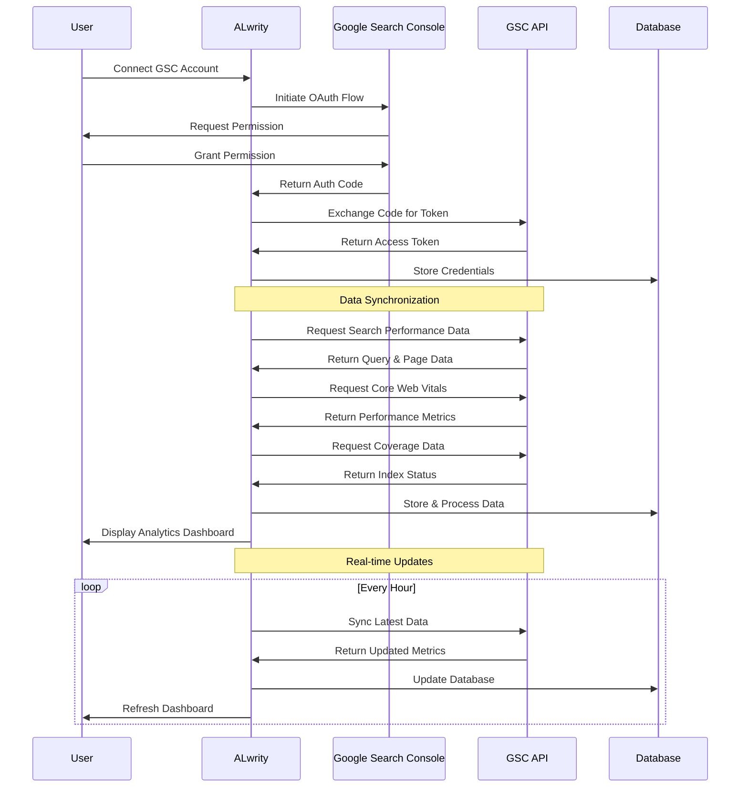

# Google Search Console Integration

ALwrity's SEO Dashboard includes comprehensive Google Search Console (GSC) integration that connects your GSC account to pull real-time performance data, analyze search trends, and optimize your content for better search visibility.

## What is GSC Integration?

Google Search Console Integration allows ALwrity to access your Google Search Console data directly, providing real-time insights into your website's search performance, keyword rankings, and optimization opportunities.

### Key Benefits

- **Real-Time Data**: Access live search performance data
- **Keyword Insights**: Track keyword rankings and performance
- **Content Optimization**: Identify content optimization opportunities
- **Technical SEO**: Monitor technical SEO issues and improvements
- **Performance Tracking**: Track SEO performance over time

## GSC Integration Flow



## Setup and Configuration

### 1. Google Search Console Setup

#### Account Requirements
- **Google Account**: Valid Google account with GSC access
- **Website Verification**: Verified website property in GSC
- **API Access**: Google Search Console API enabled
- **Permissions**: Appropriate permissions for data access
- **Data History**: Sufficient data history for analysis

#### Verification Process
1. **Access GSC**: Log into your Google Search Console account
2. **Select Property**: Choose the website property to connect
3. **API Setup**: Enable Google Search Console API
4. **Credentials**: Generate API credentials for ALwrity
5. **Connection**: Connect ALwrity to your GSC account

### 2. ALwrity Integration

#### Connection Setup
```json
{
  "gsc_property": "https://your-website.com",
  "api_credentials": {
    "client_id": "your_client_id",
    "client_secret": "your_client_secret",
    "refresh_token": "your_refresh_token"
  },
  "data_permissions": [
    "search_analytics",
    "sitemaps",
    "url_inspection",
    "core_web_vitals"
  ]
}
```

#### Authentication Flow
1. **OAuth Setup**: Configure OAuth 2.0 authentication
2. **Permission Request**: Request necessary GSC permissions
3. **Token Exchange**: Exchange authorization code for access token
4. **Token Refresh**: Set up automatic token refresh
5. **Data Access**: Verify data access and permissions

## Data Synchronization

### Real-Time Data Access

#### Search Performance Data
- **Queries**: Search queries driving traffic to your site
- **Pages**: Top-performing pages and content
- **Countries**: Geographic distribution of search traffic
- **Devices**: Device types used for search
- **Search Appearance**: How your site appears in search results

#### Core Web Vitals
- **Largest Contentful Paint (LCP)**: Loading performance metrics
- **First Input Delay (FID)**: Interactivity metrics
- **Cumulative Layout Shift (CLS)**: Visual stability metrics
- **Mobile Usability**: Mobile-specific performance metrics
- **Page Experience**: Overall page experience scores

### Data Processing

#### Data Aggregation
- **Daily Aggregation**: Aggregate daily performance data
- **Weekly Trends**: Identify weekly performance trends
- **Monthly Analysis**: Monthly performance analysis
- **Year-over-Year**: Compare performance year-over-year
- **Seasonal Patterns**: Identify seasonal performance patterns

#### Data Enrichment
- **Keyword Classification**: Classify keywords by intent and category
- **Content Mapping**: Map search data to specific content
- **Competitor Analysis**: Compare performance with competitors
- **Trend Analysis**: Identify emerging trends and opportunities
- **Insight Generation**: Generate actionable insights from data

## SEO Analysis Features

### Keyword Performance

#### Search Query Analysis
- **Top Queries**: Identify top-performing search queries
- **Query Trends**: Track query performance over time
- **Click-Through Rates**: Analyze CTR for different queries
- **Average Position**: Track average position for queries
- **Impression Share**: Monitor impression share for queries

#### Keyword Opportunities
- **Low-Hanging Fruit**: Identify easy optimization opportunities
- **High-Volume Keywords**: Find high-volume keyword opportunities
- **Long-Tail Keywords**: Discover long-tail keyword opportunities
- **Featured Snippet Opportunities**: Identify featured snippet opportunities
- **Local SEO Keywords**: Find local SEO opportunities

### Content Performance

#### Page-Level Analysis
- **Top Pages**: Identify top-performing pages
- **Page Performance**: Analyze individual page performance
- **Content Gaps**: Identify content gaps and opportunities
- **Duplicate Content**: Find and address duplicate content issues
- **Content Quality**: Assess content quality and relevance

#### Content Optimization
- **Title Tag Optimization**: Optimize title tags for better performance
- **Meta Description**: Improve meta descriptions for higher CTR
- **Header Structure**: Optimize heading structure for better SEO
- **Internal Linking**: Improve internal linking structure
- **Content Updates**: Identify content that needs updates

### Technical SEO

#### Site Health Monitoring
- **Crawl Errors**: Monitor and fix crawl errors
- **Index Coverage**: Track index coverage and issues
- **Sitemap Status**: Monitor sitemap submission and status
- **Mobile Usability**: Check mobile usability issues
- **Security Issues**: Monitor security issues and warnings

#### Performance Optimization
- **Page Speed**: Monitor and improve page loading speed
- **Core Web Vitals**: Track and optimize Core Web Vitals
- **Mobile Performance**: Optimize mobile performance
- **User Experience**: Improve overall user experience
- **Technical Issues**: Identify and fix technical SEO issues

## Reporting and Analytics

### Performance Dashboards

#### Overview Dashboard
- **Key Metrics**: Display key SEO performance metrics
- **Trend Charts**: Show performance trends over time
- **Top Performers**: Highlight top-performing content and keywords
- **Issues Alerts**: Alert on critical SEO issues
- **Quick Actions**: Provide quick access to common actions

#### Detailed Reports
- **Keyword Reports**: Detailed keyword performance reports
- **Content Reports**: Comprehensive content performance analysis
- **Technical Reports**: Technical SEO health and performance
- **Competitive Reports**: Competitive analysis and benchmarking
- **Custom Reports**: Customizable reports for specific needs

### Automated Insights

#### Performance Insights
- **Trend Analysis**: Automatic trend analysis and insights
- **Anomaly Detection**: Detect unusual performance patterns
- **Opportunity Identification**: Identify optimization opportunities
- **Issue Alerts**: Alert on critical issues and problems
- **Recommendation Engine**: Provide actionable recommendations

#### Predictive Analytics
- **Performance Forecasting**: Predict future performance trends
- **Seasonal Analysis**: Analyze seasonal performance patterns
- **Growth Projections**: Project growth based on current trends
- **Risk Assessment**: Assess risks to SEO performance
- **Opportunity Scoring**: Score optimization opportunities

## Integration with Other Features

### Blog Writer Integration

#### Content Optimization
- **Keyword Integration**: Use GSC data to inform content creation
- **Performance Feedback**: Get feedback on content performance
- **Optimization Suggestions**: Receive optimization suggestions
- **Content Gaps**: Identify content gaps from search data
- **Trend Integration**: Incorporate search trends into content

#### SEO Analysis
- **Real-Time Analysis**: Analyze content performance in real-time
- **Keyword Performance**: Track keyword performance for content
- **Content Rankings**: Monitor content rankings and performance
- **Optimization Opportunities**: Identify content optimization opportunities
- **Performance Tracking**: Track content performance over time

### Content Strategy Integration

#### Strategic Planning
- **Data-Driven Strategy**: Use GSC data to inform content strategy
- **Keyword Strategy**: Develop keyword strategy based on GSC data
- **Content Planning**: Plan content based on search performance
- **Competitive Analysis**: Analyze competitor performance
- **Market Opportunities**: Identify market opportunities

#### Performance Optimization
- **Strategy Refinement**: Refine strategy based on performance data
- **Content Prioritization**: Prioritize content based on performance
- **Resource Allocation**: Allocate resources based on performance
- **ROI Analysis**: Analyze ROI of content and SEO efforts
- **Continuous Improvement**: Continuously improve based on data

## Best Practices

### Data Management

#### Data Quality
1. **Regular Sync**: Ensure regular data synchronization
2. **Data Validation**: Validate data accuracy and completeness
3. **Error Handling**: Handle data errors and inconsistencies
4. **Backup**: Maintain data backups and recovery procedures
5. **Monitoring**: Monitor data quality and performance

#### Data Security
1. **Access Control**: Implement proper access controls
2. **Data Encryption**: Encrypt sensitive data
3. **Audit Logging**: Maintain audit logs for data access
4. **Compliance**: Ensure compliance with data regulations
5. **Privacy**: Protect user privacy and data

### Performance Optimization

#### Data Processing
1. **Efficient Queries**: Optimize data queries for performance
2. **Caching**: Implement appropriate caching strategies
3. **Batch Processing**: Use batch processing for large datasets
4. **Real-Time Updates**: Balance real-time updates with performance
5. **Resource Management**: Manage system resources efficiently

#### User Experience
1. **Fast Loading**: Ensure fast loading of dashboards and reports
2. **Responsive Design**: Provide responsive design for all devices
3. **Intuitive Interface**: Create intuitive and user-friendly interfaces
4. **Customization**: Allow customization of dashboards and reports
5. **Accessibility**: Ensure accessibility for all users

## Troubleshooting

### Common Issues

#### Connection Problems
- **Authentication Issues**: Resolve OAuth authentication problems
- **Permission Errors**: Fix permission and access issues
- **API Limits**: Handle API rate limits and quotas
- **Token Expiration**: Manage token expiration and refresh
- **Network Issues**: Resolve network connectivity problems

#### Data Issues
- **Sync Problems**: Fix data synchronization issues
- **Data Quality**: Address data quality and accuracy issues
- **Missing Data**: Handle missing or incomplete data
- **Data Delays**: Manage data processing delays
- **Format Issues**: Resolve data format and structure issues

### Getting Help

#### Support Resources
- **Documentation**: Review GSC integration documentation
- **Tutorials**: Watch GSC integration tutorials
- **Best Practices**: Follow GSC integration best practices
- **Community**: Join user community discussions
- **Support**: Contact technical support

#### Optimization Tips
- **Regular Monitoring**: Monitor integration performance regularly
- **Data Validation**: Validate data accuracy and completeness
- **Performance Tuning**: Tune performance for optimal results
- **Error Handling**: Implement robust error handling
- **Continuous Improvement**: Continuously improve integration

## Advanced Features

### Custom Analytics

#### Custom Metrics
- **Business Metrics**: Track business-specific metrics
- **Custom KPIs**: Define and track custom KPIs
- **Performance Indicators**: Monitor key performance indicators
- **Success Metrics**: Track success metrics and goals
- **ROI Metrics**: Measure ROI of SEO efforts

#### Advanced Reporting
- **Custom Dashboards**: Create custom dashboards
- **Scheduled Reports**: Set up automated report generation
- **Data Export**: Export data in various formats
- **API Access**: Provide API access to data
- **Integration**: Integrate with other analytics tools

### Machine Learning

#### Predictive Analytics
- **Performance Prediction**: Predict future performance
- **Trend Analysis**: Analyze trends and patterns
- **Anomaly Detection**: Detect unusual patterns
- **Recommendation Engine**: Provide intelligent recommendations
- **Optimization Suggestions**: Suggest optimization opportunities

#### Automated Insights
- **Insight Generation**: Automatically generate insights
- **Pattern Recognition**: Recognize patterns in data
- **Opportunity Identification**: Identify opportunities automatically
- **Issue Detection**: Detect issues and problems
- **Action Recommendations**: Recommend actions based on data

---

*Ready to integrate Google Search Console with your SEO strategy? [Start with our First Steps Guide](../../getting-started/first-steps.md) and [Explore SEO Dashboard Features](overview.md) to begin leveraging GSC data for better SEO performance!*
