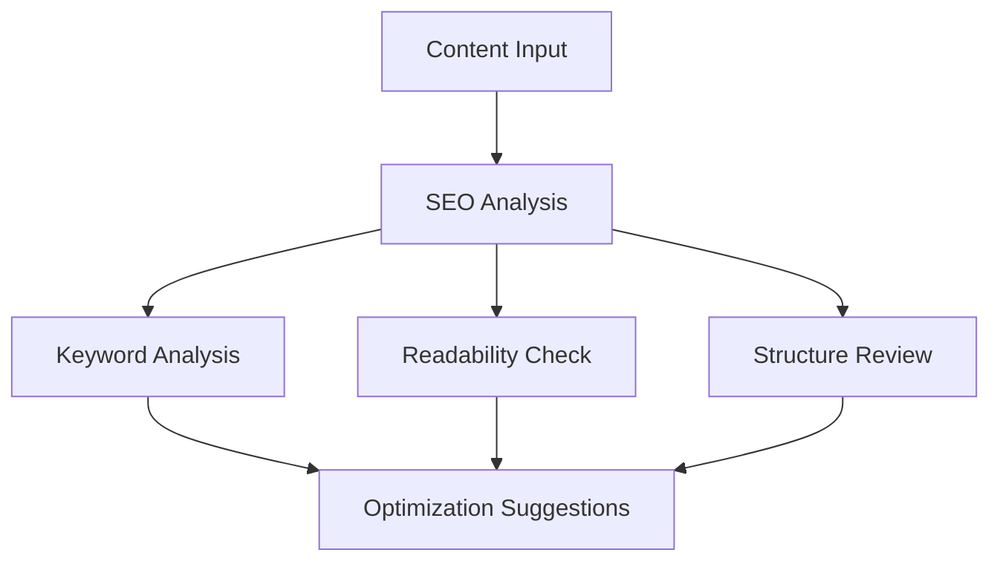

# SEO Dashboard Overview

The ALwrity SEO Dashboard provides comprehensive SEO analysis and optimization tools to help you improve your content's search engine visibility and performance.

## Key Features

### 🔍 Comprehensive SEO Analysis
- **Content Analysis**: In-depth content evaluation
- **Keyword Optimization**: Keyword density and placement
- **Readability Assessment**: Content readability scoring
- **Technical SEO**: Meta tags, headings, and structure

### 📊 Google Search Console Integration
- **Real Performance Data**: Actual search performance metrics
- **Keyword Insights**: Top-performing search queries
- **Click-through Rates**: CTR analysis and optimization
- **Search Rankings**: Position tracking and monitoring

### 🎯 Metadata Generation
- **Title Tags**: SEO-optimized page titles
- **Meta Descriptions**: Compelling meta descriptions
- **Schema Markup**: Structured data implementation
- **Open Graph**: Social media optimization

## Dashboard Components

### 1. Content Analysis Panel

### 2. Performance Metrics
- **Search Visibility**: Overall search performance
- **Keyword Rankings**: Position tracking
- **Traffic Analysis**: Organic traffic insights
- **Conversion Rates**: Goal completion tracking

### 3. Optimization Tools
- **Keyword Suggestions**: Related keyword recommendations
- **Content Gaps**: Missing content opportunities
- **Competitor Analysis**: Competitive insights
- **Technical Issues**: SEO problem identification

## SEO Analysis Features

### Content Optimization
- **Keyword Density**: Optimal keyword usage
- **Content Length**: Word count analysis
- **Heading Structure**: H1-H6 hierarchy
- **Internal Linking**: Link optimization

### Technical SEO
- **Page Speed**: Loading time optimization
- **Mobile Optimization**: Responsive design check
- **URL Structure**: Clean, SEO-friendly URLs
- **Image Optimization**: Alt text and compression

### On-Page SEO
- **Title Tag Optimization**: Compelling, keyword-rich titles
- **Meta Description**: Engaging descriptions
- **Header Tags**: Proper heading structure
- **Content Quality**: Originality and relevance

## Google Search Console Integration

### Setup Process
1. **Authentication**: Connect your GSC account
2. **Property Selection**: Choose your website
3. **Data Sync**: Import performance data
4. **Real-time Updates**: Live data integration

### Available Data
- **Search Queries**: Top search terms
- **Click Data**: Click-through rates
- **Impression Data**: Search visibility
- **Position Data**: Average rankings

### Performance Insights
- **Top Pages**: Best-performing content
- **Keyword Opportunities**: Untapped keywords
- **Content Gaps**: Missing content areas
- **Technical Issues**: SEO problems

## Metadata Generation

### Title Tag Optimization
- **Length Optimization**: 50-60 character limit
- **Keyword Placement**: Primary keyword positioning
- **Brand Integration**: Consistent branding
- **Click-through Optimization**: Compelling titles

### Meta Description Creation
- **Length Guidelines**: 150-160 characters
- **Call-to-Action**: Compelling CTAs
- **Keyword Integration**: Natural keyword usage
- **Value Proposition**: Clear benefits

### Schema Markup
- **Article Schema**: Content structure
- **Organization Schema**: Business information
- **Breadcrumb Schema**: Navigation structure
- **FAQ Schema**: Question-answer format

## Advanced Features

### Competitor Analysis
- **Content Comparison**: Competitive content analysis
- **Keyword Gap Analysis**: Missing keyword opportunities
- **Performance Benchmarking**: Competitive performance
- **Content Strategy**: Strategic recommendations

### Content Planning
- **Keyword Research**: Comprehensive keyword analysis
- **Content Calendar**: SEO-optimized publishing schedule
- **Topic Clusters**: Content pillar strategy
- **Internal Linking**: Strategic link planning

### Performance Monitoring
- **Ranking Tracking**: Keyword position monitoring
- **Traffic Analysis**: Organic traffic insights
- **Conversion Tracking**: Goal completion analysis
- **Alert System**: Performance change notifications

## Integration Capabilities

### Content Management
- **WordPress Integration**: Direct publishing
- **CMS Integration**: Various platform support
- **API Access**: Custom integrations
- **Bulk Operations**: Mass content optimization

### Analytics Integration
- **Google Analytics**: Traffic data integration
- **Custom Analytics**: Proprietary tracking
- **Conversion Tracking**: Goal monitoring
- **ROI Analysis**: Performance measurement

## Best Practices

### SEO Optimization
1. **Keyword Research**: Comprehensive keyword analysis
2. **Content Quality**: High-quality, original content
3. **Technical SEO**: Proper site structure
4. **User Experience**: Mobile-friendly design

### Performance Monitoring
1. **Regular Analysis**: Consistent SEO audits
2. **Data Tracking**: Performance monitoring
3. **Optimization**: Continuous improvement
4. **Reporting**: Regular performance reports

### Content Strategy
1. **Keyword Strategy**: Strategic keyword targeting
2. **Content Planning**: SEO-optimized content calendar
3. **Internal Linking**: Strategic link structure
4. **Content Updates**: Regular content refresh

## Getting Started

1. **[GSC Integration](gsc-integration.md)** - Set up Google Search Console
2. **[Metadata Generation](metadata.md)** - Configure meta tag generation
3. **[Design Document](design-document.md)** - Technical specifications
4. **[Best Practices](../guides/best-practices.md)** - Optimization tips

## Related Features

- **[Blog Writer](../blog-writer/overview.md)** - Content creation with SEO
- **[Content Strategy](../content-strategy/overview.md)** - Strategic planning
- **[AI Features](../ai/grounding-ui.md)** - Advanced AI capabilities
- **[API Reference](../../api/overview.md)** - Technical integration

---

*Ready to optimize your SEO? Check out our [GSC Integration Guide](gsc-integration.md) to get started!*
