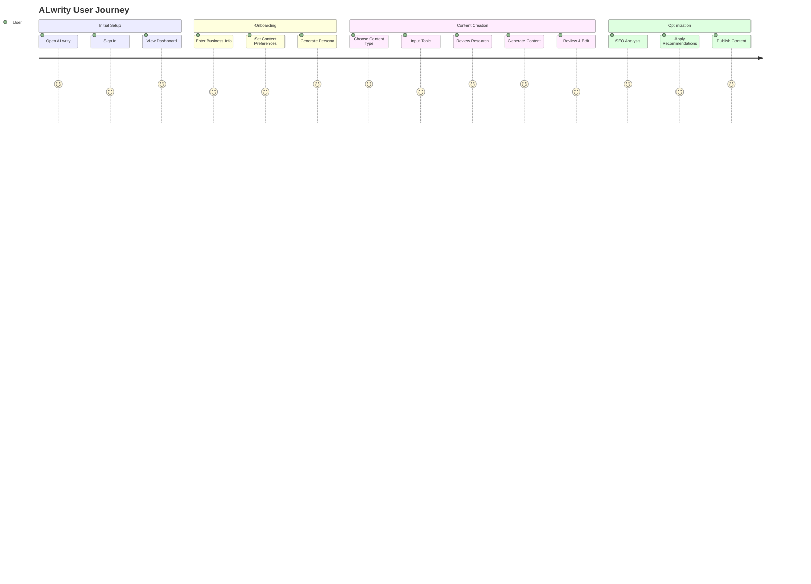

# First Steps with ALwrity

Welcome to ALwrity! This guide will walk you through your first content creation journey, from initial setup to publishing your first AI-generated content. Follow these steps to get the most out of your AI-powered content creation platform.

## Prerequisites

Before you begin, ensure you have:

- ✅ **ALwrity Installed**: Follow the [Installation Guide](installation.md)
- ✅ **Configuration Complete**: Set up your [API keys and settings](configuration.md)
- ✅ **Backend Running**: Server available at `http://localhost:8000`
- ✅ **Frontend Running**: Application available at `http://localhost:3000`

## Step 1: Access the Dashboard

### 1.1 Open ALwrity

1. **Navigate to**: `http://localhost:3000`
2. **Sign In**: Use your authentication method (if configured)
3. **Dashboard**: You'll see the main ALwrity dashboard

### 1.2 User Journey Overview

### 1.2 Dashboard Overview

The dashboard provides access to:

- **📝 Blog Writer**: AI-powered blog content creation
- **📊 SEO Dashboard**: Content optimization and analytics
- **💼 LinkedIn Writer**: Professional social media content
- **📱 Facebook Writer**: Social media content creation
- **🎯 Content Strategy**: Strategic planning and personas
- **📈 Analytics**: Performance tracking and insights

## Step 2: Complete Onboarding

### 2.1 Business Information

1. **Click "Get Started"** or navigate to onboarding
2. **Enter Business Details**:
   - Business name and type
   - Industry or niche
   - Target audience description
   - Business goals and objectives

### 2.2 Content Preferences

1. **Content Types**: Select the types of content you want to create
   - Blog posts
   - Social media content
   - Email newsletters
   - Marketing materials

2. **Brand Voice**: Define your brand personality
   - Professional and formal
   - Casual and friendly
   - Technical and detailed
   - Creative and engaging

3. **Content Goals**: Specify your objectives
   - Brand awareness
   - Lead generation
   - Customer education
   - Sales conversion

### 2.3 AI Persona Generation

1. **Persona Creation**: ALwrity will generate detailed buyer personas
2. **Review Personas**: Examine the AI-generated audience profiles
3. **Customize**: Adjust personas based on your knowledge
4. **Save**: Confirm your persona configuration

## Step 3: Create Your First Blog Post

### 3.1 Access Blog Writer

1. **Navigate to**: Blog Writer from the dashboard
2. **Click**: "Create New Blog Post"
3. **Select**: Content creation mode

### 3.2 Topic Selection

1. **Enter Topic**: Provide a topic or keyword
   - Example: "AI in Digital Marketing"
   - Example: "Content Strategy for Small Businesses"
   - Example: "SEO Best Practices 2024"

2. **AI Research**: ALwrity will automatically:
   - Research your topic
   - Analyze competitor content
   - Identify key points to cover
   - Find relevant statistics and data

### 3.3 Content Planning

1. **Review Research**: Examine the AI-generated research
2. **Outline Generation**: AI creates a structured outline
3. **Customize Outline**: Adjust sections and points
4. **Add Requirements**: Specify any special requirements

### 3.4 Content Generation

1. **Generate Content**: AI creates the full blog post
2. **Review Sections**: Examine each section of the content
3. **Edit and Refine**: Make adjustments as needed
4. **Add Personal Touch**: Include your unique insights

### 3.5 SEO Optimization

1. **SEO Analysis**: AI analyzes content for SEO
2. **Keyword Optimization**: Optimize for target keywords
3. **Meta Tags**: Generate title and description
4. **Readability**: Ensure content is easy to read

## Step 4: Optimize with SEO Dashboard

### 4.1 SEO Analysis

1. **Navigate to**: SEO Dashboard
2. **Upload Content**: Import your blog post
3. **Run Analysis**: AI performs comprehensive SEO analysis

### 4.2 SEO Recommendations

1. **Keyword Density**: Optimize keyword usage
2. **Content Structure**: Improve headings and organization
3. **Meta Optimization**: Enhance title and description
4. **Internal Linking**: Add relevant internal links

### 4.3 Performance Insights

1. **Competitor Analysis**: Compare with top-performing content
2. **Gap Analysis**: Identify missing elements
3. **Improvement Suggestions**: Get specific recommendations
4. **Performance Prediction**: Forecast content success

## Step 5: Create Social Media Content

### 5.1 LinkedIn Content

1. **Navigate to**: LinkedIn Writer
2. **Select Content Type**:
   - Professional posts
   - Articles
   - Carousel posts
   - Video scripts

3. **Generate Content**: AI creates LinkedIn-optimized content
4. **Review and Edit**: Customize for your brand voice
5. **Add Hashtags**: Include relevant hashtags

### 5.2 Facebook Content

1. **Navigate to**: Facebook Writer
2. **Choose Format**:
   - Text posts
   - Image captions
   - Video descriptions
   - Event promotions

3. **Generate Content**: AI creates Facebook-optimized content
4. **Review Engagement**: Optimize for Facebook algorithms
5. **Schedule Posts**: Plan your content calendar

## Step 6: Develop Content Strategy

### 6.1 Strategic Planning

1. **Navigate to**: Content Strategy
2. **Review AI-Generated Strategy**: Examine the comprehensive plan
3. **Content Calendar**: View your suggested publishing schedule
4. **Topic Clusters**: Understand content themes and relationships

### 6.2 Persona Refinement

1. **Access Personas**: Review your buyer personas
2. **Update Information**: Add new insights about your audience
3. **Content Alignment**: Ensure content matches persona needs
4. **Journey Mapping**: Understand customer touchpoints

### 6.3 Performance Tracking

1. **Set Goals**: Define measurable objectives
2. **Track Metrics**: Monitor key performance indicators
3. **Analyze Results**: Review content performance
4. **Optimize Strategy**: Adjust based on data insights

## Step 7: Publish and Monitor

### 7.1 Content Publishing

1. **Export Content**: Download your optimized content
2. **Publish**: Upload to your website or platform
3. **Share**: Distribute across social media channels
4. **Track**: Monitor publication status

### 7.2 Performance Monitoring

1. **Analytics Dashboard**: View performance metrics
2. **Engagement Tracking**: Monitor likes, shares, comments
3. **Traffic Analysis**: Track website visits and conversions
4. **ROI Measurement**: Calculate return on investment

## Step 8: Iterate and Improve

### 8.1 Content Optimization

1. **Review Performance**: Analyze what's working
2. **Identify Patterns**: Find successful content types
3. **Adjust Strategy**: Modify approach based on results
4. **Scale Success**: Replicate winning formulas

### 8.2 Continuous Learning

1. **AI Feedback**: Let ALwrity learn from your preferences
2. **Strategy Refinement**: Continuously improve your approach
3. **New Features**: Explore additional ALwrity capabilities
4. **Best Practices**: Implement proven strategies

## Best Practices for Success

### Content Creation

- **Be Specific**: Provide detailed topic descriptions
- **Review AI Output**: Always review and customize generated content
- **Maintain Brand Voice**: Ensure consistency across all content
- **Add Personal Insights**: Include your unique perspective

### SEO Optimization

- **Target Keywords**: Focus on relevant, high-value keywords
- **Optimize Structure**: Use proper headings and formatting
- **Internal Linking**: Connect related content pieces
- **Monitor Performance**: Track SEO improvements over time

### Social Media

- **Platform Optimization**: Tailor content for each platform
- **Engagement Focus**: Create content that encourages interaction
- **Consistent Posting**: Maintain regular publishing schedule
- **Community Building**: Foster relationships with your audience

### Strategy Development

- **Data-Driven Decisions**: Base strategy on performance data
- **Regular Reviews**: Assess and adjust strategy monthly
- **Goal Alignment**: Ensure content supports business objectives
- **Competitive Analysis**: Stay aware of competitor activities

## Common First-Time User Tips

### Getting Started

1. **Start Small**: Begin with one content type and expand
2. **Learn the Interface**: Familiarize yourself with all features
3. **Test Different Topics**: Experiment with various content themes
4. **Save Templates**: Create reusable content templates

### Content Quality

1. **Review Everything**: Always review AI-generated content
2. **Add Personal Touch**: Include your unique insights
3. **Fact-Check**: Verify important information and statistics
4. **Maintain Consistency**: Keep brand voice consistent

### Performance Optimization

1. **Track Metrics**: Monitor key performance indicators
2. **A/B Test**: Experiment with different approaches
3. **Learn from Data**: Use analytics to guide decisions
4. **Iterate Quickly**: Make adjustments based on results

## Troubleshooting Common Issues

### Content Generation

**Issue**: AI generates generic content
**Solution**: Provide more specific topic descriptions and requirements

**Issue**: Content doesn't match brand voice
**Solution**: Update persona settings and brand voice preferences

**Issue**: SEO scores are low
**Solution**: Use SEO Dashboard recommendations and optimize content

### Technical Issues

**Issue**: Content doesn't save
**Solution**: Check browser console for errors and refresh page

**Issue**: Slow content generation
**Solution**: Verify API keys and check internet connection

**Issue**: Research data is outdated
**Solution**: Ensure research services are properly configured

## Next Steps

After completing your first content creation cycle:

1. **[Explore Advanced Features](../features/blog-writer/overview.md)** - Learn about advanced content creation
2. **[SEO Optimization Guide](../features/seo-dashboard/overview.md)** - Master SEO techniques
3. **[Content Strategy Development](../features/content-strategy/overview.md)** - Build comprehensive strategies
4. **[Performance Analytics](../guides/performance.md)** - Track and optimize results
5. **[Troubleshooting Guide](../guides/troubleshooting.md)** - Resolve common issues

## Success Metrics to Track

### Content Performance

- **Engagement Rate**: Likes, shares, comments per post
- **Click-Through Rate**: Clicks on links and CTAs
- **Time on Page**: How long readers engage with content
- **Conversion Rate**: Actions taken after reading content

### SEO Performance

- **Search Rankings**: Position in search results
- **Organic Traffic**: Visitors from search engines
- **Keyword Rankings**: Performance for target keywords
- **Backlinks**: Links from other websites

### Business Impact

- **Lead Generation**: New prospects from content
- **Sales Conversion**: Revenue attributed to content
- **Brand Awareness**: Mentions and recognition
- **Customer Engagement**: Interaction and feedback

---

*Ready to create amazing content? [Explore our advanced features](../features/blog-writer/overview.md) and take your content strategy to the next level!*
