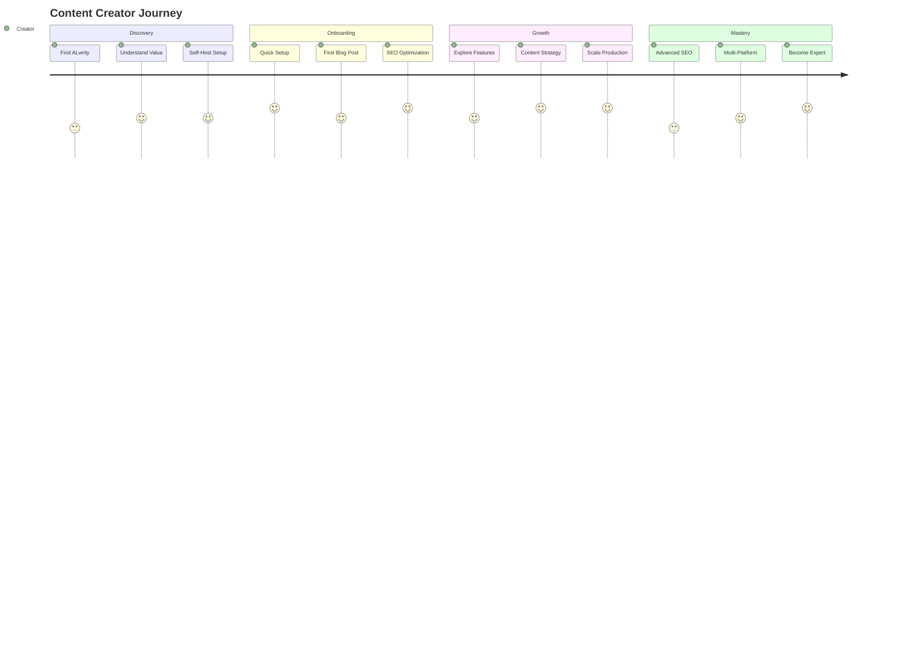

# Content Creators Journey

Welcome to ALwrity! This journey is designed specifically for bloggers, writers, small business owners, and freelancers who want to create amazing content efficiently using AI-powered tools.

## 🎯 Your Journey Overview

## 🚀 What You'll Achieve

### Immediate Benefits (Week 1)
- **Create your first high-quality blog post** in under 30 minutes
- **Improve your content's SEO** with built-in optimization tools
- **Generate research-backed content** with AI-powered research integration
- **Save 70% of your content creation time**

### Short-term Goals (Month 1)
- **Publish 4x more content** with the same effort
- **Increase organic traffic** by 50%+ through better SEO
- **Build a loyal audience** with consistent, valuable content
- **Establish thought leadership** in your niche

### Long-term Success (3+ Months)
- **Scale your content business** to new heights
- **Generate passive income** through content marketing
- **Build a personal brand** that attracts opportunities
- **Become a content creation expert** in your field

## 🎨 Perfect For You If...

✅ **You're a blogger** who wants to publish more frequently  
✅ **You're a small business owner** who needs to create marketing content  
✅ **You're a freelancer** who wants to showcase your expertise  
✅ **You're a writer** who wants to focus on creativity, not technical details  
✅ **You want to improve your SEO** without learning complex tools  
✅ **You need consistent content** but don't have time to write everything  

## 🛠️ What Makes This Journey Special

### AI-Powered Content Creation
- **Blog Writer**: Complete blog post generation with research integration
- **SEO Analysis**: Built-in SEO optimization and metadata generation
- **Research Integration**: Automated fact-checking and source citation
- **Content Planning**: AI-powered content strategy and calendar

### Self-Hosted Solution
- **Full Control**: Your data stays on your server
- **No Vendor Lock-in**: Open source, modify as needed
- **Privacy First**: Complete data ownership and control
- **Cost Effective**: No monthly SaaS fees

### Professional Features
- **Google Search Console Integration**: Real SEO performance data
- **Hallucination Detection**: Built-in fact-checking for accuracy
- **Multi-Platform Support**: Blog, LinkedIn, Facebook content
- **Subscription System**: Track usage and costs

## 📋 Your Journey Steps

### Step 1: Self-Host Setup (30 minutes)
**[Get Started →](getting-started.md)**

- Set up ALwrity on your local machine
- Configure API keys for AI services
- Complete simple onboarding process
- Verify everything is working

### Step 2: Create Your First Blog Post (30 minutes)
**[Create First Content →](first-content.md)**

- Use the Blog Writer to generate content
- Leverage research integration for facts
- Apply SEO optimization automatically
- Publish your first AI-assisted post

### Step 3: Optimize Your Content (20 minutes)
**[SEO Optimization →](seo-optimization.md)**

- Use built-in SEO analysis tools
- Connect Google Search Console
- Monitor content performance
- Apply SEO recommendations

### Step 4: Scale Your Production (Ongoing)
**[Scaling Your Content →](scaling.md)**

- Create content templates and workflows
- Use content planning features
- Implement multi-platform publishing
- Track performance and ROI

## 🎯 Success Stories

### Sarah - Lifestyle Blogger
*"I went from publishing once a week to three times a week, and my traffic increased by 200%. ALwrity's research integration helps me create factually accurate content that my audience trusts."*

### Mike - Small Business Owner
*"As a restaurant owner, I never had time for marketing content. Now I publish weekly blog posts and social media content that brings in new customers every week. The SEO tools help me rank higher in local searches."*

### Lisa - Freelance Writer
*"ALwrity helps me create high-quality content for my clients faster than ever. The hallucination detection ensures accuracy, and my clients love the research-backed content."*

## 🚀 Ready to Start?

### Quick Start (5 minutes)
1. **[Set up ALwrity locally](getting-started.md)**
2. **[Create your first blog post](first-content.md)**
3. **[Optimize for SEO](seo-optimization.md)**

### Need Help?
- **[Common Questions](troubleshooting.md)** - Quick answers to common issues
- **[Video Tutorials](https://youtube.com/alwrity)** - Watch step-by-step guides
- **[Community Support](https://github.com/AJaySi/ALwrity/discussions)** - Get help from other users

## 📚 What's Next?

Once you've completed your first content creation, explore these next steps:

- **[SEO Optimization](seo-optimization.md)** - Improve your content visibility
- **[Content Strategy](content-strategy.md)** - Plan your content calendar
- **[Multi-Platform Publishing](multi-platform.md)** - LinkedIn and Facebook content
- **[Performance Tracking](performance-tracking.md)** - Monitor your success

## 🔧 Technical Requirements

### Prerequisites
- **Python 3.8+** installed on your system
- **Node.js 18+** for the frontend
- **API Keys** for AI services (Gemini, OpenAI, etc.)
- **Basic command line** knowledge

### Supported Platforms
- **Windows**: Full support with PowerShell
- **macOS**: Native support with Terminal
- **Linux**: Ubuntu, CentOS, and other distributions

## 🎯 Success Metrics

### Content Quality
- **Research Integration**: Fact-checked, accurate content
- **SEO Optimization**: Higher search rankings
- **Engagement**: Increased reader interaction
- **Authority**: Established thought leadership

### Efficiency Gains
- **Time Savings**: 70% reduction in content creation time
- **Output Increase**: 4x more content with same effort
- **Quality Improvement**: Better researched, SEO-optimized content
- **Consistency**: Regular publishing schedule

---

*Ready to transform your content creation? [Start your journey now →](getting-started.md)*
