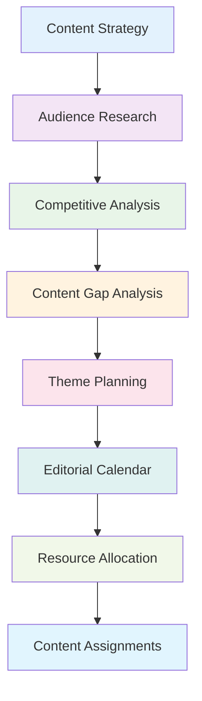

# Content Production for Content Teams

## 🎯 Overview

This guide helps content teams optimize their content production workflows using ALwrity. You'll learn how to streamline content creation, improve team collaboration, maintain quality standards, and scale your content operations effectively.

## 🚀 What You'll Achieve

### Production Excellence
- **Streamlined Workflows**: Optimize content creation and approval processes
- **Quality Consistency**: Maintain consistent content quality across all team members
- **Efficiency Gains**: Increase content production efficiency and output
- **Team Coordination**: Improve team coordination and collaboration

### Scalable Operations
- **Volume Scaling**: Scale content production to meet growing demands
- **Process Standardization**: Standardize processes for consistency and efficiency
- **Resource Optimization**: Optimize team resources and workload distribution
- **Performance Tracking**: Track and improve team performance metrics

## 📋 Content Production Framework

### Production Workflow
**Content Planning Phase**:
1. **Strategy Development**: Develop content strategy and themes
2. **Calendar Planning**: Plan content calendar and scheduling
3. **Resource Allocation**: Allocate team resources and assignments
4. **Timeline Setting**: Set realistic timelines and deadlines

**Content Creation Phase**:
- **Research and Planning**: Conduct research and create content outlines
- **Content Writing**: Write and develop content using ALwrity tools
- **Review and Editing**: Review and edit content for quality
- **Approval Process**: Get content approved through team workflow

**Content Publishing Phase**:
- **Final Review**: Conduct final quality review
- **Formatting and Optimization**: Format content for different platforms
- **Publishing**: Publish content to various channels
- **Performance Tracking**: Track content performance and metrics

### Team Roles and Responsibilities
**Content Strategist**:
- **Strategy Development**: Develop overall content strategy
- **Theme Planning**: Plan content themes and topics
- **Calendar Management**: Manage content calendar and scheduling
- **Performance Analysis**: Analyze content performance and optimization

**Content Writers**:
- **Content Creation**: Create high-quality content using ALwrity tools
- **Research**: Conduct research and fact-checking
- **SEO Optimization**: Optimize content for search engines
- **Quality Assurance**: Ensure content meets quality standards

**Content Editors**:
- **Content Review**: Review and edit content for quality and consistency
- **Style Guide Compliance**: Ensure content follows style guidelines
- **Fact Checking**: Verify facts and information accuracy
- **Final Approval**: Provide final approval for content publication

## 🛠️ ALwrity Team Features

### Collaborative Content Creation
**Shared Workspaces**:
- **Team Projects**: Create shared projects for team collaboration
- **Content Libraries**: Build shared content libraries and templates
- **Resource Sharing**: Share research, assets, and resources
- **Version Control**: Track content versions and changes

**Real-Time Collaboration**:
- **Live Editing**: Collaborate on content in real-time
- **Comments and Feedback**: Add comments and feedback on content
- **Assignment Management**: Assign tasks and track progress
- **Notification System**: Get notified of updates and changes

### Workflow Management
**Approval Workflows**:
- **Multi-Stage Approval**: Set up multi-stage approval processes
- **Role-Based Permissions**: Configure permissions based on team roles
- **Automated Notifications**: Send automated notifications for approvals
- **Status Tracking**: Track content status throughout workflow

**Task Management**:
- **Task Assignment**: Assign tasks to team members
- **Deadline Tracking**: Track deadlines and deliverables
- **Progress Monitoring**: Monitor progress and completion status
- **Workload Management**: Balance workload across team members

## 📊 Content Production Process

### Content Planning
**Strategy Development**:
- **Content Audits**: Conduct regular content audits and analysis
- **Competitive Analysis**: Analyze competitor content and strategies
- **Audience Research**: Research target audience and preferences
- **Content Gap Analysis**: Identify content gaps and opportunities

**Calendar Planning**:
- **Editorial Calendar**: Create comprehensive editorial calendar
- **Content Themes**: Plan content themes and topics
- **Seasonal Planning**: Plan seasonal and event-based content
- **Resource Planning**: Plan resources and team assignments

#### Content Planning Process Flow

### Content Creation
**Research Phase**:
- **Topic Research**: Research topics using ALwrity research tools
- **Source Verification**: Verify sources and information accuracy
- **Competitor Analysis**: Analyze competitor content and approaches
- **Audience Insights**: Gather audience insights and preferences

**Writing Phase**:
- **Outline Development**: Create detailed content outlines
- **Content Writing**: Write content using ALwrity blog writer
- **SEO Optimization**: Optimize content for search engines
- **Quality Review**: Review content for quality and accuracy

**Editing Phase**:
- **Content Review**: Review content for clarity and accuracy
- **Style Guide Compliance**: Ensure content follows style guidelines
- **Fact Checking**: Verify all facts and information
- **Final Polish**: Polish content for publication readiness

### Content Publishing
**Pre-Publication**:
- **Final Review**: Conduct final quality review
- **SEO Check**: Final SEO optimization check
- **Formatting**: Format content for target platform
- **Asset Preparation**: Prepare images, videos, and other assets

**Publication**:
- **Platform Publishing**: Publish to various platforms and channels
- **Social Media**: Share on social media platforms
- **Email Marketing**: Include in email marketing campaigns
- **Cross-Promotion**: Cross-promote across different channels

## 🎯 Quality Assurance

### Content Quality Standards
**Quality Criteria**:
- **Accuracy**: Ensure all information is accurate and verified
- **Clarity**: Write clear and understandable content
- **Relevance**: Ensure content is relevant to target audience
- **Engagement**: Create engaging and compelling content

**Style Guidelines**:
- **Tone and Voice**: Maintain consistent tone and voice
- **Formatting**: Follow consistent formatting guidelines
- **Grammar and Spelling**: Ensure proper grammar and spelling
- **Brand Compliance**: Ensure content aligns with brand guidelines

### Review Process
**Multi-Level Review**:
- **Self-Review**: Writers review their own content first
- **Peer Review**: Team members review each other's content
- **Editor Review**: Editors conduct thorough content review
- **Final Approval**: Final approval from content strategist or manager

**Quality Metrics**:
- **Readability Scores**: Monitor readability and comprehension scores
- **SEO Performance**: Track SEO optimization and performance
- **Engagement Metrics**: Monitor reader engagement and interaction
- **Error Rates**: Track and minimize content errors and issues

## 📈 Performance Optimization

### Production Efficiency
**Workflow Optimization**:
- **Process Streamlining**: Streamline content creation processes
- **Automation**: Automate repetitive tasks and processes
- **Template Usage**: Use templates to speed up content creation
- **Batch Processing**: Process similar content in batches

**Resource Optimization**:
- **Skill Matching**: Match tasks to team member skills
- **Workload Balancing**: Balance workload across team members
- **Tool Utilization**: Maximize use of ALwrity tools and features
- **Time Management**: Optimize time allocation and scheduling

### Quality Improvement
**Continuous Improvement**:
- **Feedback Integration**: Integrate feedback into content improvement
- **Performance Analysis**: Analyze content performance regularly
- **Process Refinement**: Refine processes based on results
- **Training and Development**: Provide ongoing training and development

**Best Practice Implementation**:
- **Industry Standards**: Follow industry best practices
- **Innovation**: Implement innovative content approaches
- **Technology Utilization**: Leverage latest content creation technology
- **Team Development**: Develop team skills and capabilities

## 🛠️ Team Management

### Team Coordination
**Communication**:
- **Regular Meetings**: Hold regular team meetings and check-ins
- **Clear Communication**: Maintain clear and open communication
- **Feedback Culture**: Foster culture of constructive feedback
- **Conflict Resolution**: Address conflicts and issues promptly

**Collaboration Tools**:
- **Project Management**: Use project management tools effectively
- **Communication Platforms**: Leverage communication platforms
- **Shared Resources**: Maintain shared resource libraries
- **Knowledge Sharing**: Promote knowledge sharing and learning

### Performance Management
**Goal Setting**:
- **Team Goals**: Set clear team goals and objectives
- **Individual Goals**: Set individual goals and development plans
- **Performance Metrics**: Define and track performance metrics
- **Regular Reviews**: Conduct regular performance reviews

**Development and Training**:
- **Skill Development**: Provide opportunities for skill development
- **Training Programs**: Implement training and development programs
- **Mentoring**: Establish mentoring and coaching relationships
- **Career Development**: Support career development and growth

## 📊 Analytics and Reporting

### Performance Metrics
**Production Metrics**:
- **Content Volume**: Track content production volume
- **Quality Scores**: Monitor content quality metrics
- **Timeline Adherence**: Track adherence to timelines and deadlines
- **Resource Utilization**: Monitor resource utilization and efficiency

**Content Performance**:
- **Engagement Metrics**: Track reader engagement and interaction
- **SEO Performance**: Monitor SEO optimization and ranking
- **Conversion Rates**: Track conversion and lead generation
- **ROI Metrics**: Measure return on investment for content

### Reporting and Analysis
**Regular Reporting**:
- **Weekly Reports**: Generate weekly production and performance reports
- **Monthly Analysis**: Conduct monthly performance analysis
- **Quarterly Reviews**: Hold quarterly team and performance reviews
- **Annual Planning**: Conduct annual planning and goal setting

**Data-Driven Decisions**:
- **Performance Analysis**: Use data to analyze performance and trends
- **Optimization Opportunities**: Identify optimization opportunities
- **Resource Allocation**: Make data-driven resource allocation decisions
- **Strategic Planning**: Use data for strategic planning and decision making

## 🎯 Best Practices

### Content Production Best Practices
**Planning and Strategy**:
1. **Comprehensive Planning**: Plan content strategy comprehensively
2. **Audience Focus**: Keep audience needs and preferences at center
3. **Quality Over Quantity**: Prioritize quality over quantity
4. **Consistent Scheduling**: Maintain consistent content scheduling
5. **Performance Monitoring**: Monitor performance and optimize continuously

**Team Collaboration**:
- **Clear Roles**: Define clear roles and responsibilities
- **Effective Communication**: Maintain effective team communication
- **Collaborative Culture**: Foster collaborative and supportive culture
- **Continuous Learning**: Promote continuous learning and improvement

### Process Optimization
**Workflow Efficiency**:
- **Process Documentation**: Document all processes and procedures
- **Template Usage**: Use templates and standardized approaches
- **Automation**: Automate repetitive tasks and processes
- **Regular Review**: Regularly review and optimize processes

## 🎯 Next Steps

### Immediate Actions (This Week)
1. **Team Assessment**: Assess current team capabilities and processes
2. **Workflow Planning**: Plan optimized content production workflows
3. **Tool Setup**: Set up ALwrity tools for team collaboration
4. **Role Definition**: Define clear roles and responsibilities

### Short-Term Planning (This Month)
1. **Process Implementation**: Implement optimized production processes
2. **Team Training**: Train team on ALwrity tools and best practices
3. **Quality Standards**: Establish quality standards and review processes
4. **Performance Tracking**: Set up performance tracking and metrics

### Long-Term Strategy (Next Quarter)
1. **Process Optimization**: Optimize processes based on performance data
2. **Team Development**: Develop team skills and capabilities
3. **Scaling Preparation**: Prepare for scaling content production
4. **Excellence Achievement**: Achieve content production excellence

---

*Ready to optimize your content production? Start with [Team Management](team-management.md) to establish effective team coordination before implementing production workflows!*
