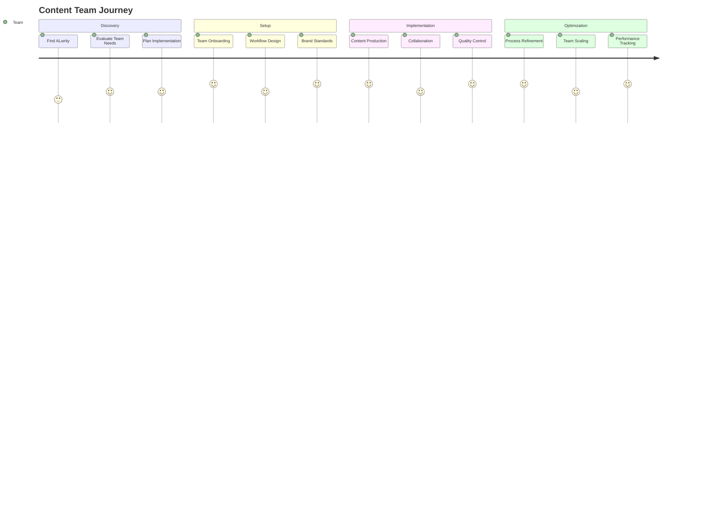

# Content Teams Journey

Welcome to ALwrity! This journey is designed specifically for marketing teams, content agencies, and editorial teams who need collaboration features, workflow management, and brand consistency across multiple team members.

## 🎯 Your Journey Overview

## 🚀 What You'll Achieve

### Immediate Benefits (Week 1)
- **Onboard your entire team** with role-based access
- **Establish content workflows** and approval processes
- **Maintain brand consistency** across all team members
- **Streamline content production** with collaborative tools

### Short-term Goals (Month 1)
- **Increase team productivity** by 60%+ through better workflows
- **Improve content quality** with consistent brand standards
- **Scale content production** without sacrificing quality
- **Reduce content creation time** by 50%+

### Long-term Success (3+ Months)
- **Build scalable content operations** that grow with your team
- **Establish thought leadership** through consistent, high-quality content
- **Generate measurable business results** from content marketing
- **Create a content machine** that runs efficiently

## 🎨 Perfect For You If...

✅ **You're a marketing team** that needs to scale content production  
✅ **You're a content agency** serving multiple clients  
✅ **You're an editorial team** managing content across platforms  
✅ **You need collaboration features** for team content creation  
✅ **You want to maintain brand consistency** across team members  
✅ **You need approval workflows** and quality control processes  

## 🛠️ What Makes This Journey Special

### Team Collaboration
- **Role-Based Access**: Different permissions for different team members
- **Collaborative Editing**: Multiple team members can work on content
- **Approval Workflows**: Structured review and approval processes
- **Version Control**: Track changes and maintain content history

### Brand Consistency
- **Brand Guidelines**: Centralized brand voice and style guidelines
- **Content Templates**: Consistent formats and structures
- **Quality Control**: Built-in checks for brand compliance
- **Style Guides**: Maintain consistent tone and messaging

### Workflow Management
- **Content Calendar**: Plan and schedule content across team members
- **Task Assignment**: Assign content tasks to specific team members
- **Progress Tracking**: Monitor content production and deadlines
- **Resource Management**: Optimize team capacity and workload

### Scalable Operations
- **Team Scaling**: Add new team members easily
- **Process Automation**: Automate repetitive tasks and workflows
- **Performance Analytics**: Track team productivity and content performance
- **Knowledge Management**: Centralize team knowledge and best practices

## 📋 Your Journey Steps

### Step 1: Workflow Setup (2 hours)
**[Get Started →](workflow-setup.md)**

- Design your content production workflow
- Set up team roles and permissions
- Create content templates and guidelines
- Establish approval processes

### Step 2: Team Management (1 hour)
**[Team Setup →](team-management.md)**

- Onboard team members with appropriate access
- Set up collaboration tools and processes
- Create content assignments and schedules
- Establish communication protocols

### Step 3: Brand Consistency (1 hour)
**[Brand Setup →](brand-consistency.md)**

- Define brand voice and style guidelines
- Create content templates and formats
- Set up quality control processes
- Train team on brand standards

## 🎯 Success Stories

### Sarah - Marketing Team Lead
*"ALwrity transformed our content team's productivity. We went from 5 blog posts per month to 20, while maintaining higher quality and brand consistency across all content."*

### Mike - Content Agency Owner
*"The collaboration features in ALwrity helped us manage content for 15+ clients efficiently. Our team productivity increased by 80%, and client satisfaction improved significantly."*

### Lisa - Editorial Director
*"The approval workflows and brand consistency tools in ALwrity ensure our content always meets our standards. We've reduced revision cycles by 60% and improved content quality."*

## 🚀 Ready to Start?

### Quick Start (5 minutes)
1. **[Set up your workflow](workflow-setup.md)**
2. **[Onboard your team](team-management.md)**
3. **[Establish brand consistency](brand-consistency.md)**

### Need Help?
- **[Common Questions](troubleshooting.md)** - Quick answers to common issues
- **[Video Tutorials](https://youtube.com/alwrity)** - Watch step-by-step guides
- **[Community Support](https://github.com/AJaySi/ALwrity/discussions)** - Connect with other content teams

## 📚 What's Next?

Once you've established your team workflow, explore these next steps:

- **[Advanced Workflows](advanced-workflows.md)** - Optimize your content production process
- **[Performance Analytics](performance-analytics.md)** - Track team and content performance
- **[Client Management](client-management.md)** - Manage multiple clients efficiently
- **[Team Scaling](team-scaling.md)** - Grow your content team

## 🔧 Technical Requirements

### Prerequisites
- **Team collaboration tools** (Slack, Microsoft Teams, etc.)
- **Project management system** for task tracking
- **Brand guidelines** and style guides
- **Content approval processes** and workflows

### Team Structure
- **Content Managers**: Oversee strategy and workflow
- **Content Creators**: Generate and edit content
- **Reviewers**: Approve and quality-check content
- **Stakeholders**: Provide input and final approval

## 🎯 Success Metrics

### Team Productivity
- **Content Output**: 3x increase in content production
- **Workflow Efficiency**: 60% improvement in process speed
- **Quality Consistency**: 95%+ brand compliance
- **Team Satisfaction**: Higher job satisfaction and retention

### Content Performance
- **Content Quality**: Improved engagement and performance
- **Brand Consistency**: Consistent voice and messaging
- **SEO Performance**: Better search rankings and traffic
- **Business Impact**: Measurable ROI from content marketing

### Operational Metrics
- **Time Savings**: 50% reduction in content creation time
- **Cost Efficiency**: Lower cost per piece of content
- **Scalability**: Ability to handle increased content volume
- **Client Satisfaction**: Higher client satisfaction and retention

---

*Ready to transform your content team's productivity and quality? [Start your journey now →](workflow-setup.md)*
