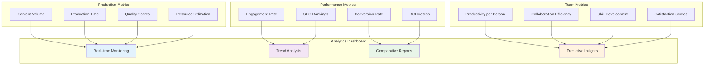

# Performance Tracking for Content Teams

## 🎯 Overview

This guide helps content teams implement effective performance tracking and analytics. You'll learn how to measure team productivity, track content performance, analyze ROI, and optimize operations based on data-driven insights.

## 🚀 What You'll Achieve

### Data-Driven Operations
- **Performance Visibility**: Gain clear visibility into team and content performance
- **ROI Measurement**: Measure return on investment for content operations
- **Optimization Insights**: Identify optimization opportunities and improvements
- **Strategic Decision Making**: Make data-driven strategic decisions

### Operational Excellence
- **Productivity Optimization**: Optimize team productivity and efficiency
- **Quality Improvement**: Improve content quality based on performance data
- **Cost Management**: Manage costs and optimize resource allocation
- **Competitive Advantage**: Build competitive advantages through performance insights

## 📋 Performance Tracking Framework

### Key Performance Indicators (KPIs)
**Production Metrics**:
1. **Content Volume**: Number of content pieces produced
2. **Production Time**: Time to produce content from start to finish
3. **Quality Scores**: Content quality metrics and scores
4. **Resource Utilization**: Resource utilization and efficiency

**Performance Metrics**:
- **Engagement Metrics**: Reader engagement and interaction rates
- **SEO Performance**: Search engine optimization and ranking metrics
- **Conversion Rates**: Content conversion and lead generation rates
- **ROI Metrics**: Return on investment for content operations

**Team Metrics**:
- **Productivity per Person**: Productivity metrics per team member
- **Collaboration Efficiency**: Team collaboration and coordination metrics
- **Skill Development**: Team skill development and improvement metrics
- **Satisfaction Scores**: Team satisfaction and engagement scores

#### Performance Metrics Dashboard

### Measurement Framework
**Data Collection**:
- **Automated Tracking**: Use automated systems for data collection
- **Manual Tracking**: Implement manual tracking for specific metrics
- **Integration**: Integrate data from multiple sources and systems
- **Validation**: Validate data accuracy and consistency

**Analysis and Reporting**:
- **Regular Reporting**: Generate regular performance reports
- **Trend Analysis**: Analyze trends and patterns over time
- **Comparative Analysis**: Compare performance across teams and periods
- **Predictive Analysis**: Use data for predictive insights and planning

## 🛠️ ALwrity Analytics Features

### Built-in Analytics
**Content Performance Analytics**:
- **Content Metrics**: Track content creation and performance metrics
- **SEO Analytics**: Monitor SEO performance and optimization
- **Engagement Analytics**: Track reader engagement and interaction
- **Quality Analytics**: Monitor content quality and improvement

**Team Performance Analytics**:
- **Productivity Tracking**: Track team productivity and efficiency
- **Collaboration Metrics**: Monitor team collaboration and coordination
- **Skill Development**: Track skill development and improvement
- **Workload Management**: Monitor workload distribution and balance

### Custom Analytics
**Custom Dashboards**:
- **Performance Dashboards**: Create custom performance dashboards
- **Team Dashboards**: Build team-specific performance dashboards
- **Content Dashboards**: Develop content-specific analytics dashboards
- **Executive Dashboards**: Create executive-level performance dashboards

**Advanced Analytics**:
- **Predictive Analytics**: Implement predictive analytics for planning
- **Comparative Analysis**: Conduct comparative analysis across teams
- **Trend Analysis**: Analyze trends and patterns over time
- **Correlation Analysis**: Identify correlations between different metrics

## 📊 Content Performance Tracking

### Content Metrics
**Creation Metrics**:
- **Content Volume**: Track number of content pieces created
- **Production Time**: Monitor time to create content
- **Content Types**: Track different types of content produced
- **Platform Distribution**: Monitor content distribution across platforms

**Quality Metrics**:
- **Quality Scores**: Track content quality scores and ratings
- **Error Rates**: Monitor content errors and issues
- **Review Cycles**: Track number of review cycles required
- **Approval Rates**: Monitor content approval rates and timelines

**Performance Metrics**:
- **Engagement Rates**: Track reader engagement and interaction
- **Share Rates**: Monitor content sharing and viral metrics
- **Conversion Rates**: Track content conversion and lead generation
- **SEO Rankings**: Monitor search engine rankings and visibility

### SEO Performance
**SEO Metrics**:
- **Keyword Rankings**: Track keyword rankings and improvements
- **Organic Traffic**: Monitor organic traffic growth and trends
- **Click-Through Rates**: Track click-through rates and CTR improvements
- **Search Visibility**: Monitor overall search visibility and presence

**Optimization Metrics**:
- **SEO Score Improvements**: Track SEO score improvements over time
- **Technical SEO**: Monitor technical SEO performance and issues
- **Content Optimization**: Track content optimization effectiveness
- **Link Building**: Monitor link building and backlink growth

## 🎯 Team Performance Tracking

### Productivity Metrics
**Individual Productivity**:
- **Content Output**: Track individual content production
- **Quality Scores**: Monitor individual quality performance
- **Efficiency Metrics**: Track individual efficiency and productivity
- **Skill Development**: Monitor individual skill development

**Team Productivity**:
- **Team Output**: Track overall team content production
- **Collaboration Efficiency**: Monitor team collaboration effectiveness
- **Workload Balance**: Track workload distribution and balance
- **Resource Utilization**: Monitor team resource utilization

### Collaboration Metrics
**Communication Metrics**:
- **Response Times**: Track communication response times
- **Meeting Effectiveness**: Monitor meeting effectiveness and productivity
- **Feedback Quality**: Track feedback quality and usefulness
- **Knowledge Sharing**: Monitor knowledge sharing and transfer

**Workflow Metrics**:
- **Process Efficiency**: Track workflow and process efficiency
- **Bottleneck Identification**: Identify bottlenecks and inefficiencies
- **Approval Times**: Monitor approval and decision-making times
- **Error Rates**: Track workflow errors and issues

## 📈 ROI and Business Impact

### ROI Measurement
**Cost Analysis**:
- **Production Costs**: Track content production costs
- **Resource Costs**: Monitor resource and team costs
- **Tool Costs**: Track tool and technology costs
- **Total Cost of Ownership**: Calculate total cost of ownership

**Revenue Impact**:
- **Lead Generation**: Track leads generated from content
- **Conversion Revenue**: Monitor revenue from content conversions
- **Customer Acquisition**: Track customer acquisition through content
- **Revenue Attribution**: Attribute revenue to content efforts

### Business Impact
**Market Impact**:
- **Brand Awareness**: Track brand awareness and recognition
- **Market Share**: Monitor market share and competitive position
- **Customer Engagement**: Track customer engagement and loyalty
- **Thought Leadership**: Monitor thought leadership and authority

**Strategic Impact**:
- **Goal Achievement**: Track achievement of strategic goals
- **Objective Progress**: Monitor progress toward objectives
- **KPI Performance**: Track key performance indicator performance
- **Strategic Alignment**: Monitor alignment with business strategy

## 🛠️ Analytics Implementation

### Data Collection
**Automated Data Collection**:
- **System Integration**: Integrate analytics with existing systems
- **API Integration**: Use APIs for automated data collection
- **Real-Time Tracking**: Implement real-time performance tracking
- **Data Validation**: Validate data accuracy and consistency

**Manual Data Collection**:
- **Survey Systems**: Implement survey systems for feedback
- **Manual Tracking**: Use manual tracking for specific metrics
- **Regular Reporting**: Establish regular reporting processes
- **Data Verification**: Verify data accuracy and completeness

### Analysis and Reporting
**Regular Reporting**:
- **Daily Reports**: Generate daily performance reports
- **Weekly Analysis**: Conduct weekly performance analysis
- **Monthly Reviews**: Hold monthly performance reviews
- **Quarterly Planning**: Conduct quarterly planning and analysis

**Advanced Analytics**:
- **Statistical Analysis**: Conduct statistical analysis of performance data
- **Trend Analysis**: Analyze trends and patterns over time
- **Predictive Modeling**: Use predictive modeling for planning
- **Correlation Analysis**: Identify correlations between metrics

## 📊 Performance Optimization

### Optimization Strategies
**Data-Driven Optimization**:
- **Performance Analysis**: Analyze performance data for insights
- **Bottleneck Identification**: Identify bottlenecks and inefficiencies
- **Improvement Opportunities**: Identify improvement opportunities
- **Optimization Implementation**: Implement optimization strategies

**Continuous Improvement**:
- **Regular Assessment**: Conduct regular performance assessments
- **Process Refinement**: Refine processes based on data insights
- **Tool Optimization**: Optimize tools and systems based on usage data
- **Training Development**: Develop training based on performance gaps

### Best Practices
**Performance Management**:
- **Goal Setting**: Set clear and measurable performance goals
- **Regular Reviews**: Conduct regular performance reviews
- **Feedback Systems**: Implement feedback and improvement systems
- **Recognition Programs**: Recognize and reward high performance

**Data Quality**:
- **Data Accuracy**: Ensure data accuracy and consistency
- **Data Completeness**: Maintain complete and comprehensive data
- **Data Timeliness**: Ensure timely data collection and reporting
- **Data Security**: Maintain data security and privacy

## 🎯 Reporting and Communication

### Performance Reporting
**Report Types**:
- **Executive Reports**: High-level performance reports for executives
- **Team Reports**: Detailed reports for team members
- **Client Reports**: Performance reports for clients and stakeholders
- **Public Reports**: Public performance reports and case studies

**Report Frequency**:
- **Real-Time Dashboards**: Real-time performance dashboards
- **Daily Reports**: Daily performance summaries
- **Weekly Reports**: Weekly performance analysis
- **Monthly Reports**: Comprehensive monthly performance reports

### Communication Strategies
**Stakeholder Communication**:
- **Executive Updates**: Regular updates for executives and leadership
- **Team Communication**: Regular communication with team members
- **Client Updates**: Regular updates for clients and stakeholders
- **Public Communication**: Public communication of achievements

**Data Visualization**:
- **Dashboard Design**: Design effective performance dashboards
- **Chart and Graph Creation**: Create clear and informative charts
- **Trend Visualization**: Visualize trends and patterns effectively
- **Comparative Visualization**: Visualize comparative performance data

## 🎯 Best Practices

### Performance Tracking Best Practices
**Measurement Strategy**:
1. **Define Clear Metrics**: Define clear and measurable performance metrics
2. **Align with Goals**: Align metrics with business and team goals
3. **Regular Review**: Regularly review and update metrics
4. **Data Quality**: Ensure high-quality data collection and analysis
5. **Actionable Insights**: Focus on actionable insights and improvements

**Implementation Best Practices**:
- **Start Simple**: Start with simple metrics and expand gradually
- **Automate Collection**: Automate data collection where possible
- **Regular Analysis**: Conduct regular analysis and reporting
- **Continuous Improvement**: Continuously improve tracking and analysis

### Team Engagement
**Performance Culture**:
- **Transparency**: Maintain transparency in performance tracking
- **Collaboration**: Encourage collaboration in performance improvement
- **Recognition**: Recognize and reward good performance
- **Development**: Focus on development and improvement

## 🎯 Next Steps

### Immediate Actions (This Week)
1. **Performance Assessment**: Assess current performance tracking capabilities
2. **Metric Definition**: Define key performance metrics and KPIs
3. **Data Collection Setup**: Set up data collection systems and processes
4. **Baseline Establishment**: Establish performance baselines and benchmarks

### Short-Term Planning (This Month)
1. **Analytics Implementation**: Implement analytics tools and systems
2. **Reporting Setup**: Set up regular reporting and analysis processes
3. **Team Training**: Train team on performance tracking and analytics
4. **Initial Analysis**: Conduct initial performance analysis and insights

### Long-Term Strategy (Next Quarter)
1. **Advanced Analytics**: Implement advanced analytics and insights
2. **Optimization Implementation**: Implement performance optimization strategies
3. **Continuous Improvement**: Establish continuous improvement processes
4. **Excellence Achievement**: Achieve performance tracking excellence

---

*Ready to track performance effectively? Start with [Team Management](team-management.md) to establish team coordination before implementing performance tracking systems!*
