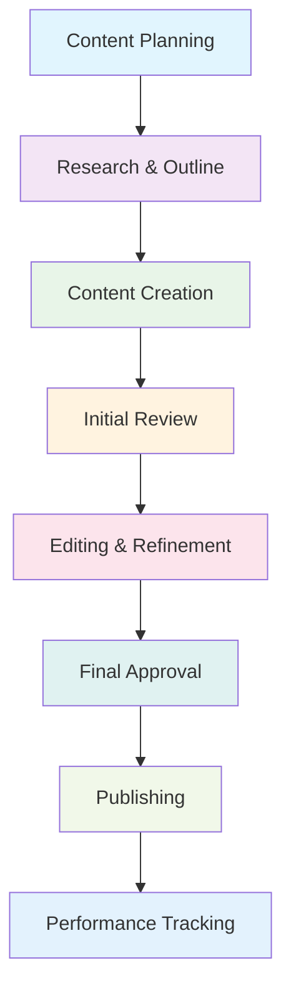

# Workflow Optimization for Content Teams

## 🎯 Overview

This guide helps content teams optimize their workflows for maximum efficiency and productivity. You'll learn how to streamline processes, eliminate bottlenecks, improve collaboration, and scale your content operations effectively.

## 🚀 What You'll Achieve

### Operational Excellence
- **Streamlined Processes**: Optimize content creation and approval workflows
- **Eliminated Bottlenecks**: Identify and eliminate workflow bottlenecks
- **Improved Efficiency**: Increase team productivity and output
- **Better Collaboration**: Enhance team coordination and communication

### Scalable Operations
- **Process Standardization**: Standardize workflows for consistency
- **Resource Optimization**: Optimize team resources and workload
- **Quality Maintenance**: Maintain quality while improving efficiency
- **Performance Tracking**: Track and improve workflow performance

## 📋 Workflow Analysis Framework

### Current State Assessment
**Workflow Mapping**:
1. **Process Documentation**: Document current workflows and processes
2. **Bottleneck Identification**: Identify bottlenecks and inefficiencies
3. **Resource Analysis**: Analyze resource utilization and allocation
4. **Performance Metrics**: Measure current performance and metrics

**Stakeholder Analysis**:
- **Team Input**: Gather input from all team members
- **Role Analysis**: Analyze roles and responsibilities
- **Communication Patterns**: Map communication and collaboration patterns
- **Pain Points**: Identify pain points and challenges

### Optimization Opportunities
**Process Improvements**:
- **Automation Opportunities**: Identify tasks that can be automated
- **Parallel Processing**: Identify tasks that can be done in parallel
- **Standardization**: Standardize processes for consistency
- **Tool Integration**: Integrate tools and systems more effectively

**Collaboration Enhancements**:
- **Communication Optimization**: Optimize team communication
- **Decision Making**: Streamline decision-making processes
- **Feedback Loops**: Improve feedback and iteration cycles
- **Knowledge Sharing**: Enhance knowledge sharing and transfer

## 🛠️ ALwrity Workflow Features

### Automated Workflows
**Content Creation Automation**:
- **Template-Based Creation**: Use templates for consistent content creation
- **Automated Research**: Automate research and fact-checking processes
- **SEO Optimization**: Automate SEO optimization and analysis
- **Quality Checks**: Implement automated quality checks and validation

**Approval Automation**:
- **Automated Routing**: Automatically route content for approval
- **Status Tracking**: Track content status throughout workflow
- **Notification System**: Send automated notifications and reminders
- **Escalation Management**: Automatically escalate overdue approvals

### Collaboration Tools
**Real-Time Collaboration**:
- **Shared Workspaces**: Create shared workspaces for team collaboration
- **Live Editing**: Collaborate on content in real-time
- **Comments and Feedback**: Add comments and feedback on content
- **Version Control**: Track versions and changes

**Task Management**:
- **Task Assignment**: Assign tasks and track progress
- **Deadline Management**: Manage deadlines and deliverables
- **Workload Balancing**: Balance workload across team members
- **Progress Monitoring**: Monitor progress and completion status

## 📊 Workflow Optimization Process

### Process Redesign
**Workflow Mapping**:

**Optimization Strategies**:
- **Parallel Processing**: Run multiple tasks simultaneously
- **Automation**: Automate repetitive and routine tasks
- **Standardization**: Standardize processes and procedures
- **Tool Integration**: Integrate tools and systems effectively

### Bottleneck Elimination
**Common Bottlenecks**:
- **Approval Delays**: Delays in content approval processes
- **Resource Constraints**: Limited resources and capacity
- **Communication Gaps**: Poor communication and coordination
- **Tool Limitations**: Limitations in tools and systems

**Elimination Strategies**:
- **Process Streamlining**: Streamline approval and decision processes
- **Resource Optimization**: Optimize resource allocation and utilization
- **Communication Improvement**: Improve communication and coordination
- **Tool Enhancement**: Enhance tools and system capabilities

## 🎯 Workflow Implementation

### Standardized Processes
**Content Creation Workflow**:
1. **Planning Phase**: Content planning and strategy development
2. **Research Phase**: Research and information gathering
3. **Creation Phase**: Content writing and development
4. **Review Phase**: Content review and editing
5. **Approval Phase**: Final approval and sign-off
6. **Publishing Phase**: Content publishing and distribution
7. **Tracking Phase**: Performance tracking and analysis

**Quality Assurance Workflow**:
- **Self-Review**: Writers review their own content
- **Peer Review**: Team members review each other's content
- **Editor Review**: Editors conduct thorough review
- **Final Approval**: Final approval from content manager
- **Post-Publication Review**: Review content after publication

### Automation Implementation
**Automated Tasks**:
- **Content Templates**: Use templates for consistent formatting
- **SEO Checks**: Automate SEO optimization and analysis
- **Quality Validation**: Automate quality checks and validation
- **Notification System**: Automate notifications and reminders

**Manual Tasks**:
- **Creative Writing**: Human creativity and storytelling
- **Strategic Decisions**: Strategic planning and decision making
- **Quality Review**: Human judgment and quality assessment
- **Relationship Building**: Client and stakeholder relationship management

## 📈 Performance Optimization

### Efficiency Metrics
**Production Metrics**:
- **Content Volume**: Number of content pieces produced
- **Production Time**: Time to produce content from start to finish
- **Quality Scores**: Content quality metrics and scores
- **Resource Utilization**: Resource utilization and efficiency

**Workflow Metrics**:
- **Cycle Time**: Time from content start to publication
- **Approval Time**: Time for content approval and sign-off
- **Revision Cycles**: Number of revision cycles required
- **Error Rates**: Error rates and quality issues

### Continuous Improvement
**Regular Assessment**:
- **Weekly Reviews**: Weekly workflow performance reviews
- **Monthly Analysis**: Monthly workflow analysis and optimization
- **Quarterly Planning**: Quarterly workflow planning and improvement
- **Annual Strategy**: Annual workflow strategy and planning

**Improvement Implementation**:
- **Process Refinement**: Continuously refine processes and procedures
- **Tool Enhancement**: Enhance tools and system capabilities
- **Training Development**: Develop team skills and capabilities
- **Innovation Integration**: Integrate new tools and technologies

## 🛠️ Team Coordination

### Communication Optimization
**Communication Channels**:
- **Daily Standups**: Brief daily team check-ins
- **Weekly Reviews**: Weekly progress and issue reviews
- **Monthly Planning**: Monthly planning and goal setting
- **Quarterly Reviews**: Quarterly performance and strategy reviews

**Information Sharing**:
- **Shared Documentation**: Maintain shared documentation and resources
- **Knowledge Base**: Build team knowledge base and resources
- **Best Practices**: Document and share best practices
- **Lessons Learned**: Capture and share lessons learned

### Role Optimization
**Role Clarity**:
- **Clear Responsibilities**: Define clear roles and responsibilities
- **Decision Authority**: Clarify decision-making authority
- **Communication Protocols**: Establish communication protocols
- **Escalation Procedures**: Define escalation procedures

**Skill Development**:
- **Cross-Training**: Cross-train team members for flexibility
- **Specialization**: Develop specialized skills and expertise
- **Leadership Development**: Develop leadership and management skills
- **Continuous Learning**: Promote continuous learning and development

## 📊 Technology Integration

### Tool Integration
**ALwrity Integration**:
- **Content Creation**: Integrate content creation tools and workflows
- **Collaboration**: Integrate collaboration and communication tools
- **Project Management**: Integrate project management and tracking
- **Analytics**: Integrate analytics and reporting tools

**External Tool Integration**:
- **Communication Platforms**: Integrate Slack, Teams, or other platforms
- **Project Management**: Integrate Asana, Trello, or other PM tools
- **Design Tools**: Integrate design and creative tools
- **Analytics Tools**: Integrate Google Analytics, social media analytics

### System Optimization
**Performance Monitoring**:
- **System Performance**: Monitor system performance and uptime
- **User Experience**: Monitor user experience and satisfaction
- **Integration Health**: Monitor integration health and performance
- **Data Quality**: Monitor data quality and accuracy

**Maintenance and Updates**:
- **Regular Updates**: Keep systems and tools updated
- **Performance Optimization**: Optimize system performance
- **Security Maintenance**: Maintain security and compliance
- **Backup and Recovery**: Implement backup and recovery procedures

## 🎯 Best Practices

### Workflow Best Practices
**Process Design**:
1. **Keep It Simple**: Design simple and intuitive workflows
2. **Automate When Possible**: Automate repetitive and routine tasks
3. **Standardize Processes**: Standardize processes for consistency
4. **Monitor and Optimize**: Continuously monitor and optimize
5. **Document Everything**: Document all processes and procedures

**Team Management**:
- **Clear Communication**: Maintain clear and open communication
- **Role Clarity**: Define clear roles and responsibilities
- **Skill Development**: Invest in team skill development
- **Continuous Improvement**: Promote continuous improvement culture

### Technology Best Practices
**Tool Selection**:
- **Fit for Purpose**: Choose tools that fit your specific needs
- **Integration Capability**: Ensure tools integrate well together
- **User Experience**: Prioritize user experience and ease of use
- **Scalability**: Choose tools that can scale with your needs

**Implementation**:
- **Gradual Rollout**: Implement changes gradually and incrementally
- **Training and Support**: Provide adequate training and support
- **Feedback Integration**: Integrate user feedback and suggestions
- **Continuous Optimization**: Continuously optimize tool usage

## 🎯 Next Steps

### Immediate Actions (This Week)
1. **Current State Analysis**: Analyze current workflows and processes
2. **Bottleneck Identification**: Identify bottlenecks and inefficiencies
3. **Optimization Planning**: Plan workflow optimization strategies
4. **Team Alignment**: Align team on optimization goals and approach

### Short-Term Planning (This Month)
1. **Process Redesign**: Redesign workflows for optimal efficiency
2. **Tool Implementation**: Implement new tools and integrations
3. **Team Training**: Train team on new workflows and tools
4. **Performance Monitoring**: Set up performance monitoring and metrics

### Long-Term Strategy (Next Quarter)
1. **Continuous Optimization**: Continuously optimize workflows
2. **Advanced Automation**: Implement advanced automation features
3. **Scaling Preparation**: Prepare workflows for scaling
4. **Excellence Achievement**: Achieve workflow optimization excellence

---

*Ready to optimize your workflows? Start with [Team Management](team-management.md) to establish effective team coordination before implementing workflow optimizations!*
