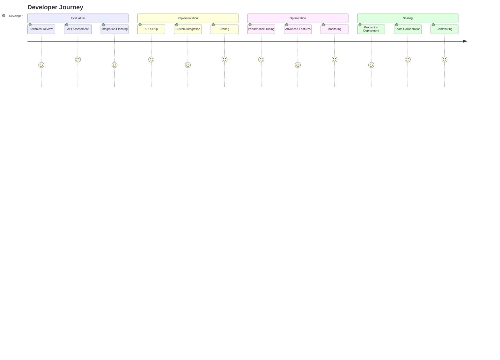

# Developers Journey

Welcome to ALwrity! This journey is designed specifically for software developers, technical writers, and dev teams who want to self-host, customize, and extend ALwrity's open-source AI content creation platform.

## 🎯 Your Journey Overview

## 🚀 What You'll Achieve

### Immediate Benefits (Week 1)
- **Self-host ALwrity** on your own infrastructure
- **Customize the platform** to your specific needs
- **Extend functionality** with custom features
- **Access full source code** and documentation

### Short-term Goals (Month 1)
- **Deploy ALwrity in production** with proper monitoring
- **Customize the UI/UX** to match your brand
- **Extend the API** with custom endpoints
- **Build integrations** with your existing tools

### Long-term Success (3+ Months)
- **Scale content operations** across multiple applications
- **Contribute to ALwrity's open source** components
- **Build and share integrations** with the developer community
- **Establish thought leadership** in AI-powered content development

## 💻 Perfect For You If...

✅ **You're a software developer** who wants to self-host AI content tools  
✅ **You're a technical writer** who wants to customize documentation workflows  
✅ **You're a dev team lead** who needs to deploy content solutions  
✅ **You're building content management systems** or CMS platforms  
✅ **You want full control** over your content creation platform  
✅ **You want to contribute** to open source AI tools  

## 🛠️ What Makes This Journey Special

### Self-Hosted Architecture
- **FastAPI backend** with comprehensive REST APIs
- **React frontend** with TypeScript and Material-UI
- **SQLite/PostgreSQL** database with full control
- **Docker support** for easy deployment

### Developer-Friendly Features
- **Full source code access** on GitHub
- **Comprehensive documentation** and setup guides
- **Modular architecture** for easy customization
- **Open source license** for commercial use

### Advanced Capabilities
- **Custom AI integrations** with multiple providers
- **Subscription system** with usage tracking
- **SEO tools** with Google Search Console integration
- **Multi-platform content** generation (Blog, LinkedIn, Facebook)

## 📋 Your Journey Steps

### Step 1: Self-Host Setup (2 hours)
**[Get Started →](self-host-setup.md)**

- Clone the ALwrity repository
- Set up the development environment
- Configure API keys and environment variables
- Start the backend and frontend servers

### Step 2: Explore the Codebase (4 hours)
**[Codebase Exploration →](codebase-exploration.md)**

- Understand the FastAPI backend structure
- Explore the React frontend components
- Review the database models and APIs
- Test the core functionality

### Step 3: Customization (1 day)
**[Customization Guide →](customization.md)**

- Customize the UI/UX to match your brand
- Add custom AI providers or models
- Extend the API with new endpoints
- Modify the content generation logic

### Step 4: Production Deployment (1 day)
**[Production Deployment →](deployment.md)**

- Deploy to your preferred cloud platform
- Set up monitoring and logging
- Configure SSL and security
- Set up automated backups

### Step 5: Contributing (Ongoing)
**[Contributing Guide →](contributing.md)**

- Contribute to the open source project
- Share your customizations and integrations
- Help improve documentation
- Participate in the community

## 🎯 Success Stories

### Alex - Full-Stack Developer
*"I integrated ALwrity into our CMS and reduced content creation time by 80%. The API is well-designed and the documentation is excellent."*

### Maria - Technical Writer
*"ALwrity's API helps me automate documentation generation for our software products. It's a game-changer for technical writing."*

### David - Dev Team Lead
*"Our team uses ALwrity to generate content for multiple client projects. The API integration is seamless and reliable."*

## 🚀 Ready to Start?

### Quick Start (5 minutes)
1. **[Sign up for Developer Account](https://alwrity.com/developers)**
2. **[Get your API keys](api-quickstart.md)**
3. **[Make your first API call](api-quickstart.md)**

### Need Help?
- **[API Documentation](https://docs.alwrity.com/api)** - Complete API reference
- **[Code Examples](https://github.com/alwrity/examples)** - Sample integrations
- **[Developer Community](https://github.com/AJaySi/ALwrity/discussions)** - Get help from other developers

## 📚 What's Next?

Once you've completed your first integration, explore these next steps:

- **[Advanced API Features](advanced-usage.md)** - Use advanced capabilities
- **[Production Deployment](deployment.md)** - Deploy to production
- **[Team Collaboration](team-collaboration.md)** - Work with your team
- **[Contributing](contributing.md)** - Contribute to ALwrity

## 🔧 Technical Requirements

### Prerequisites
- **Programming experience** in any language
- **Understanding of REST APIs** and HTTP
- **Basic knowledge** of JSON and web technologies
- **Development environment** set up

### Supported Technologies
- **Programming Languages**: Python, JavaScript, PHP, Ruby, Go, Java, C#
- **Frameworks**: React, Vue, Angular, Django, Flask, Express, Laravel
- **Databases**: PostgreSQL, MySQL, MongoDB, Redis
- **Cloud Platforms**: AWS, Google Cloud, Azure, Heroku

## 🎯 Success Metrics

### Technical Metrics
- **API Integration Success**: 90%+ success rate
- **Documentation Completeness**: 95%+ coverage
- **Developer Satisfaction**: 4.7+ stars
- **Community Contributions**: 20+ contributors

### Business Metrics
- **Content Generation Speed**: 80%+ faster
- **Development Time Savings**: 60%+ reduction
- **Integration Reliability**: 99.9%+ uptime
- **Team Productivity**: 3x increase

---

*Ready to build amazing integrations? [Start your developer journey →](api-quickstart.md)*
