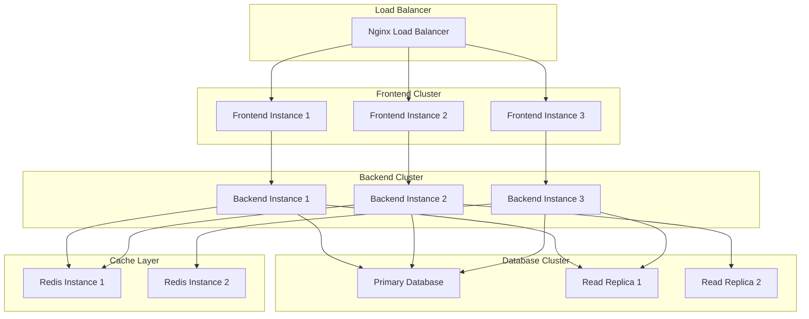
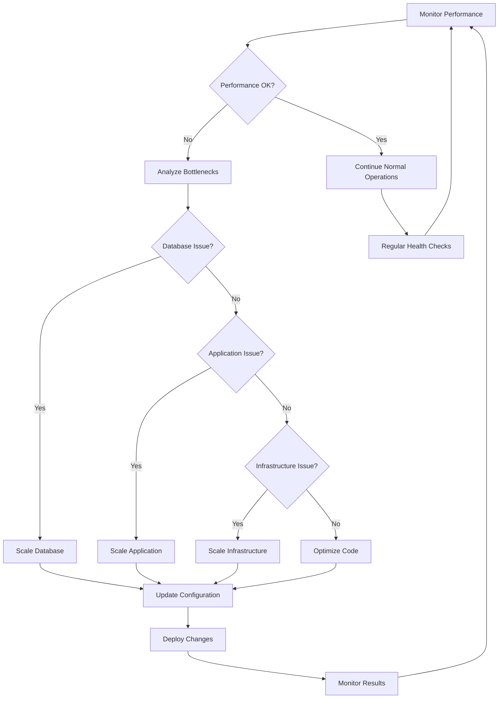

# Scaling for Developers

## 🎯 Overview

This guide helps developers scale ALwrity applications and infrastructure effectively. You'll learn how to handle increased load, optimize performance, implement caching strategies, and build scalable architectures.

## 🚀 What You'll Achieve

### Technical Scaling
- **Application Scaling**: Scale applications to handle increased load
- **Database Scaling**: Scale databases for performance and reliability
- **Infrastructure Scaling**: Scale infrastructure components effectively
- **Performance Optimization**: Optimize performance for scale

### Operational Scaling
- **Deployment Scaling**: Scale deployment processes and automation
- **Monitoring Scaling**: Scale monitoring and observability systems
- **Team Scaling**: Scale development team and processes
- **Cost Optimization**: Optimize costs while scaling operations

## 📋 Scaling Strategy Framework

### Scaling Dimensions
**Horizontal Scaling**:
1. **Load Balancing**: Distribute load across multiple servers
2. **Microservices**: Break applications into microservices
3. **Database Sharding**: Shard databases for better performance
4. **CDN Implementation**: Implement content delivery networks

**Vertical Scaling**:
- **Resource Enhancement**: Increase CPU, memory, and storage
- **Performance Tuning**: Optimize application performance
- **Database Optimization**: Optimize database performance
- **Caching Implementation**: Implement effective caching strategies

### Scaling Planning
**Capacity Planning**:
- **Load Analysis**: Analyze current and projected loads
- **Resource Requirements**: Plan resource requirements for scaling
- **Performance Targets**: Define performance targets and metrics
- **Cost Planning**: Plan scaling costs and budgets

**Risk Assessment**:
- **Performance Risks**: Assess performance risks during scaling
- **Reliability Risks**: Evaluate reliability and availability risks
- **Cost Risks**: Assess cost implications of scaling
- **Technical Risks**: Identify technical challenges and solutions

## 🛠️ Application Scaling

### Backend Scaling
**API Scaling**:
```python
# backend/middleware/rate_limiting.py
from slowapi import Limiter, _rate_limit_exceeded_handler
from slowapi.util import get_remote_address
from slowapi.errors import RateLimitExceeded

limiter = Limiter(key_func=get_remote_address)

@app.middleware("http")
async def rate_limit_middleware(request: Request, call_next):
    # Rate limiting implementation
    return await call_next(request)

@app.get("/api/content/generate")
@limiter.limit("10/minute")
async def generate_content(request: Request):
    """Generate content with rate limiting."""
    # Content generation logic
```

**Database Scaling**:
```python
# backend/database/connection_pool.py
from sqlalchemy.pool import QueuePool
from sqlalchemy import create_engine

# Connection pooling for scalability
engine = create_engine(
    DATABASE_URL,
    poolclass=QueuePool,
    pool_size=20,
    max_overflow=30,
    pool_pre_ping=True,
    pool_recycle=3600
)
```

### Frontend Scaling
**Component Optimization**:
```typescript
// frontend/src/components/OptimizedComponent.tsx
import React, { memo, lazy, Suspense } from 'react';

// Lazy loading for better performance
const HeavyComponent = lazy(() => import('./HeavyComponent'));

// Memoized component for performance
const OptimizedComponent = memo(({ data }: { data: any[] }) => {
  return (
    <div>
      <Suspense fallback={<div>Loading...</div>}>
        <HeavyComponent data={data} />
      </Suspense>
    </div>
  );
});

export default OptimizedComponent;
```

**Bundle Optimization**:
```javascript
// webpack.config.js
module.exports = {
  optimization: {
    splitChunks: {
      chunks: 'all',
      cacheGroups: {
        vendor: {
          test: /[\\/]node_modules[\\/]/,
          name: 'vendors',
          chunks: 'all',
        },
        common: {
          name: 'common',
          minChunks: 2,
          chunks: 'all',
        },
      },
    },
  },
};
```

## 📊 Performance Optimization

### Caching Strategies
**Redis Caching**:
```python
# backend/services/cache_service.py
import redis
import json
from typing import Optional, Any

class CacheService:
    def __init__(self):
        self.redis_client = redis.Redis(
            host='localhost',
            port=6379,
            db=0,
            decode_responses=True
        )
    
    async def get(self, key: str) -> Optional[Any]:
        """Get value from cache."""
        value = self.redis_client.get(key)
        return json.loads(value) if value else None
    
    async def set(self, key: str, value: Any, expire: int = 3600):
        """Set value in cache with expiration."""
        self.redis_client.setex(
            key, 
            expire, 
            json.dumps(value, default=str)
        )
    
    async def invalidate(self, pattern: str):
        """Invalidate cache keys matching pattern."""
        keys = self.redis_client.keys(pattern)
        if keys:
            self.redis_client.delete(*keys)
```

**Application-Level Caching**:
```python
# backend/middleware/caching_middleware.py
from functools import wraps
import hashlib

def cache_response(expire_seconds: int = 300):
    def decorator(func):
        @wraps(func)
        async def wrapper(*args, **kwargs):
            # Generate cache key
            cache_key = f"{func.__name__}:{hashlib.md5(str(kwargs).encode()).hexdigest()}"
            
            # Check cache
            cached_result = await cache_service.get(cache_key)
            if cached_result:
                return cached_result
            
            # Execute function and cache result
            result = await func(*args, **kwargs)
            await cache_service.set(cache_key, result, expire_seconds)
            return result
        return wrapper
    return decorator
```

### Database Optimization
**Query Optimization**:
```python
# backend/services/optimized_queries.py
from sqlalchemy.orm import joinedload, selectinload
from sqlalchemy import func, desc

class OptimizedQueryService:
    async def get_content_with_relations(self, content_id: int):
        """Optimized query with eager loading."""
        return await self.db.query(Content)\
            .options(
                joinedload(Content.author),
                selectinload(Content.tags),
                joinedload(Content.seo_analysis)
            )\
            .filter(Content.id == content_id)\
            .first()
    
    async def get_content_analytics(self, limit: int = 100):
        """Optimized analytics query."""
        return await self.db.query(
            func.date(Content.created_at).label('date'),
            func.count(Content.id).label('content_count'),
            func.avg(Content.quality_score).label('avg_quality')
        )\
        .group_by(func.date(Content.created_at))\
        .order_by(desc('date'))\
        .limit(limit)\
        .all()
```

**Database Indexing**:
```sql
-- backend/database/migrations/add_indexes.sql
-- Performance indexes for scaling
CREATE INDEX CONCURRENTLY idx_content_created_at ON content(created_at);
CREATE INDEX CONCURRENTLY idx_content_author_id ON content(author_id);
CREATE INDEX CONCURRENTLY idx_content_status ON content(status);
CREATE INDEX CONCURRENTLY idx_seo_analysis_url ON seo_analysis(url);

-- Composite indexes for complex queries
CREATE INDEX CONCURRENTLY idx_content_author_status 
ON content(author_id, status, created_at);
```

## 🎯 Infrastructure Scaling

### Container Scaling
**Docker Scaling**:
```yaml
# docker-compose.scale.yml
version: '3.8'
services:
  backend:
    image: alwrity/backend:latest
    deploy:
      replicas: 3
      resources:
        limits:
          cpus: '2'
          memory: 4G
        reservations:
          cpus: '1'
          memory: 2G
      restart_policy:
        condition: on-failure
        delay: 5s
        max_attempts: 3
    environment:
      - DATABASE_POOL_SIZE=20
      - REDIS_URL=redis://redis:6379/0
    depends_on:
      - db
      - redis

  frontend:
    image: alwrity/frontend:latest
    deploy:
      replicas: 2
      resources:
        limits:
          cpus: '1'
          memory: 2G
    environment:
      - REACT_APP_API_URL=http://backend:8000
```

**Kubernetes Scaling**:
```yaml
# k8s/deployment.yaml
apiVersion: apps/v1
kind: Deployment
metadata:
  name: alwrity-backend
spec:
  replicas: 5
  selector:
    matchLabels:
      app: alwrity-backend
  template:
    metadata:
      labels:
        app: alwrity-backend
    spec:
      containers:
      - name: backend
        image: alwrity/backend:latest
        resources:
          requests:
            memory: "2Gi"
            cpu: "1000m"
          limits:
            memory: "4Gi"
            cpu: "2000m"
        env:
        - name: DATABASE_URL
          valueFrom:
            secretKeyRef:
              name: alwrity-secrets
              key: database-url
---
apiVersion: v1
kind: Service
metadata:
  name: alwrity-backend-service
spec:
  selector:
    app: alwrity-backend
  ports:
  - port: 8000
    targetPort: 8000
  type: LoadBalancer
```

### Load Balancing
**Nginx Configuration**:
```nginx
# nginx.conf
upstream backend {
    least_conn;
    server backend1:8000 weight=3;
    server backend2:8000 weight=3;
    server backend3:8000 weight=2;
}

upstream frontend {
    least_conn;
    server frontend1:3000;
    server frontend2:3000;
}

server {
    listen 80;
    server_name alwrity.com;
    
    location /api/ {
        proxy_pass http://backend;
        proxy_set_header Host $host;
        proxy_set_header X-Real-IP $remote_addr;
        proxy_set_header X-Forwarded-For $proxy_add_x_forwarded_for;
        proxy_connect_timeout 30s;
        proxy_send_timeout 30s;
        proxy_read_timeout 30s;
    }
    
    location / {
        proxy_pass http://frontend;
        proxy_set_header Host $host;
        proxy_set_header X-Real-IP $remote_addr;
    }
}
```

## 📈 Monitoring and Observability

### Application Monitoring
**Metrics Collection**:
```python
# backend/monitoring/metrics.py
from prometheus_client import Counter, Histogram, Gauge, generate_latest
import time

# Application metrics
request_count = Counter('http_requests_total', 'Total HTTP requests', ['method', 'endpoint'])
request_duration = Histogram('http_request_duration_seconds', 'HTTP request duration')
active_connections = Gauge('active_connections', 'Number of active connections')
content_generation_time = Histogram('content_generation_seconds', 'Content generation time')

@app.middleware("http")
async def metrics_middleware(request: Request, call_next):
    start_time = time.time()
    
    # Increment request counter
    request_count.labels(
        method=request.method,
        endpoint=request.url.path
    ).inc()
    
    response = await call_next(request)
    
    # Record request duration
    duration = time.time() - start_time
    request_duration.observe(duration)
    
    return response

@app.get("/metrics")
async def metrics():
    """Prometheus metrics endpoint."""
    return Response(generate_latest(), media_type="text/plain")
```

**Health Checks**:
```python
# backend/health/health_checks.py
from fastapi import Depends
from sqlalchemy.orm import Session
import redis

async def database_health_check(db: Session = Depends(get_db)) -> bool:
    """Check database connectivity."""
    try:
        db.execute("SELECT 1")
        return True
    except Exception:
        return False

async def redis_health_check() -> bool:
    """Check Redis connectivity."""
    try:
        redis_client = redis.Redis(host='redis', port=6379)
        redis_client.ping()
        return True
    except Exception:
        return False

@app.get("/health")
async def health_check():
    """Comprehensive health check."""
    db_healthy = await database_health_check()
    redis_healthy = await redis_health_check()
    
    status = "healthy" if db_healthy and redis_healthy else "unhealthy"
    
    return {
        "status": status,
        "database": "healthy" if db_healthy else "unhealthy",
        "redis": "healthy" if redis_healthy else "unhealthy",
        "timestamp": datetime.utcnow().isoformat()
    }
```

### Performance Monitoring
**APM Integration**:
```python
# backend/monitoring/apm.py
from elasticapm.contrib.fastapi import ElasticAPM
from elasticapm.handlers.logging import LoggingHandler

# Elastic APM configuration
apm = ElasticAPM(
    app,
    service_name="alwrity-backend",
    service_version="1.0.0",
    environment="production",
    server_url="http://apm-server:8200",
    secret_token="your-secret-token"
)

# Custom performance tracking
@apm.capture_span("content_generation")
async def generate_content(request: ContentRequest):
    """Generate content with APM tracking."""
    # Content generation logic
    pass
```

## 🛠️ Scaling Best Practices

### Code Optimization
**Performance Best Practices**:
1. **Async/Await**: Use async/await for I/O operations
2. **Connection Pooling**: Implement database connection pooling
3. **Caching**: Implement multi-level caching strategies
4. **Lazy Loading**: Use lazy loading for large datasets
5. **Batch Processing**: Process data in batches for efficiency

**Memory Optimization**:
```python
# backend/utils/memory_optimization.py
import gc
from typing import Generator

class MemoryOptimizedProcessor:
    def process_large_dataset(self, data: list) -> Generator:
        """Process large datasets with memory optimization."""
        batch_size = 1000
        
        for i in range(0, len(data), batch_size):
            batch = data[i:i + batch_size]
            yield self.process_batch(batch)
            
            # Force garbage collection
            gc.collect()
    
    def process_batch(self, batch: list):
        """Process a batch of data."""
        # Batch processing logic
        pass
```

### Error Handling and Resilience
**Circuit Breaker Pattern**:
```python
# backend/middleware/circuit_breaker.py
import asyncio
from enum import Enum
from typing import Callable, Any

class CircuitState(Enum):
    CLOSED = "closed"
    OPEN = "open"
    HALF_OPEN = "half_open"

class CircuitBreaker:
    def __init__(self, failure_threshold: int = 5, timeout: int = 60):
        self.failure_threshold = failure_threshold
        self.timeout = timeout
        self.failure_count = 0
        self.last_failure_time = None
        self.state = CircuitState.CLOSED
    
    async def call(self, func: Callable, *args, **kwargs) -> Any:
        """Execute function with circuit breaker protection."""
        if self.state == CircuitState.OPEN:
            if self._should_attempt_reset():
                self.state = CircuitState.HALF_OPEN
            else:
                raise Exception("Circuit breaker is OPEN")
        
        try:
            result = await func(*args, **kwargs)
            self._on_success()
            return result
        except Exception as e:
            self._on_failure()
            raise e
    
    def _should_attempt_reset(self) -> bool:
        """Check if circuit breaker should attempt reset."""
        return (
            self.last_failure_time and
            time.time() - self.last_failure_time >= self.timeout
        )
    
    def _on_success(self):
        """Handle successful execution."""
        self.failure_count = 0
        self.state = CircuitState.CLOSED
    
    def _on_failure(self):
        """Handle failed execution."""
        self.failure_count += 1
        self.last_failure_time = time.time()
        
        if self.failure_count >= self.failure_threshold:
            self.state = CircuitState.OPEN
```

## 📊 Scaling Architecture Diagrams

### System Architecture


### Scaling Process Flow


## 🎯 Next Steps

### Immediate Actions (This Week)
1. **Performance Baseline**: Establish current performance baselines
2. **Monitoring Setup**: Set up comprehensive monitoring and alerting
3. **Load Testing**: Conduct load testing to identify bottlenecks
4. **Scaling Plan**: Develop scaling strategy and implementation plan

### Short-Term Planning (This Month)
1. **Infrastructure Scaling**: Implement infrastructure scaling solutions
2. **Application Optimization**: Optimize applications for better performance
3. **Database Scaling**: Implement database scaling strategies
4. **Caching Implementation**: Implement comprehensive caching strategies

### Long-Term Strategy (Next Quarter)
1. **Advanced Scaling**: Implement advanced scaling techniques
2. **Auto-Scaling**: Implement automatic scaling based on load
3. **Performance Excellence**: Achieve performance excellence goals
4. **Cost Optimization**: Optimize costs while maintaining performance

---

*Ready to scale your application? Start with [Codebase Exploration](codebase-exploration.md) to understand the current architecture before implementing scaling strategies!*
