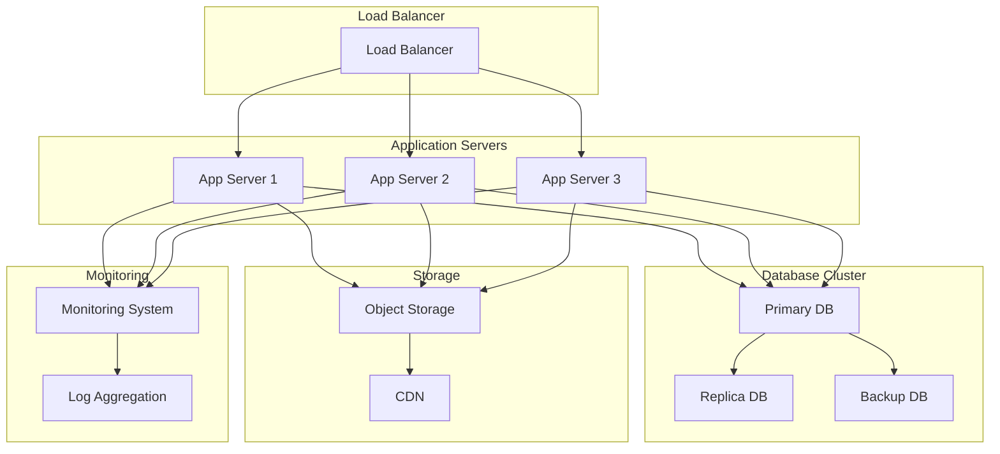

# Enterprise Implementation - Enterprise Users

This guide will help you plan and implement ALwrity at enterprise scale with proper security, compliance, and governance measures.

## 🎯 What You'll Accomplish

By the end of this guide, you'll have:
- ✅ A comprehensive enterprise deployment strategy
- ✅ Security and compliance measures implemented
- ✅ Monitoring and analytics configured
- ✅ Governance and approval processes established
- ✅ Performance optimization and scaling in place

## ⏱️ Time Required: 1 week

## 🚀 Step-by-Step Enterprise Implementation

### Step 1: Enterprise Deployment Planning (2 days)

#### Infrastructure Requirements
- **High-Performance Servers**: Dedicated servers for content generation
- **Scalable Database**: PostgreSQL or MySQL for enterprise data
- **Load Balancers**: Distribute traffic across multiple servers
- **CDN**: Content delivery network for global performance
- **Backup Systems**: Automated backup and disaster recovery

#### Security Architecture
- **Network Security**: Firewalls, VPNs, and network segmentation
- **Application Security**: Authentication, authorization, and encryption
- **Data Security**: Encryption at rest and in transit
- **Access Control**: Role-based access and permission management
- **Audit Logging**: Comprehensive audit trails and monitoring

### Step 2: Security and Compliance Setup (2 days)

#### Security Measures
- **Authentication**: Multi-factor authentication and SSO integration
- **Authorization**: Role-based access control and permission management
- **Encryption**: Data encryption at rest and in transit
- **Network Security**: Firewalls, VPNs, and network segmentation
- **Monitoring**: Security monitoring and threat detection

#### Compliance Requirements
- **Data Privacy**: GDPR, CCPA, and other privacy regulations
- **Industry Standards**: SOC 2, ISO 27001, and other certifications
- **Audit Trails**: Comprehensive logging and audit capabilities
- **Data Governance**: Data classification and handling policies
- **Risk Management**: Risk assessment and mitigation strategies

### Step 3: Monitoring and Analytics Configuration (1 day)

#### System Monitoring
- **Performance Monitoring**: Server performance and resource utilization
- **Application Monitoring**: Application performance and error tracking
- **Security Monitoring**: Security events and threat detection
- **Availability Monitoring**: System uptime and availability tracking
- **Capacity Planning**: Resource usage and scaling requirements

#### Business Analytics
- **Content Performance**: Content engagement and performance metrics
- **User Analytics**: User behavior and usage patterns
- **ROI Tracking**: Return on investment and business impact
- **Cost Analysis**: API usage and cost optimization
- **Compliance Reporting**: Regulatory compliance and audit reports

### Step 4: Governance and Approval Processes (1 day)

#### Content Governance
- **Content Policies**: Content creation and approval policies
- **Brand Guidelines**: Brand compliance and consistency standards
- **Quality Control**: Content quality and review processes
- **Legal Compliance**: Legal review and approval requirements
- **Risk Management**: Content risk assessment and mitigation

#### Operational Governance
- **Change Management**: System changes and deployment processes
- **Incident Response**: Security incidents and system outages
- **Business Continuity**: Disaster recovery and business continuity
- **Vendor Management**: Third-party vendor and service management
- **Performance Management**: System performance and optimization

### Step 5: Performance Optimization and Scaling (1 day)

#### Performance Optimization
- **Database Optimization**: Query optimization and indexing
- **Caching**: Application and database caching strategies
- **CDN Configuration**: Content delivery network optimization
- **Load Balancing**: Traffic distribution and load management
- **Resource Optimization**: CPU, memory, and storage optimization

#### Scaling Strategy
- **Horizontal Scaling**: Add more servers and instances
- **Vertical Scaling**: Increase server capacity and resources
- **Auto-Scaling**: Automatic scaling based on demand
- **Capacity Planning**: Future capacity and resource planning
- **Cost Optimization**: Optimize costs while maintaining performance

## 📊 Enterprise Architecture

### System Architecture

### Security Architecture
- **Perimeter Security**: Firewalls and network segmentation
- **Application Security**: Authentication and authorization
- **Data Security**: Encryption and access controls
- **Monitoring**: Security monitoring and threat detection
- **Compliance**: Regulatory compliance and audit capabilities

## 🎯 Enterprise Features

### Advanced Security
- **Multi-Factor Authentication**: Enhanced security for user access
- **Single Sign-On**: Integration with enterprise identity providers
- **Role-Based Access Control**: Granular permissions and access management
- **Audit Logging**: Comprehensive audit trails and compliance reporting
- **Data Encryption**: End-to-end encryption for data protection

### Scalability and Performance
- **High Availability**: 99.9% uptime and availability
- **Auto-Scaling**: Automatic scaling based on demand
- **Load Balancing**: Traffic distribution and load management
- **Caching**: Application and database caching for performance
- **CDN**: Global content delivery for optimal performance

### Compliance and Governance
- **Regulatory Compliance**: GDPR, CCPA, SOC 2, ISO 27001
- **Data Governance**: Data classification and handling policies
- **Audit Capabilities**: Comprehensive audit trails and reporting
- **Risk Management**: Risk assessment and mitigation strategies
- **Business Continuity**: Disaster recovery and business continuity

## 🚀 Implementation Timeline

### Week 1: Planning and Setup
- **Day 1-2**: Infrastructure planning and procurement
- **Day 3-4**: Security architecture and compliance setup
- **Day 5**: Monitoring and analytics configuration

### Week 2: Deployment and Testing
- **Day 1-2**: System deployment and configuration
- **Day 3-4**: Security testing and compliance validation
- **Day 5**: Performance testing and optimization

### Week 3: Go-Live and Optimization
- **Day 1-2**: User training and documentation
- **Day 3-4**: Go-live and initial monitoring
- **Day 5**: Performance optimization and tuning

## 🎯 Success Metrics

### Technical Metrics
- **System Availability**: 99.9% uptime and availability
- **Performance**: Sub-second response times
- **Security**: Zero security incidents
- **Compliance**: 100% regulatory compliance

### Business Metrics
- **ROI**: 200% return on investment
- **Cost Optimization**: 40% reduction in content creation costs
- **Productivity**: 300% increase in content production
- **Quality**: 95% content quality and consistency

## 🚀 Next Steps

### Immediate Actions (This Week)
1. **[Set up security and compliance](security-compliance.md)** - Implement security measures
2. **[Configure analytics and reporting](analytics.md)** - Set up monitoring and analytics
3. **[Train your team](team-training.md)** - Get your team up to speed

### This Month
1. **[Optimize performance](performance-optimization.md)** - Optimize system performance
2. **[Scale operations](scaling.md)** - Scale your content operations
3. **[Monitor and maintain](monitoring.md)** - Ongoing monitoring and maintenance

## 🆘 Need Help?

### Common Questions

**Q: How do I ensure enterprise-grade security?**
A: Implement multi-factor authentication, encryption, access controls, and comprehensive monitoring.

**Q: What compliance requirements should I consider?**
A: GDPR, CCPA, SOC 2, ISO 27001, and industry-specific regulations.

**Q: How do I scale ALwrity for enterprise use?**
A: Use load balancers, auto-scaling, caching, and CDN for optimal performance and scalability.

**Q: What monitoring and analytics should I implement?**
A: System performance, security events, business metrics, and compliance reporting.

### Getting Support
- **[Security and Compliance Guide](security-compliance.md)** - Implement security measures
- **[Analytics and Reporting Guide](analytics.md)** - Set up monitoring and analytics
- **[Performance Optimization Guide](performance-optimization.md)** - Optimize system performance

## 🎉 Ready for the Next Step?

**[Set up security and compliance →](security-compliance.md)**

---

*Questions? [Contact enterprise support](mailto:enterprise@alwrity.com) or [join our community](https://github.com/AJaySi/ALwrity/discussions)!*
