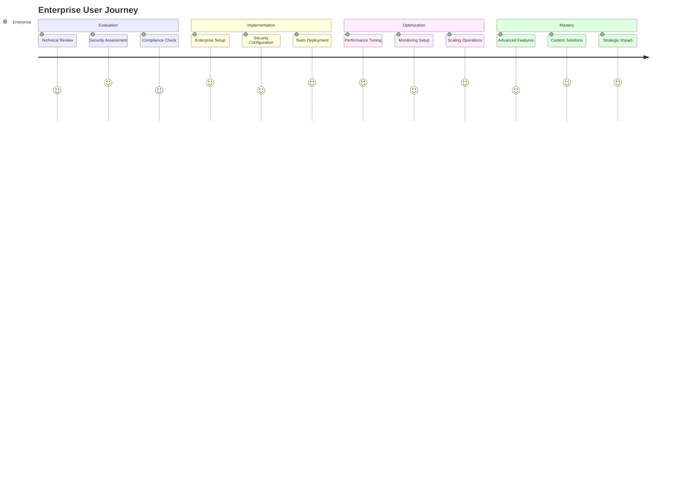

# Enterprise Users Journey

Welcome to ALwrity! This journey is designed specifically for large organizations, enterprise marketing teams, and C-suite executives who need enterprise-grade solutions, compliance, security, and scalability for their content operations.

## 🎯 Your Journey Overview

## 🚀 What You'll Achieve

### Immediate Benefits (Week 1)
- **Deploy enterprise-grade solution** with full security and compliance
- **Set up comprehensive monitoring** and analytics
- **Implement usage tracking** and cost management
- **Establish governance** and approval processes

### Short-term Goals (Month 1)
- **Scale content operations** across multiple departments
- **Implement advanced security** and compliance measures
- **Optimize performance** and resource utilization
- **Establish ROI measurement** and reporting

### Long-term Success (3+ Months)
- **Transform content operations** at enterprise scale
- **Achieve measurable business impact** across the organization
- **Build competitive advantage** through superior content
- **Establish thought leadership** in your industry

## 🎨 Perfect For You If...

✅ **You're a large organization** with complex content needs  
✅ **You're an enterprise marketing team** that needs to scale  
✅ **You're a C-suite executive** who needs strategic content solutions  
✅ **You need enterprise-grade security** and compliance  
✅ **You want to optimize costs** and resource utilization  
✅ **You need to measure ROI** and business impact  

## 🛠️ What Makes This Journey Special

### Enterprise-Grade Security
- **Self-Hosted Deployment**: Complete control over your data and infrastructure
- **Advanced Security**: Enterprise-level security measures and compliance
- **Data Privacy**: Full data ownership and privacy protection
- **Access Control**: Role-based access and permission management

### Scalable Architecture
- **High Performance**: Handle large-scale content operations
- **Resource Optimization**: Efficient use of computing resources
- **Load Balancing**: Distribute workload across multiple servers
- **Auto-Scaling**: Automatically adjust resources based on demand

### Advanced Analytics
- **Comprehensive Reporting**: Detailed analytics and performance metrics
- **ROI Measurement**: Track business impact and return on investment
- **Cost Management**: Monitor and optimize API usage and costs
- **Performance Monitoring**: Real-time system and content performance tracking

### Compliance & Governance
- **Regulatory Compliance**: Meet industry-specific compliance requirements
- **Audit Trails**: Complete audit logs for all activities
- **Data Governance**: Structured data management and policies
- **Risk Management**: Identify and mitigate potential risks

## 📋 Your Journey Steps

### Step 1: Enterprise Implementation (1 week)
**[Get Started →](implementation.md)**

- Plan enterprise deployment strategy
- Set up infrastructure and security
- Configure monitoring and analytics
- Establish governance and compliance

### Step 2: Security & Compliance (3 days)
**[Security Setup →](security-compliance.md)**

- Implement enterprise security measures
- Set up compliance monitoring
- Configure access controls and permissions
- Establish audit and reporting processes

### Step 3: Analytics & Reporting (2 days)
**[Analytics Setup →](analytics.md)**

- Set up comprehensive analytics and reporting
- Configure ROI measurement and tracking
- Implement performance monitoring
- Establish business impact measurement

## 🎯 Success Stories

### Sarah - CMO at Fortune 500 Company
*"ALwrity's enterprise deployment helped us scale our content operations across 15 departments. We reduced content creation costs by 40% while increasing output by 300%."*

### Mike - IT Director at Large Corporation
*"The self-hosted architecture and security features in ALwrity gave us complete control over our data and infrastructure. We met all compliance requirements while improving content quality."*

### Lisa - Marketing Operations Director
*"The analytics and ROI tracking in ALwrity helped us demonstrate clear business impact to our executive team. We achieved 200% ROI within 6 months of implementation."*

## 🚀 Ready to Start?

### Quick Start (5 minutes)
1. **[Plan your implementation](implementation.md)**
2. **[Set up security and compliance](security-compliance.md)**
3. **[Configure analytics and reporting](analytics.md)**

### Need Help?
- **[Common Questions](troubleshooting.md)** - Quick answers to common issues
- **[Video Tutorials](https://youtube.com/alwrity)** - Watch step-by-step guides
- **[Enterprise Support](mailto:enterprise@alwrity.com)** - Get dedicated enterprise support

## 📚 What's Next?

Once you've completed your enterprise setup, explore these next steps:

- **[Advanced Security](advanced-security.md)** - Implement advanced security measures
- **[Performance Optimization](performance-optimization.md)** - Optimize system performance
- **[Custom Solutions](custom-solutions.md)** - Develop custom enterprise solutions
- **[Strategic Planning](strategic-planning.md)** - Align content strategy with business goals

## 🔧 Technical Requirements

### Prerequisites
- **Enterprise infrastructure** (servers, databases, etc.)
- **Security and compliance** requirements
- **IT team** for deployment and maintenance
- **Executive sponsorship** and budget approval

### Infrastructure Requirements
- **High-performance servers** for content generation
- **Scalable database** for content and user data
- **Load balancers** for traffic distribution
- **Monitoring tools** for system and performance tracking

## 🎯 Success Metrics

### Business Impact
- **ROI Achievement**: 200%+ return on investment
- **Cost Optimization**: 40% reduction in content creation costs
- **Revenue Growth**: Measurable impact on business revenue
- **Competitive Advantage**: Superior content and market position

### Operational Excellence
- **Scalability**: 10x increase in content production capacity
- **Efficiency**: 60% improvement in operational efficiency
- **Quality**: 95%+ content quality and consistency
- **Compliance**: 100% regulatory compliance achievement

### Strategic Outcomes
- **Market Leadership**: Established thought leadership position
- **Brand Authority**: Increased brand recognition and authority
- **Customer Engagement**: Higher customer engagement and satisfaction
- **Business Growth**: Measurable business growth and expansion

---

*Ready to transform your enterprise content operations? [Start your journey now →](implementation.md)*
