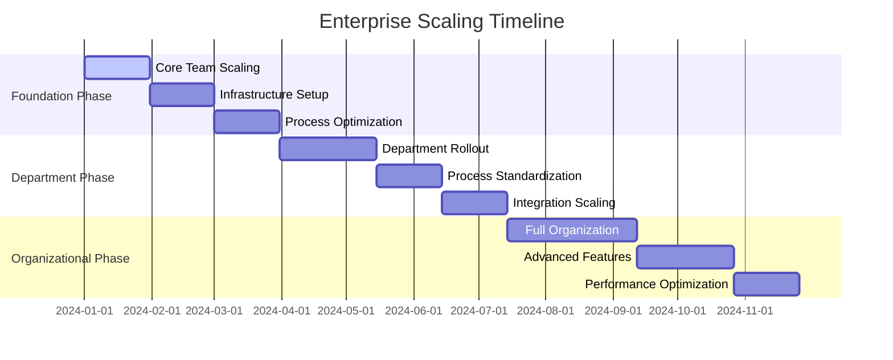

# Scaling for Enterprise Users

## 🎯 Overview

This guide helps enterprise users scale ALwrity effectively across their organization. You'll learn how to expand usage, manage growth, optimize resources, and ensure the platform scales with your business needs.

## 🚀 What You'll Achieve

### Organizational Scaling
- **Multi-Department Rollout**: Scale ALwrity across multiple departments and teams
- **User Growth Management**: Manage growing user base and usage patterns
- **Resource Scaling**: Scale infrastructure and resources as needed
- **Process Optimization**: Optimize processes for large-scale operations

### Business Growth
- **Operational Scaling**: Scale content operations to support business growth
- **Team Expansion**: Expand content teams and capabilities
- **Market Expansion**: Scale content operations for new markets
- **Competitive Advantage**: Build scalable competitive advantages

## 📋 Scaling Strategy Framework

### Scaling Planning
**Growth Assessment**:
1. **Current State Analysis**: Analyze current usage and performance
2. **Growth Projections**: Project future growth and requirements
3. **Resource Planning**: Plan resource scaling and optimization
4. **Timeline Planning**: Develop scaling timeline and milestones

**Scaling Strategy Development**:
- **Horizontal Scaling**: Scale across departments and teams
- **Vertical Scaling**: Scale capabilities and features within teams
- **Geographic Scaling**: Scale across different locations and regions
- **Process Scaling**: Scale processes and workflows

### Scaling Dimensions
**User Scaling**:
- **User Growth**: Manage growing number of users
- **Role Diversification**: Support diverse user roles and needs
- **Access Management**: Manage access and permissions at scale
- **Support Scaling**: Scale support and assistance capabilities

**Content Scaling**:
- **Volume Scaling**: Handle increasing content volumes
- **Quality Scaling**: Maintain quality standards at scale
- **Diversity Scaling**: Support diverse content types and formats
- **Distribution Scaling**: Scale content distribution and publishing

**System Scaling**:
- **Infrastructure Scaling**: Scale system infrastructure and resources
- **Performance Scaling**: Maintain performance with increased load
- **Data Scaling**: Scale data storage and management
- **Integration Scaling**: Scale system integrations and connections

## 🛠️ ALwrity Scaling Features

### Enterprise Scaling Tools
**Multi-Tenant Architecture**:
- **Tenant Isolation**: Isolated environments for different departments
- **Resource Allocation**: Flexible resource allocation per tenant
- **Custom Configurations**: Per-tenant custom configurations
- **Billing Management**: Flexible billing and subscription management

**User Management at Scale**:
- **Bulk User Management**: Manage large numbers of users efficiently
- **Role-Based Access**: Comprehensive role-based access control
- **Permission Management**: Granular permission and access management
- **User Provisioning**: Automated user provisioning and management

### Performance Scaling
**Infrastructure Scaling**:
- **Auto-Scaling**: Automatic scaling based on demand
- **Load Balancing**: Distribute load across multiple servers
- **Caching Systems**: Advanced caching for improved performance
- **Database Scaling**: Scale database performance and capacity

**Content Processing Scaling**:
- **Batch Processing**: Process large volumes of content efficiently
- **Parallel Processing**: Run multiple operations simultaneously
- **Queue Management**: Manage processing queues and priorities
- **Resource Optimization**: Optimize resource usage for efficiency

## 📊 Scaling Metrics and Monitoring

### Key Scaling Metrics
**Usage Metrics**:
- **Active Users**: Number of active users and sessions
- **Content Volume**: Volume of content created and processed
- **API Usage**: API usage and performance metrics
- **Feature Adoption**: Adoption of features across organization

**Performance Metrics**:
- **Response Times**: System response times and performance
- **Throughput**: System throughput and capacity
- **Error Rates**: Error rates and system reliability
- **Resource Utilization**: CPU, memory, and storage utilization

**Business Metrics**:
- **ROI**: Return on investment from scaling initiatives
- **Cost Efficiency**: Cost per user and content piece
- **Productivity**: Productivity improvements from scaling
- **Quality Metrics**: Quality metrics maintained at scale

### Scaling Monitoring
**Real-Time Monitoring**:
- **Performance Dashboards**: Real-time performance monitoring
- **Usage Analytics**: Detailed usage and performance analytics
- **Capacity Planning**: Capacity planning and forecasting
- **Alert Systems**: Automated alerts for scaling issues

**Growth Planning**:
- **Growth Forecasting**: Predict future growth and requirements
- **Resource Planning**: Plan resource scaling and optimization
- **Cost Planning**: Plan scaling costs and budgets
- **Timeline Planning**: Plan scaling timeline and milestones

## 🎯 Scaling Implementation

### Scaling Phases
**Phase 1: Foundation Scaling (Months 1-3)**:
- **Core Team Scaling**: Scale core content creation teams
- **Basic Infrastructure**: Establish basic scaling infrastructure
- **Process Optimization**: Optimize core processes and workflows
- **Performance Baseline**: Establish performance baselines

**Phase 2: Department Scaling (Months 4-6)**:
- **Department Rollout**: Roll out to additional departments
- **Process Standardization**: Standardize processes across departments
- **Integration Scaling**: Scale integrations and connections
- **Training Scaling**: Scale training and support programs

**Phase 3: Organizational Scaling (Months 7-12)**:
- **Full Organization**: Scale across entire organization
- **Advanced Features**: Implement advanced scaling features
- **Optimization**: Optimize performance and efficiency
- **Innovation**: Drive innovation and continuous improvement

#### Enterprise Scaling Roadmap

### Scaling Challenges and Solutions
**Common Scaling Challenges**:
- **Performance Degradation**: Maintain performance with increased load
- **User Management**: Manage large numbers of users effectively
- **Resource Constraints**: Manage resource constraints and costs
- **Process Complexity**: Manage increasing process complexity

**Scaling Solutions**:
- **Infrastructure Optimization**: Optimize infrastructure for scale
- **Process Automation**: Automate processes for efficiency
- **Resource Management**: Implement effective resource management
- **Change Management**: Manage organizational change effectively

## 📈 Advanced Scaling Strategies

### Geographic Scaling
**Multi-Location Scaling**:
- **Regional Deployment**: Deploy across multiple regions
- **Localization**: Adapt for local languages and cultures
- **Time Zone Management**: Manage operations across time zones
- **Regional Compliance**: Ensure regional compliance and regulations

**Global Scaling**:
- **Global Infrastructure**: Establish global infrastructure
- **Cultural Adaptation**: Adapt for different cultural contexts
- **Regulatory Compliance**: Ensure global regulatory compliance
- **Local Partnerships**: Establish local partnerships and support

### Process Scaling
**Workflow Optimization**:
- **Process Standardization**: Standardize processes across organization
- **Automation Implementation**: Implement process automation
- **Quality Assurance**: Scale quality assurance processes
- **Continuous Improvement**: Establish continuous improvement processes

**Team Scaling**:
- **Team Structure**: Optimize team structure for scale
- **Role Specialization**: Specialize roles for efficiency
- **Collaboration Scaling**: Scale collaboration and communication
- **Leadership Scaling**: Scale leadership and management

## 🛠️ Scaling Tools and Resources

### ALwrity Scaling Tools
**Built-in Scaling Features**:
- **Multi-Tenant Support**: Built-in multi-tenant architecture
- **User Management**: Comprehensive user management tools
- **Performance Monitoring**: Built-in performance monitoring
- **Resource Management**: Resource management and optimization tools

**Scaling Administration**:
- **Scaling Dashboard**: Central scaling management dashboard
- **Usage Analytics**: Detailed usage and scaling analytics
- **Capacity Planning**: Capacity planning and forecasting tools
- **Cost Management**: Cost management and optimization tools

### External Scaling Resources
**Infrastructure Services**:
- **Cloud Services**: Cloud infrastructure and services
- **CDN Services**: Content delivery network services
- **Database Services**: Scalable database services
- **Monitoring Services**: Third-party monitoring and analytics

**Professional Services**:
- **Scaling Consultants**: Professional scaling consultants
- **Implementation Partners**: Scaling implementation partners
- **Support Services**: Ongoing scaling support services
- **Training Services**: Scaling training and development

## 🎯 Scaling Best Practices

### Scaling Best Practices
**Infrastructure Best Practices**:
1. **Plan for Growth**: Plan infrastructure for anticipated growth
2. **Monitor Performance**: Continuously monitor performance and capacity
3. **Automate Scaling**: Implement automated scaling where possible
4. **Optimize Resources**: Continuously optimize resource usage
5. **Plan for Failures**: Plan for and handle scaling failures

**Process Best Practices**:
- **Standardize Processes**: Standardize processes for consistency
- **Automate Routines**: Automate routine and repetitive tasks
- **Monitor Quality**: Maintain quality standards at scale
- **Continuous Improvement**: Establish continuous improvement processes

### Change Management
**Organizational Change**:
- **Communication Strategy**: Clear communication about scaling changes
- **Training Programs**: Comprehensive training for scaling changes
- **Support Systems**: Support systems for scaling challenges
- **Feedback Mechanisms**: Feedback mechanisms for continuous improvement

## 📊 Success Measurement

### Scaling Success Metrics
**Technical Metrics**:
- **Performance Maintenance**: Maintain performance with scaling
- **Reliability**: Maintain system reliability at scale
- **Resource Efficiency**: Optimize resource usage and costs
- **User Experience**: Maintain good user experience at scale

**Business Metrics**:
- **Cost Efficiency**: Improve cost efficiency with scaling
- **Productivity**: Increase productivity with scaling
- **Quality**: Maintain quality standards at scale
- **ROI**: Achieve positive ROI from scaling initiatives

### Scaling Success Factors
**Short-Term Success (1-3 months)**:
- **Successful Initial Scaling**: Successful initial scaling implementation
- **Performance Maintenance**: Maintain performance with initial scaling
- **User Adoption**: Successful user adoption of scaled systems
- **Process Optimization**: Optimize processes for scaling

**Long-Term Success (6+ months)**:
- **Sustainable Scaling**: Establish sustainable scaling practices
- **Cost Optimization**: Achieve cost optimization through scaling
- **Competitive Advantage**: Build competitive advantages through scaling
- **Organizational Excellence**: Achieve organizational excellence at scale

## 🎯 Next Steps

### Immediate Actions (This Week)
1. **Scaling Assessment**: Assess current scaling needs and capabilities
2. **Growth Planning**: Plan for anticipated growth and scaling
3. **Resource Planning**: Plan resources needed for scaling
4. **Timeline Development**: Develop scaling timeline and milestones

### Short-Term Planning (This Month)
1. **Scaling Strategy**: Develop comprehensive scaling strategy
2. **Infrastructure Planning**: Plan infrastructure scaling and optimization
3. **Process Optimization**: Optimize processes for scaling
4. **Team Preparation**: Prepare teams for scaling changes

### Long-Term Strategy (Next Quarter)
1. **Scaling Implementation**: Implement scaling strategy and initiatives
2. **Performance Optimization**: Optimize performance and efficiency
3. **Continuous Monitoring**: Establish continuous monitoring and improvement
4. **Scaling Excellence**: Achieve scaling excellence and best practices

---

*Ready to scale your operations? Start with ALwrity's [Implementation Guide](implementation.md) to understand the platform before developing your scaling strategy!*
