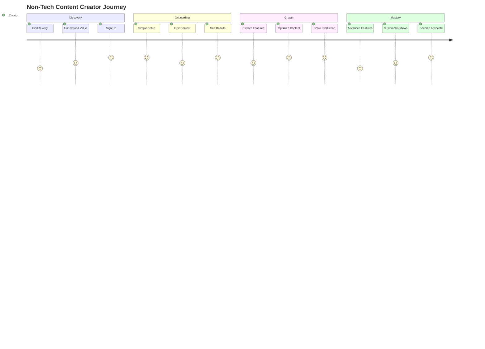

# Non-Tech Content Creators Journey

Welcome to ALwrity! This journey is designed specifically for bloggers, writers, small business owners, and freelancers who want to create amazing content without getting bogged down in technical complexity.

## 🎯 Your Journey Overview

## 🚀 What You'll Achieve

### Immediate Benefits (Week 1)
- **Create your first high-quality blog post** in under 30 minutes
- **Improve your content's SEO** without technical knowledge
- **Maintain consistent brand voice** across all content
- **Save 70% of your content creation time**

### Short-term Goals (Month 1)
- **Publish 4x more content** with the same effort
- **Increase organic traffic** by 50%+ through better SEO
- **Build a loyal audience** with consistent, valuable content
- **Establish thought leadership** in your niche

### Long-term Success (3+ Months)
- **Scale your content business** to new heights
- **Generate passive income** through content marketing
- **Build a personal brand** that attracts opportunities
- **Become a content creation expert** in your field

## 🎨 Perfect For You If...

✅ **You're a blogger** who wants to publish more frequently  
✅ **You're a small business owner** who needs to create marketing content  
✅ **You're a freelancer** who wants to showcase your expertise  
✅ **You're a writer** who wants to focus on creativity, not technical details  
✅ **You want to improve your SEO** without learning complex tools  
✅ **You need consistent content** but don't have time to write everything  

## 🛠️ What Makes This Journey Special

### Simple, Guided Experience
- **No technical jargon** - everything explained in plain English
- **Step-by-step guidance** - never feel lost or overwhelmed
- **Visual tutorials** - see exactly what to do
- **Quick wins** - see results from day one

### AI-Powered Assistance
- **Smart content suggestions** based on your niche and audience
- **Automatic SEO optimization** - no need to learn SEO
- **Brand voice consistency** - your content always sounds like you
- **Research integration** - facts and data automatically included

### Time-Saving Features
- **One-click content generation** for common content types
- **Template library** for different content formats
- **Automated scheduling** and publishing
- **Performance tracking** without complex analytics

## 📋 Your Journey Steps

### Step 1: Quick Setup (15 minutes)
**[Get Started →](getting-started.md)**

- Create your ALwrity account
- Complete simple onboarding questions
- Connect your website (optional)
- Set up your content preferences

### Step 2: Create Your First Content (30 minutes)
**[Create First Content →](first-content.md)**

- Choose your content type (blog post, social media, etc.)
- Enter your topic and key points
- Let AI generate your content
- Review and customize as needed
- Publish or schedule your content

### Step 3: Optimize Your Content (20 minutes)
**[Content Optimization →](content-optimization.md)**

- Learn how to improve your content quality
- Understand SEO basics (simplified)
- Set up content performance tracking
- Create your content calendar

### Step 4: Scale Your Production (Ongoing)
**[Scaling Your Content →](scaling.md)**

- Create content templates
- Set up automated workflows
- Build your content library
- Develop your content strategy

## 🎯 Success Stories

### Sarah - Lifestyle Blogger
*"I went from publishing once a week to three times a week, and my traffic increased by 200%. ALwrity helped me find my voice and create content my audience loves."*

### Mike - Small Business Owner
*"As a restaurant owner, I never had time for marketing content. Now I publish weekly blog posts and social media content that brings in new customers every week."*

### Lisa - Freelance Writer
*"ALwrity helps me create high-quality content for my clients faster than ever. I can take on more projects and deliver better results."*

## 🚀 Ready to Start?

### Quick Start (5 minutes)
1. **[Sign up for ALwrity](https://alwrity.com/signup)**
2. **[Complete simple setup](getting-started.md)**
3. **[Create your first content](first-content.md)**

### Need Help?
- **[Common Questions](troubleshooting.md)** - Quick answers to common issues
- **[Video Tutorials](https://youtube.com/alwrity)** - Watch step-by-step guides
- **[Community Support](https://github.com/AJaySi/ALwrity/discussions)** - Get help from other users

## 📚 What's Next?

Once you've completed your first content creation, explore these next steps:

- **[Content Optimization](content-optimization.md)** - Improve your content quality
- **[SEO Basics](seo-basics.md)** - Learn simple SEO techniques
- **[Content Strategy](content-strategy.md)** - Plan your content calendar
- **[Performance Tracking](performance-tracking.md)** - Monitor your success

---

*Ready to transform your content creation? [Start your journey now →](getting-started.md)*
