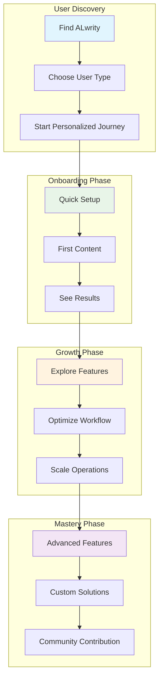
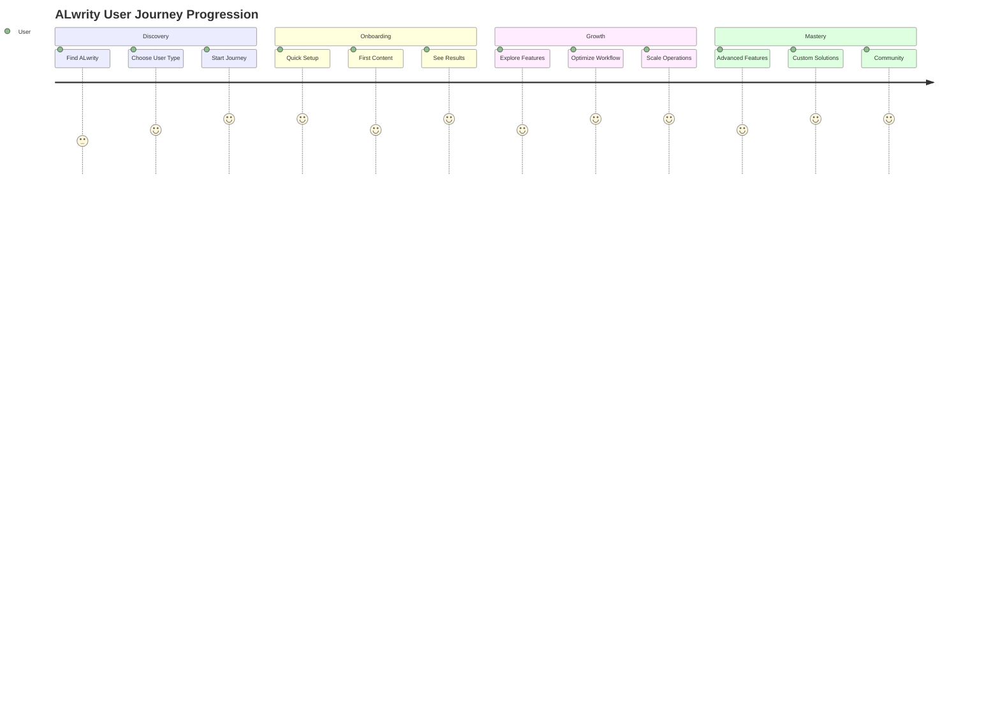

# User Journey Overview

Welcome to ALwrity! This guide helps you find the perfect path based on your role, experience level, and goals. Choose your user type below to get started with a personalized journey designed specifically for you.

## 🎯 Choose Your User Type

-   :material-account-edit:{ .lg .middle } **Non-Tech Content Creators**

    ---

    Bloggers, writers, small business owners, and freelancers who want to create quality content without technical complexity.

    [:octicons-arrow-right-24: Start Your Journey](non-tech-creators/overview.md)

-   :material-code-tags:{ .lg .middle } **Developers**

    ---

    Software developers, technical writers, and dev teams who need API access, customization, and integration capabilities.

    [:octicons-arrow-right-24: Start Your Journey](developers/overview.md)

-   :material-chart-line:{ .lg .middle } **Tech Marketers**

    ---

    Marketing professionals in tech companies, growth hackers, and digital marketers who need data-driven insights and performance tracking.

    [:octicons-arrow-right-24: Start Your Journey](tech-marketers/overview.md)

-   :material-rocket-launch:{ .lg .middle } **Solopreneurs**

    ---

    Individual entrepreneurs, consultants, coaches, and course creators who need to build their personal brand and grow their audience.

    [:octicons-arrow-right-24: Start Your Journey](solopreneurs/overview.md)

-   :material-account-group:{ .lg .middle } **Content Teams**

    ---

    Marketing teams, content agencies, and editorial teams who need collaboration features and workflow management.

    [:octicons-arrow-right-24: Start Your Journey](content-teams/overview.md)

-   :material-domain:{ .lg .middle } **Enterprise Users**

    ---

    Large organizations, enterprise marketing teams, and C-suite executives who need enterprise-grade solutions and compliance.

    [:octicons-arrow-right-24: Start Your Journey](enterprise/overview.md)

## 🗺️ User Journey Map

## 📊 User Type Comparison

| User Type | Primary Goal | Key Features | Tech Comfort | Time Investment |
|-----------|--------------|--------------|--------------|-----------------|
| **Non-Tech Content Creators** | Create quality content easily | Simple UI, guided workflows | Low-Medium | 30 min setup |
| **Developers** | Integrate and customize | APIs, webhooks, SDKs | High | 2-4 hours setup |
| **Tech Marketers** | Optimize performance | Analytics, A/B testing, ROI tracking | Medium-High | 1-2 hours setup |
| **Solopreneurs** | Build personal brand | Persona system, automation | Medium | 45 min setup |
| **Content Teams** | Collaborate efficiently | Team features, approval workflows | Medium-High | 1-3 hours setup |
| **Enterprise Users** | Scale securely | Enterprise features, compliance | Mixed | 1-2 weeks setup |

## 🚀 Quick Start by User Type

### For Non-Tech Content Creators
1. **[Simple Setup](non-tech-creators/getting-started.md)** - 5-minute guided setup
2. **[Create First Content](non-tech-creators/first-content.md)** - Your first blog post
3. **[Optimize Your Content](non-tech-creators/content-optimization.md)** - Improve quality and SEO

### For Developers
1. **[API Quickstart](developers/api-quickstart.md)** - Get started with APIs
2. **[Integration Guide](developers/integration-guide.md)** - Build custom integrations
3. **[Advanced Usage](developers/advanced-usage.md)** - Advanced API features

### For Tech Marketers
1. **[Strategy Setup](tech-marketers/strategy-setup.md)** - Plan your content strategy
2. **[Team Onboarding](tech-marketers/team-onboarding.md)** - Onboard your team
3. **[Analytics & ROI](tech-marketers/analytics.md)** - Track performance and ROI

### For Solopreneurs
1. **[Brand Strategy](solopreneurs/brand-strategy.md)** - Define your brand voice
2. **[Content Production](solopreneurs/content-production.md)** - Create content efficiently
3. **[Audience Growth](solopreneurs/audience-growth.md)** - Grow your audience

### For Content Teams
1. **[Workflow Setup](content-teams/workflow-setup.md)** - Design your content workflow
2. **[Team Management](content-teams/team-management.md)** - Manage your team
3. **[Brand Consistency](content-teams/brand-consistency.md)** - Maintain brand standards

### For Enterprise Users
1. **[Enterprise Setup](enterprise/implementation.md)** - Enterprise implementation
2. **[Security & Compliance](enterprise/security-compliance.md)** - Security and compliance
3. **[Analytics & Reporting](enterprise/analytics.md)** - Enterprise analytics

## 🎯 Success Metrics by User Type

### Non-Tech Content Creators
- **Time to First Content**: < 30 minutes
- **Content Quality Improvement**: 40%+ increase
- **User Satisfaction**: 4.5+ stars

### Developers
- **API Integration Success**: 90%+ success rate
- **Documentation Completeness**: 95%+ coverage
- **Developer Satisfaction**: 4.7+ stars

### Tech Marketers
- **ROI Measurement**: 200%+ ROI
- **Performance Improvement**: 50%+ increase
- **Team Adoption**: 80%+ team usage

### Solopreneurs
- **Time Savings**: 70%+ reduction
- **Content Production**: 3x increase
- **Audience Growth**: 100%+ increase

### Content Teams
- **Workflow Efficiency**: 60%+ improvement
- **Brand Consistency**: 95%+ consistency
- **Team Collaboration**: 80%+ improvement

### Enterprise Users
- **Security Compliance**: 100% compliance
- **Scalability**: 10x user capacity
- **Integration Success**: 95%+ success rate

## 🔄 Journey Progression

## 🆘 Need Help Choosing?

### Quick Assessment Questions

**1. What's your primary goal with ALwrity?**
- **A)** Create content easily without technical complexity → [Non-Tech Content Creators](non-tech-creators/overview.md)
- **B)** Integrate ALwrity into existing systems → [Developers](developers/overview.md)
- **C)** Optimize content performance and track ROI → [Tech Marketers](tech-marketers/overview.md)
- **D)** Build my personal brand and grow my audience → [Solopreneurs](solopreneurs/overview.md)
- **E)** Collaborate with a team on content creation → [Content Teams](content-teams/overview.md)
- **F)** Implement enterprise-grade solutions → [Enterprise Users](enterprise/overview.md)

**2. What's your technical comfort level?**
- **Low-Medium**: [Non-Tech Content Creators](non-tech-creators/overview.md) or [Solopreneurs](solopreneurs/overview.md)
- **Medium-High**: [Tech Marketers](tech-marketers/overview.md) or [Content Teams](content-teams/overview.md)
- **High**: [Developers](developers/overview.md)
- **Mixed (decision makers vs. users)**: [Enterprise Users](enterprise/overview.md)

**3. How much time can you invest in setup?**
- **< 1 hour**: [Non-Tech Content Creators](non-tech-creators/overview.md) or [Solopreneurs](solopreneurs/overview.md)
- **1-4 hours**: [Tech Marketers](tech-marketers/overview.md) or [Content Teams](content-teams/overview.md)
- **4+ hours**: [Developers](developers/overview.md)
- **1-2 weeks**: [Enterprise Users](enterprise/overview.md)

## 🎉 Ready to Start?

Choose your user type above and begin your personalized ALwrity journey. Each path is designed to help you achieve your specific goals with the right level of technical detail and support.

---

*Not sure which path is right for you? [Contact our support team](https://github.com/AJaySi/ALwrity/discussions) for personalized guidance!*
