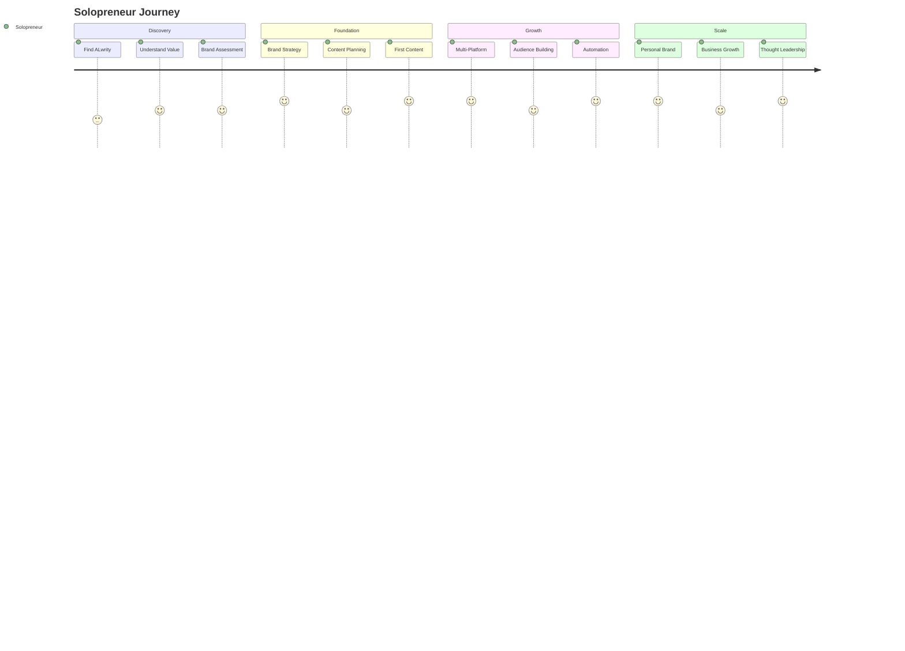

# Solopreneurs Journey

Welcome to ALwrity! This journey is designed specifically for individual entrepreneurs, consultants, coaches, and course creators who need to build their personal brand, grow their audience, and create content efficiently without a team.

## 🎯 Your Journey Overview

## 🚀 What You'll Achieve

### Immediate Benefits (Week 1)
- **Define your personal brand** and unique voice
- **Create consistent content** across multiple platforms
- **Automate content creation** to save time
- **Build your audience** with valuable content

### Short-term Goals (Month 1)
- **Establish thought leadership** in your niche
- **Grow your audience** by 100%+ through consistent content
- **Generate leads** and business opportunities
- **Build brand recognition** and authority

### Long-term Success (3+ Months)
- **Scale your personal brand** to new heights
- **Generate passive income** through content marketing
- **Attract high-value clients** and opportunities
- **Become a recognized expert** in your field

## 🎨 Perfect For You If...

✅ **You're an entrepreneur** building your personal brand  
✅ **You're a consultant** who needs to showcase expertise  
✅ **You're a coach** who wants to attract clients  
✅ **You're a course creator** who needs content marketing  
✅ **You're a freelancer** who wants to stand out  
✅ **You want to build authority** in your niche  

## 🛠️ What Makes This Journey Special

### Personal Brand Building
- **AI Persona System**: Develop and maintain your unique voice
- **Brand Consistency**: Ensure all content reflects your brand
- **Thought Leadership**: Establish expertise and authority
- **Personal Storytelling**: Connect with your audience authentically

### Multi-Platform Content
- **LinkedIn Writer**: Professional content for business networking
- **Facebook Writer**: Engaging content for broader audiences
- **Blog Writer**: In-depth content for your website
- **Cross-Platform Strategy**: Consistent messaging across all channels

### Time-Saving Automation
- **Content Templates**: Reuse successful content formats
- **Automated Research**: AI-powered fact-checking and insights
- **SEO Optimization**: Automatic optimization for search engines
- **Content Scheduling**: Plan and schedule content in advance

### Audience Growth
- **Engagement Optimization**: Content designed to drive interaction
- **Lead Generation**: Convert readers into prospects
- **Community Building**: Foster loyal followers and advocates
- **Relationship Building**: Connect with your audience personally

## 📋 Your Journey Steps

### Step 1: Brand Strategy (45 minutes)
**[Get Started →](brand-strategy.md)**

- Define your personal brand and unique value proposition
- Identify your target audience and their needs
- Create your brand voice and messaging
- Set up your content pillars and themes

### Step 2: Content Production (30 minutes)
**[Create Content →](content-production.md)**

- Set up content templates and workflows
- Create your first pieces of content
- Establish your content calendar
- Automate repetitive content tasks

### Step 3: Audience Growth (Ongoing)
**[Grow Audience →](audience-growth.md)**

- Optimize content for engagement
- Build your email list and community
- Leverage social media for growth
- Convert followers into customers

## 🎯 Success Stories

### Sarah - Business Coach
*"ALwrity helped me establish myself as a thought leader in business coaching. I went from 500 to 10,000 LinkedIn followers in 6 months, and my client inquiries increased by 300%."*

### Mike - Marketing Consultant
*"As a solopreneur, I needed to create content consistently without a team. ALwrity's automation features saved me 20 hours per week, and my content quality actually improved."*

### Lisa - Course Creator
*"The multi-platform content creation in ALwrity helped me reach different audiences across LinkedIn, Facebook, and my blog. My course sales increased by 150% in 3 months."*

## 🚀 Ready to Start?

### Quick Start (5 minutes)
1. **[Define your brand strategy](brand-strategy.md)**
2. **[Create your first content](content-production.md)**
3. **[Start growing your audience](audience-growth.md)**

### Need Help?
- **[Common Questions](troubleshooting.md)** - Quick answers to common issues
- **[Video Tutorials](https://youtube.com/alwrity)** - Watch step-by-step guides
- **[Community Support](https://github.com/AJaySi/ALwrity/discussions)** - Connect with other solopreneurs

## 📚 What's Next?

Once you've established your foundation, explore these next steps:

- **[Advanced Branding](advanced-branding.md)** - Take your personal brand to the next level
- **[Content Monetization](content-monetization.md)** - Turn your content into revenue
- **[Community Building](community-building.md)** - Build a loyal following
- **[Business Growth](business-growth.md)** - Scale your solopreneur business

## 🔧 Technical Requirements

### Prerequisites
- **Social media accounts** (LinkedIn, Facebook, etc.)
- **Website or blog** for long-form content
- **Email marketing tool** for audience building
- **Basic understanding** of personal branding

### Supported Platforms
- **LinkedIn**: Professional networking and thought leadership
- **Facebook**: Broader audience engagement
- **Blog/Website**: In-depth content and SEO
- **Email**: Direct audience communication

## 🎯 Success Metrics

### Brand Building
- **Follower Growth**: 100%+ increase in 3 months
- **Engagement Rate**: 5%+ average engagement
- **Brand Recognition**: Increased mentions and shares
- **Thought Leadership**: Speaking opportunities and media mentions

### Business Impact
- **Lead Generation**: 200%+ increase in qualified leads
- **Client Acquisition**: More high-value clients
- **Revenue Growth**: 150%+ increase in business revenue
- **Time Savings**: 70% reduction in content creation time

### Content Performance
- **Content Quality**: Consistent, high-quality output
- **SEO Performance**: Higher search rankings
- **Social Engagement**: Increased likes, shares, and comments
- **Email Growth**: Growing subscriber list

---

*Ready to build your personal brand and grow your business? [Start your journey now →](brand-strategy.md)*
