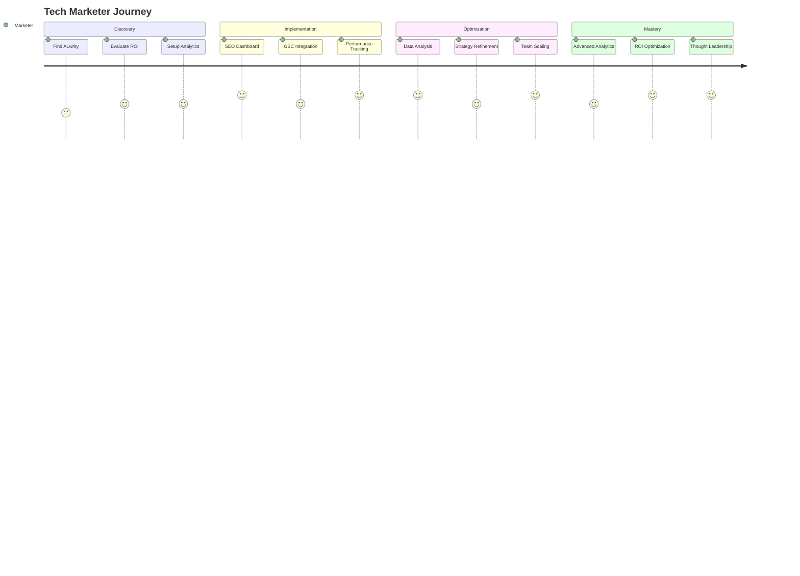

# Tech Marketers Journey

Welcome to ALwrity! This journey is designed specifically for marketing professionals in tech companies, growth hackers, and digital marketers who need data-driven insights, performance tracking, and ROI optimization.

## 🎯 Your Journey Overview

## 🚀 What You'll Achieve

### Immediate Benefits (Week 1)
- **Connect Google Search Console** for real-time SEO data
- **Set up comprehensive analytics** and performance tracking
- **Implement SEO optimization** across all content
- **Track ROI and performance metrics** from day one

### Short-term Goals (Month 1)
- **Increase organic traffic** by 50%+ through better SEO
- **Optimize content performance** with data-driven insights
- **Scale content production** while maintaining quality
- **Demonstrate clear ROI** to stakeholders

### Long-term Success (3+ Months)
- **Establish data-driven content strategy** that consistently delivers results
- **Build scalable content operations** for your team
- **Achieve measurable business impact** through content marketing
- **Become a thought leader** in data-driven marketing

## 🎨 Perfect For You If...

✅ **You're a marketing professional** in a tech company  
✅ **You're a growth hacker** who needs to optimize content performance  
✅ **You're a digital marketer** who wants data-driven insights  
✅ **You need to track ROI** and demonstrate business impact  
✅ **You want to scale content operations** efficiently  
✅ **You need to optimize SEO** and search performance  

## 🛠️ What Makes This Journey Special

### Data-Driven Marketing
- **Google Search Console Integration**: Real-time SEO performance data
- **Comprehensive Analytics**: Track content performance and ROI
- **SEO Dashboard**: Monitor rankings, traffic, and optimization opportunities
- **Performance Tracking**: Measure and optimize content effectiveness

### Advanced SEO Tools
- **SEO Analysis**: Comprehensive on-page and technical SEO analysis
- **Metadata Generation**: Optimized titles, descriptions, and tags
- **Keyword Research**: Data-driven keyword strategy and optimization
- **Competitor Analysis**: Track and analyze competitor performance

### ROI Optimization
- **Usage Tracking**: Monitor API costs and content generation efficiency
- **Performance Metrics**: Track content performance and business impact
- **A/B Testing**: Optimize content for better performance
- **Cost Analysis**: Understand and optimize content creation costs

## 📋 Your Journey Steps

### Step 1: Strategy Setup (1 hour)
**[Get Started →](strategy-setup.md)**

- Set up your content marketing strategy
- Configure analytics and tracking
- Define KPIs and success metrics
- Plan your content calendar

### Step 2: SEO Dashboard Configuration (2 hours)
**[SEO Setup →](seo-setup.md)**

- Connect Google Search Console
- Configure SEO monitoring and alerts
- Set up performance tracking
- Implement SEO best practices

### Step 3: Team Onboarding (3 hours)
**[Team Setup →](team-onboarding.md)**

- Onboard your marketing team
- Set up collaboration workflows
- Configure approval processes
- Establish content standards

### Step 4: Analytics & ROI (Ongoing)
**[Analytics Setup →](analytics.md)**

- Track content performance metrics
- Monitor ROI and business impact
- Optimize based on data insights
- Report results to stakeholders

## 🎯 Success Stories

### Sarah - Marketing Director at Tech Startup
*"ALwrity's SEO dashboard helped us increase organic traffic by 200% in 3 months. The Google Search Console integration gives us real-time insights that we never had before."*

### Mike - Growth Hacker
*"The ROI tracking features in ALwrity help me demonstrate clear business impact to our leadership team. We've reduced content creation costs by 60% while increasing output."*

### Lisa - Digital Marketing Manager
*"The analytics and performance tracking in ALwrity transformed our content strategy. We now make data-driven decisions that consistently improve our results."*

## 🚀 Ready to Start?

### Quick Start (5 minutes)
1. **[Set up your strategy](strategy-setup.md)**
2. **[Configure SEO dashboard](seo-setup.md)**
3. **[Start tracking performance](analytics.md)**

### Need Help?
- **[Common Questions](troubleshooting.md)** - Quick answers to common issues
- **[Video Tutorials](https://youtube.com/alwrity)** - Watch step-by-step guides
- **[Community Support](https://github.com/AJaySi/ALwrity/discussions)** - Get help from other marketers

## 📚 What's Next?

Once you've completed your initial setup, explore these next steps:

- **[Advanced Analytics](advanced-analytics.md)** - Deep dive into performance data
- **[ROI Optimization](roi-optimization.md)** - Maximize your content marketing ROI
- **[Team Management](team-management.md)** - Scale your content operations
- **[Competitive Analysis](competitive-analysis.md)** - Stay ahead of the competition

## 🔧 Technical Requirements

### Prerequisites
- **Google Search Console account** for SEO data
- **Analytics tools** (Google Analytics, etc.)
- **Basic understanding** of SEO and digital marketing
- **Team collaboration** tools and processes

### Supported Integrations
- **Google Search Console**: Real-time SEO performance data
- **Google Analytics**: Traffic and conversion tracking
- **Social Media Platforms**: LinkedIn, Facebook performance tracking
- **Email Marketing**: Newsletter and campaign performance

## 🎯 Success Metrics

### Performance Metrics
- **Organic Traffic Growth**: 50%+ increase in 3 months
- **SEO Rankings**: Improved rankings for target keywords
- **Content Performance**: Higher engagement and conversion rates
- **ROI Measurement**: Clear business impact and cost optimization

### Operational Metrics
- **Content Production**: 3x increase in output
- **Team Efficiency**: 60% improvement in workflow
- **Cost Optimization**: 40% reduction in content creation costs
- **Quality Consistency**: 95%+ brand consistency across content

---

*Ready to transform your content marketing with data-driven insights? [Start your journey now →](strategy-setup.md)*
